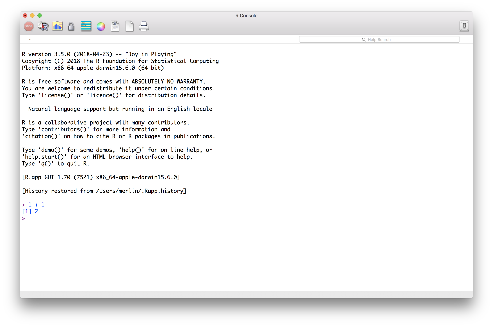
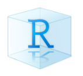
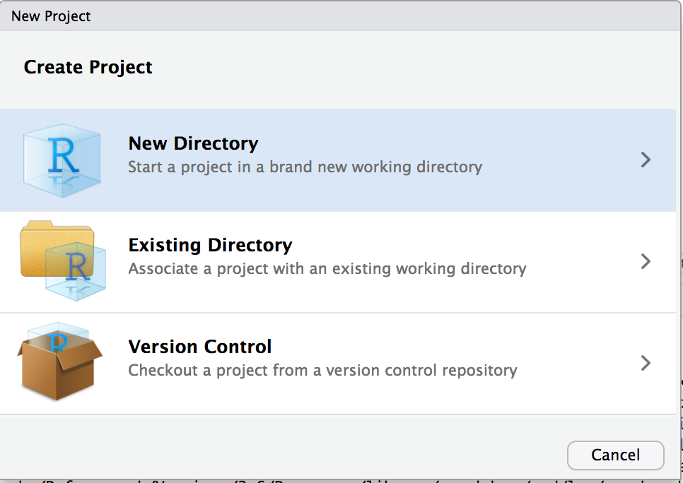
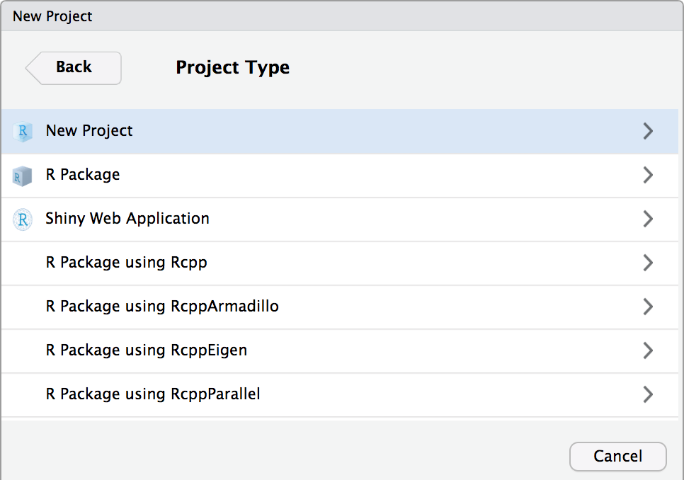
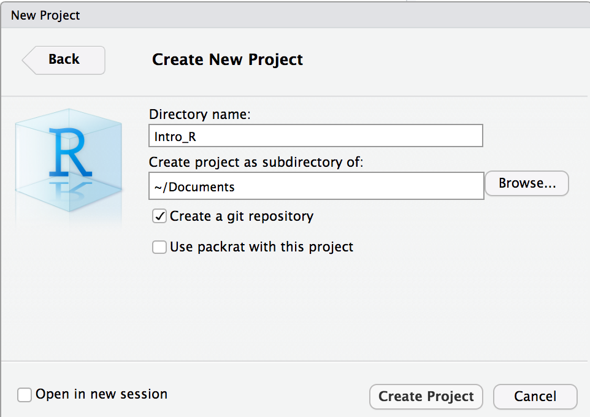
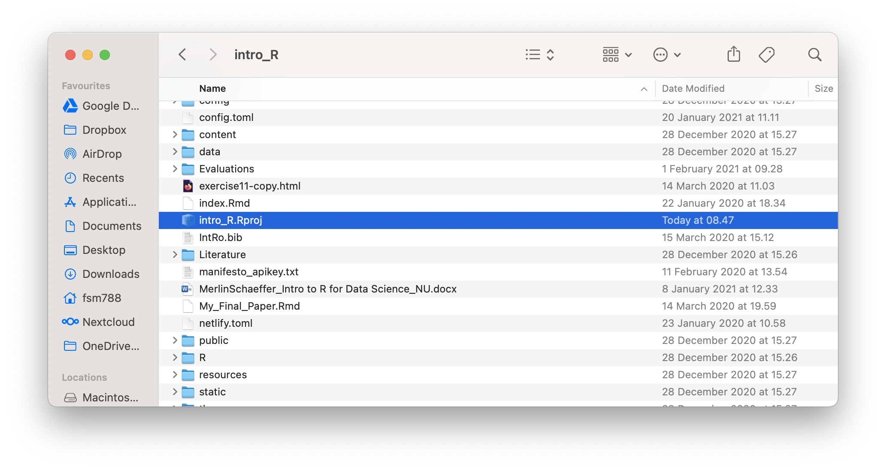
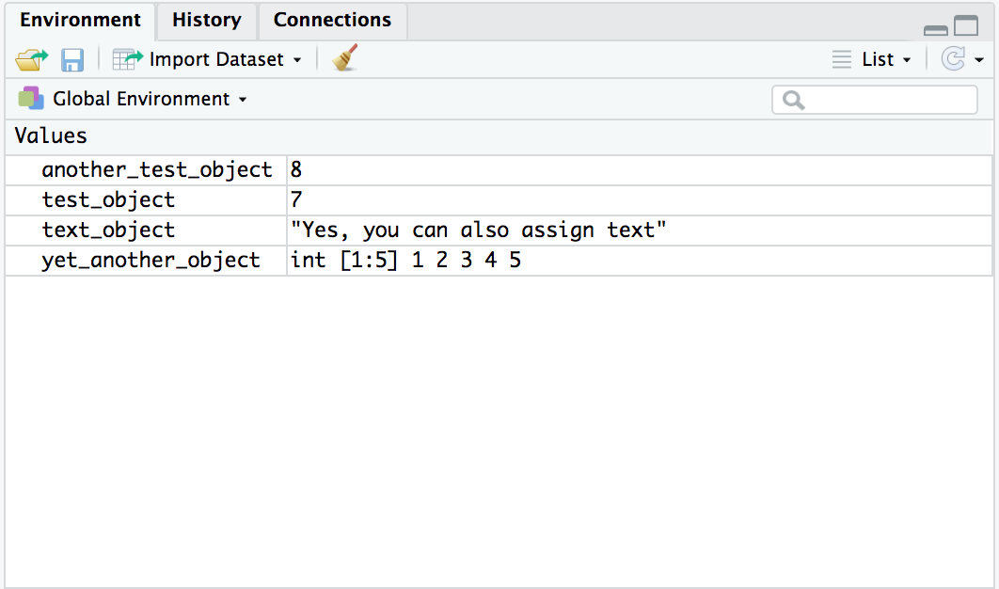

```{r setup, include = FALSE}
library(tidyverse)
library(RefManageR)
library(knitr)

options(htmltools.dir.version = FALSE, servr.interval = 0.5, width = 115, digits = 3)
knitr::opts_chunk$set(
  collapse = TRUE, message = FALSE, fig.retina = 3, error = TRUE,
  warning = FALSE, cache = FALSE, fig.align = 'center',
  comment = "#", strip.white = TRUE, tidy = FALSE)

BibOptions(check.entries = FALSE, 
           bib.style = "authoryear", 
           style = "markdown",
           hyperlink = FALSE,
           no.print.fields = c("doi", "url", "ISSN", "urldate", "language", "note", "isbn", "volume"))
myBib <- ReadBib("./../../intRo.bib", check = FALSE)

xaringanExtra::use_xaringan_extra(c("tile_view", "tachyons"))
xaringanExtra::use_panelset()
```

class: clear

<!-- <iframe src="https://app.sli.do/event/aflvddc2" height="100%" width="100%" frameBorder="0" style="min-height: 560px;"></iframe> -->

<!-- --- -->
# What is R?

--

.push-left[
If you're mainly interested in using regression to analyze a specific survey, it is

1. ... a rather tedious stats programming language.

2. ... basically a calculator:

```{r}
1 + 1
```

```{r}
x <- 1
x + 1
```
]

--

.push-right[
If you enjoy coding and working with
many or diverse data sources, it is

1. ... a great platform for (social) data science of
  + networks, text, location data, images, ...

2. ... an all in one solution, for<br>
  + data collection, processing, and communicating, ...
  <br>
  <br>
  $\rightarrow$ Merlin and I created these slides in R!

3. ... a worldwide, cutting-edge, and cooperative community.
]

---
# What you will learn

.center[
**(Social) Data Science**]
```{r, echo = FALSE, out.width='70%', fig.align='center'}
knitr::include_graphics('https://rstudio-education.github.io/tidyverse-cookbook/images/data-science-workflow.png')
```
.center[.backgrnote[*Source*: `r Citet(myBib, "grolemund2020")`]]

.center[
$\rightarrow$ The goal of this course is to give you an introduction the most important tools
]


---
background-image: url(https://www.tidyverse.org/images/tidyverse-default.png)
background-size: cover
background-position: center
class: clear

---
background-image: url(https://mareds.github.io/r_course/img_site/Tidyverse_packages.png)
background-size: contain
background-position: center
class: clear

---
background-image: url(https://upload.wikimedia.org/wikipedia/commons/thumb/1/1b/R_logo.svg/724px-R_logo.svg.png)
background-size: contain
background-position: center
class: clear

--

<br>
<br>
```{r, echo = FALSE, out.width='70%', fig.align='center'}

```

---
background-image: url(https://upload.wikimedia.org/wikipedia/commons/thumb/d/d0/RStudio_logo_flat.svg/1280px-RStudio_logo_flat.svg.png)
background-size: contain
background-position: center
class: clear

--

```{r, echo = FALSE, out.width='70%', fig.align='center'}
knitr::include_graphics('https://d33wubrfki0l68.cloudfront.net/8a64bb047429d7ae0e2acae35c40e421e6439bf6/80e5d/diagrams/rstudio-editor.png')
```

---
# Set R Studio preferences

.left-column[
Set these preferences to improve *reproducibility*!
  + $\rightarrow$ RStudio/Preferences
]

.right-column[
```{r, echo = FALSE, out.width='70%', fig.align='center'}
knitr::include_graphics('https://d33wubrfki0l68.cloudfront.net/7fa44a5471d40025344176ede4169c5ad3159482/1577f/screenshots/rstudio-workspace.png')
```
]

---
# R Studio workflow

.left-column[
1. Use **Projects** to manage all files (scripts, data, figures and tables) belonging to the same project.
2. Use the editor the write **R scripts**, so you can reproduce your results.
]

.right-column[
```{r, echo = FALSE, out.width='85%', fig.align='center'}
knitr::include_graphics('https://d33wubrfki0l68.cloudfront.net/8a64bb047429d7ae0e2acae35c40e421e6439bf6/80e5d/diagrams/rstudio-editor.png')
```
]

---
# Set up your "IntRo" project

.left-column[
- Click on the Project button.
]

.right-column[
```{r, echo = FALSE, out.width='40%', fig.align='center'}

```
]

---
layout: true
# Set up your "IntRo" project
.left-column[
- Set up a new project in R Studio. 
  + "New Directory"
  + "New Project"
  + Finally, a name for the folder and under "Browse" where you want that folder to be located.
  + **Done!** Now you should find an empty folder under the path your wanted it to be set up.
  + In the future, start RStudio by double clicking on the project icon in your folder.
]

---

.right-column[
```{r, echo = FALSE, out.width='90%', fig.align='center'}

```
]

---

.right-column[
```{r, echo = FALSE, out.width='90%', fig.align='center'}

```
]

---

.right-column[
```{r, echo = FALSE, out.width='90%', fig.align='center'}

```
]

---

.right-column[
```{r, echo = FALSE, out.width='90%', fig.align='center'}

```
]

---
layout: false
layout: true
# R Scripts
---

.left-column[
- Open a new R Script.
- Save it in your new folder.
  + Find it under "Files".
]

.right-column[
```{r, echo = FALSE, out.width='100%', fig.align='center'}
knitr::include_graphics('./img/Rscript1.png')
```
]

---

.left-column[
- Type the following lines.
- Save the file;
  - I called mine "Lecture.R".
- Mark all code and click "run".
]

.right-column[
```{r, echo = FALSE, out.width='100%', fig.align='center'}
knitr::include_graphics('./img/Rscript3.png')
```
]

---

.left-column[
OK, you are good to go! 

**Pro tip:** *Use the R Script to take notes during the lecture!*
]

.right-column[
```{r, echo = FALSE, out.width='100%', fig.align='center'}
knitr::include_graphics('./img/Rscript4.png')
```
]

---
layout: false
class: clear

<iframe src="https://app.sli.do/event/aflvddc2" height="100%" width="100%" frameBorder="0" style="min-height: 560px;"></iframe>

---
layout: true
# First steps with R .font60[Creating **objects**]
---

```{r}
# I am a comment; the hashtag "#" makes me one.
# It is good programming style to use me a lot ;).
```

--

R is an _**object**-oriented_ programming language. We create objects with the **assignment operator** `<-`.<br> .backgrnote[The names you give objects need to start with a letter.]

```{r}
# Create a new object "test_object" and assign to it the result of 5 + 2
test_object <- 5 + 2 #<<
```

--

The assignment operator may be used in both *directions*: `<-`, or `->`. .backgrnote[This can help you write more legible code.]

```{r}
5 + 3 -> another_test_object # Create another object #<<
```

---

Objects can contain all kinds of information.
```{r}
text_object <- "Yes, you can also assign text"
```

---
layout: false
# First steps with R .font60[Printing objects]

You can make R print the content of an object by typing its name.
```{r}
test_object # Print object #<<
```

--

```{r}
another_test_object
text_object
```

---
layout: false
# Printing $\neq$ assigning!

If you don't use the assignment operator, R will simply print the result of an operation without changing that object (i.e., without any further consequences).

```{r}
test_object + 3 # Print the result of adding 3 to the content of test_object + 3.
test_object # Print the content of test_object.
```

--

If you actually want to create or modify objects, you need to use the assignment operator and explicitly assign the result of your operation to the object you want to change.

```{r}
test_object <- test_object + 3 # Assign to test_object: the result of adding 3 to the content of test_object.
test_object # Print the content of test_object
```

--

The short-hand version for assigning and printing an object right away uses surrounding `()`:
```{r}
(test_object <- 5 + 2) # Assign the result of 5 + 2 to "test_object" and print tat object's content. #<<
```

---

# First steps with R .font60[**Functions**]
Functions do the work in R. You call/use them by:<br> `
function_name(argument1 = value1, argument2 = value2, ...)`

--

The `seq()` function, for instance, produces a sequence of numbers and has (among others) the arguments `from` and `to`.
```{r}
(yet_another_object <- seq(from = 1, to = 5)) #<<
```

--

To shorten code, R can infer the arguments by their position (i.e., the positions of supplied values).<br> .backgrnote[(i.e., Here R assumes you mean from-to and *not* to-from)]

```{r}
(yet_another_object <- seq(1, 5))
```

---
# First steps with R .font60[Object **classes**]

What a function does, depends on the type of object you feed to its arguments as values. The `class()` function tells you what **class**/type of object your are dealing with:

```{r}
class(yet_another_object) # "yet_another_object" contails whole numbers, so it is: #<<
class(text_object) # "text_object" contains a sentence, so it is:
```

--

Functions will throw an error message, if you feed them with an object of a class it cannot handle:

```{r error = TRUE}
alphabet <- seq(from = "a", to = "z")
```

--

Although functions do stuff with objects we feed to them, they are also objects themselves:

```{r}
class(seq)
```

---
# First steps with R .font60[The **Environment**]

.left-column[
The upper-right panel of R Studio has a sheet called **Environment**. It lists all the objects you have created and which you can work with. It is the environment you are working in.
]

.right-column[
```{r, echo = FALSE, out.width='100%', fig.align='center'}

```
]

---
# **Arithmetic operators**

Like any decent calculator, R knows how to handle basic arithmetic:

```{r}
2 + 3 # Plus
2 - 3 # Minus
2 * 3 # Multiplication
2 / 3 # Devision
2^3   # Power
```

--

Other mathematical operations are implemented as functions:

```{r}
yet_another_object # Print another_object.
sqrt(yet_another_object) # Print square root of every element contained in another_object.
```

---
# **Logical** (Boolean) **operators**

.center[`&` "and", `|` "or", and `!` "not"]

```{r, echo = FALSE, out.width='80%', fig.align='center'}
knitr::include_graphics('https://d33wubrfki0l68.cloudfront.net/01f4b6d39d2be8269740a3ad7946faa79f7243cf/8369a/diagrams/transform-logical.png')
```
.center[.backgrnote[*Source*: Wickham & Grolemund [R for Data Science](http://r4ds.had.co.nz/transform.html)]]

---
# Logical (Boolean) operators .font60[In action]
```{r}
x <- 2    # Assign 2 to object x
x == 3    # equals
x != 3    # unequals
x < 5     # less than
x > 5     # greater than
x <= 5    # less or equal
x >= 2    # greater or equal
x > 5 & 6 # greater than 5 and greater than 6
x > 5 | 1 # greater than 5 or greater then 1
x >= (5 & 6) | (5 & 1) | (1 & 2) # Complex comparison
```

---
# Getting **help**

R has a steep learning curve and is, at times, simply frustrating. The documentation of a specific function can be accessed via typing `?<NAME_OF_FUNCTION>`.

```{r eval = FALSE}
?seq()
```

You can find further useful links on the course website.

<!-- --- -->
<!-- class: clear -->

<!-- <iframe src="https://app.sli.do/event/aflvddc2" height="100%" width="100%" frameBorder="0" style="min-height: 560px;"></iframe> -->

---
class: inverse
# Today's general lessons


1. R is an **object**-oriented programming language. Objects are basically containers and they can contain anything: data, functions, other objects, results, figures, and more ... Objects can be called by their name, which needs to start with a letter. If you just type the name of an object, R prints the object.
2. **Functions** do stuff with objects, which we assign as **values** to a function's **arguments**. What exactly a function does, depends on the **class** of an object. Functions themselves are objects too.

---
class: inverse
# Operators

1. `?`: View a function's help file.
2. `#`: defines a **comment** in your code. Comment as much as possible!
3. `<-`: is the **assignment operator** of R. It creates objects and assigns information to them.
4. `->`: is the **reversed assignment operator** of R. It also creates objects and assigns information to them.
5. `+`, `-`, `*`, `\`, `^` : **Arithmetic operators**
6. `&` "and", `|` "or", `!` "not" : **Logical** (Boolean) **operators**

---
class: inverse
# Today's (important) functions
1. `class()`: tells you the class of an object.

---
# References

```{r ref, results = 'asis', echo = FALSE}
PrintBibliography(myBib)
```
