```{r setup, include = FALSE}
library(tidyverse)
library(RefManageR)
library(knitr)

options(htmltools.dir.version = FALSE, servr.interval = 0.5, width = 115, digits = 3)
knitr::opts_chunk$set(
  collapse = TRUE, message = FALSE, fig.retina = 3, error = TRUE,
  warning = FALSE, cache = FALSE, fig.align = 'center',
  comment = "#", strip.white = TRUE, tidy = FALSE)

BibOptions(check.entries = FALSE, 
           bib.style = "authoryear", 
           style = "markdown",
           hyperlink = FALSE,
           no.print.fields = c("doi", "url", "ISSN", "urldate", "language", "note", "isbn", "volume"))
myBib <- ReadBib("./../../intRo.bib", check = FALSE)

xaringanExtra::use_xaringan_extra(c("tile_view", "tachyons"))
xaringanExtra::use_panelset()
```

# Lecturers and Schedule

--

.push-left[


<!-- Need to use &nbsp; to force spaces for formatting -->
.caption[
&nbsp; Merlin Schaeffer &nbsp;&nbsp;&nbsp;&nbsp; Friedolin Merhout
]

]

--

.push-right[
    Day|Time|Content
    ---|---|---
    1|**10**-12| Hello R: Vectors
     |12-13| `r emo::ji("plate")`
     |13-15| Data Frames and Tibbles
     |15-**17**| Visualization I
    2|**9**-11| Piping and Grouped Operations
     |11-13| Visualization II
     |13-14| `r emo::ji("plate")`
     |14-16| Linear OLS Regression I
     |16-**18**| Linear OLS Regression II
    
]

---


# What is R?

--

.push-left[
If you're mainly interested in using regression to analyze a specific survey, it is ...

1. ... a rather tedious statistical programming language. <br><br>
  - ` x <- 1 `
  
]

---

# What is R?

.push-left[
If you're mainly interested in using regression to analyze a specific survey, it is ...

1. ... a rather tedious statistical programming language. <br>
  - ` x <- 1 `

2. ... a supercharged calculator. <br><br>
  - `(17*9^3)/6`

]


---

# What is R?

.push-left[
If you're mainly interested in using regression to analyze a specific survey, it is ...

1. ... a rather tedious statistical programming language. <br>
  - ` x <- 1 `

2. ... a supercharged calculator. <br><br>
  - `(17*9^3)/6`

]

.push-right[
If you enjoy coding and working with many or diverse data sources, it is ...
]

---

# What is R?

.push-left[
If you're mainly interested in using regression to analyze a specific survey, it is ...

1. ... a rather tedious statistical programming language. <br>
  - ` x <- 1 `

2. ... a supercharged calculator. <br><br>
  - `(17*9^3)/6`

]

.push-right[
If you enjoy coding and working with many or diverse data sources, it is ...

1. ... a flexible language for __reproducible__ (social) science using <br><br>
  + network, text, location, image, and or traditional social science data ... 
  
]

---

# What is R?


.push-left[
If you're mainly interested in using regression to analyze a specific survey, it is ...

1. ... a rather tedious statistical programming language. <br>
  - ` x <- 1 `

2. ... a supercharged calculator. <br><br>
  - `(17*9^3)/6`

]

.push-right[
If you enjoy coding and working with many or diverse data sources, it is ...

1. ... a flexible language for __reproducible__ (social) science using
  + network, text, location, image, and or traditional social science data ... 

2. ... an all in one solution, for<br>
  + data collection, processing, and communicating, ...
  <br>
  <br>
  $\rightarrow$ Merlin and I created these slides in R!
]

---

# What is R?

.push-left[
If you're mainly interested in using regression to analyze a specific survey, it is ...

1. ... a rather tedious statistical programming language. <br>
  - ` x <- 1 `

2. ... a supercharged calculator. <br><br>
  - `(17*9^3)/6`

]

.push-right[
If you enjoy coding and working with many or diverse data sources, it is ...

1. ... a flexible language for __reproducible__ (social) science using
  + network, text, location, image, and or traditional social science data ... 

2. ... an all in one solution, for<br>
  + data collection, processing, and communicating, ...
  <br>
  <br>
  $\rightarrow$ Merlin and I created these slides in R!

3. ... a worldwide, cutting-edge, and cooperative community.
]

---
# Workshop focus

```{r, echo = FALSE, out.width='70%', fig.align='center'}
knitr::include_graphics('https://rstudio-education.github.io/tidyverse-cookbook/images/data-science-workflow.png')
```
.center[.backgrnote[*Source*: `r Citet(myBib, "grolemund2020")`]]

.center[
$\rightarrow$ This workshop will introduce you to the central R tools for reproducible data processing and analysis in social science
]

---
background-image: url(https://upload.wikimedia.org/wikipedia/commons/thumb/1/1b/R_logo.svg/724px-R_logo.svg.png)
background-size: contain
background-position: center
class: clear

--

<br>
<br>
```{r, echo = FALSE, out.width='70%', fig.align='center'}
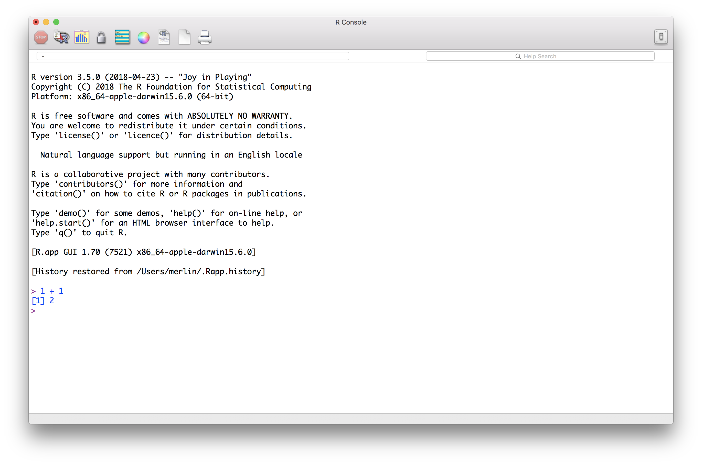
```

---
background-image: url(https://upload.wikimedia.org/wikipedia/commons/thumb/d/d0/RStudio_logo_flat.svg/1280px-RStudio_logo_flat.svg.png)
background-size: contain
background-position: center
class: clear

--

```{r, echo = FALSE, out.width='70%', fig.align='center'}
knitr::include_graphics('https://d33wubrfki0l68.cloudfront.net/8a64bb047429d7ae0e2acae35c40e421e6439bf6/80e5d/diagrams/rstudio-editor.png')
```

---
# Set R Studio preferences

.left-column[
Set these preferences to improve *reproducibility*!
  + Mac: $\rightarrow$ RStudio/Preferences
  + Windows: Tools\Global options\
]

.right-column[
```{r, echo = FALSE, out.width='70%', fig.align='center'}
knitr::include_graphics('https://d33wubrfki0l68.cloudfront.net/7fa44a5471d40025344176ede4169c5ad3159482/1577f/screenshots/rstudio-workspace.png')
```
]

???

- In Windows: Profile > Global Options...

---
# Reproducible workflow

.left-column[
1. **Projects** organize all files (scripts, data, figures and tables) belonging to the same (research) project.
2. **R scripts** contain your code to load, process, and analyze data, making the results reproducible.
]

.right-column[
```{r, echo = FALSE, out.width='85%', fig.align='center'}
knitr::include_graphics('https://d33wubrfki0l68.cloudfront.net/8a64bb047429d7ae0e2acae35c40e421e6439bf6/80e5d/diagrams/rstudio-editor.png')
```
]

---
layout: true
# Creating your first project

---

.left-column[
- Click on the Project button on the top right, and choose **New Project...**.
]

.right-column[
```{r, echo = FALSE, out.width='60%', fig.align='center'}

```
]

---

.left-column[
- Click through the New Project Wizard 
  + **New Directory**
]

.right-column[
```{r, echo = FALSE, out.width='90%', fig.align='center'}
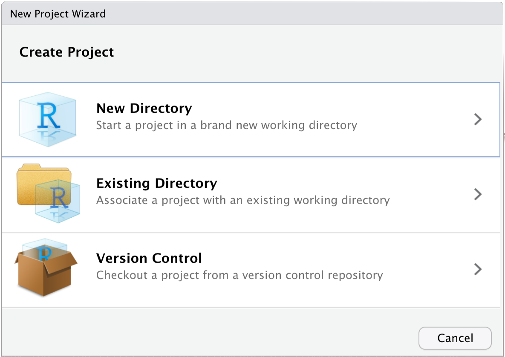
```
]

---

.left-column[
- Click through the New Project Wizard 
  + New Directory
  + **New Project**
]

.right-column[
```{r, echo = FALSE, out.width='90%', fig.align='center'}
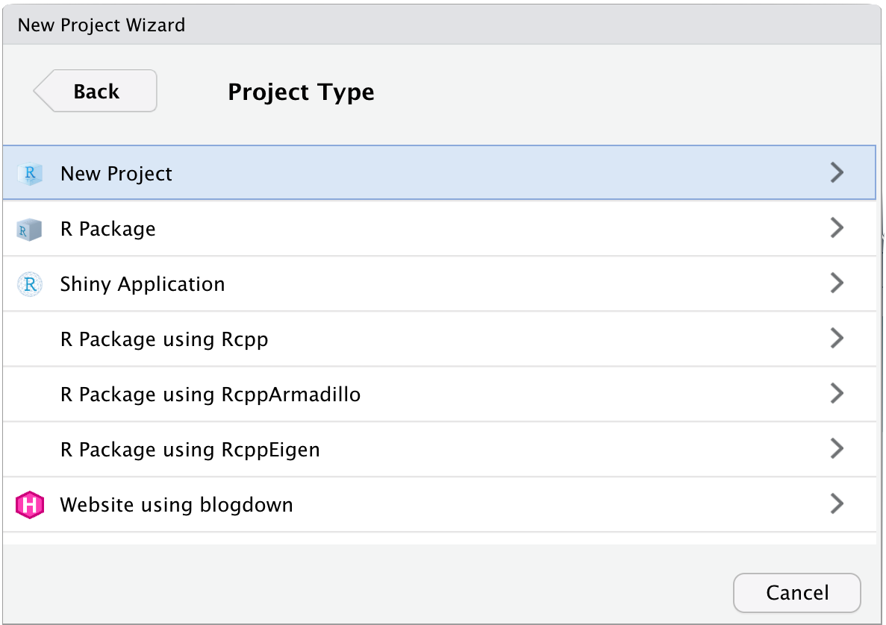
```
]

---

.left-column[
- Click through the New Project Wizard 
  + New Directory
  + New Project
  + Choose a **name** for your project folder and set its **location** by clicking "Browse".
]

.right-column[
```{r, echo = FALSE, out.width='90%', fig.align='center'}
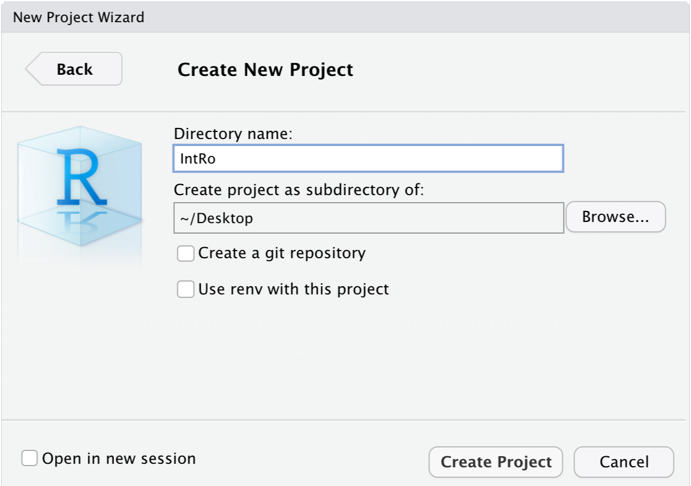
```
]

---

.left-column[
- Click through the New Project Wizard 
  + New Directory
  + New Project
  + Choose a name for your project folder and set its location clicking "Browse".<br><br>
  + **Done!** Now you should find an empty folder at your specified path.<br><br>
  + In the future, start RStudio by double clicking on the project icon in your folder.
]

.right-column[
```{r, echo = FALSE, out.width='90%', fig.align='center'}
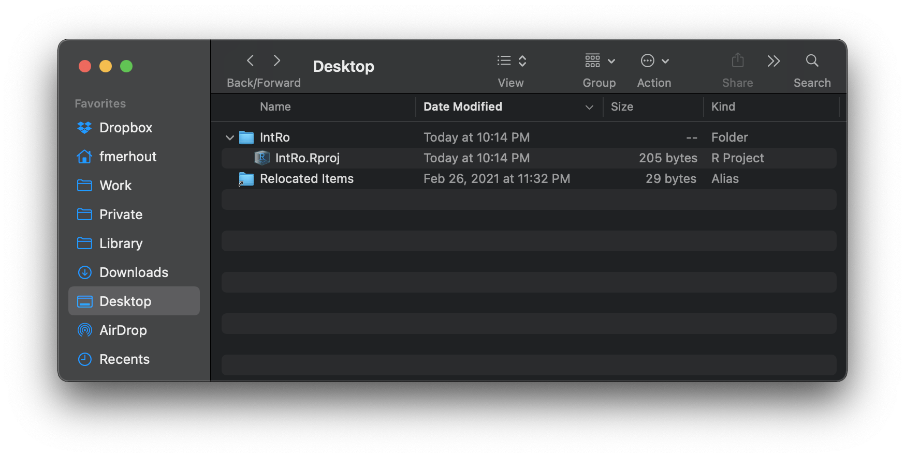
```
]

---
layout: false
layout: true
# Creating your first R script
---

.left-column[
- Open a new R Script on the top left.
]

.right-column[
```{r, echo = FALSE, out.width='100%', fig.align='center'}
knitr::include_graphics('./img/Rscript1.png')
```
]

---

.left-column[
- Type the following lines:
  ```{r, results = 'hide'}
  # This example script
  # starts with a comment,
  # marked by "#".

  # A programming tradition.
  print("Hello, World!")
  ```
- Save the file and give it a descriptive name.
  - I called mine "hello-world.R".
  - Then find it under "Files" on the bottom right.
]

.right-column[
```{r, echo = FALSE, out.width='100%', fig.align='center'}
knitr::include_graphics('./img/Rscript2.png')
```
]

---

.left-column[
- Finally, select all the code and run it by pressing:
    - Windows: `Ctrl` + `Enter`
    - Mac OS: `Cmd` + `Return`.
    
- When your console on the bottom left shows: 

```{r, echo = FALSE}
print("Hello, World!")
```

  - You are good to go! 

**Pro tip:** *Use the R Script to take notes during the lecture!*
]

.right-column[
```{r, echo = FALSE, out.width='100%', fig.align='center'}
knitr::include_graphics('./img/Rscript3.png')
```
]


---
layout:false
# First steps with R .font60[Arithmetic operators]

Like any decent calculator, R knows how to handle basic arithmetic:

```{r}
2 + 3 # Addition
2 - 3 # Subtraction
2 * 3 # Multiplication
2 / 3 # Division
2^3   # Power
```

---
# First steps with R .font60[Logical operators]

.push-left[
But it can also perform comparison...


```{r}
2 == 3    # Equal
2 != 3    # Not equal
2 < 5     # Less than
2 > 5     # Greater than
2 <= 5    # Less than or equal
2 >= 2    # Greater than or equal
```


]

--

.push-right[
... and set operations, using `&` "AND", `|` "OR", and `!` "NOT"

```{r, echo = FALSE, out.width='80%', fig.align='center'}
knitr::include_graphics('https://d33wubrfki0l68.cloudfront.net/01f4b6d39d2be8269740a3ad7946faa79f7243cf/8369a/diagrams/transform-logical.png')
```
.center[.backgrnote[*Source*: `r Citet(myBib, "grolemundDataScience2017")`]]


```{r}
2 < 5 & 2 < 1 # Less than 5 AND less than 1
2 > 5 | 2 < 1 # Less than 5 OR less than 1
2 < 5 & ! 2 < 1 # Less than 5 AND NOT less than 1
```

]


???
More advanced mathematical operations are implemented as functions, we'll get to those in a bit.

---
# First steps with R .font60[Creating objects]

--

```{r}
# I am a comment; the hashtag "#" makes me one.
# It is good programming style to use me a lot ;).
```

--

R is an _**object**-oriented_ programming language. We create objects with the **assignment operator** `<-`.<br> .backgrnote[The names you give objects need to start with a letter and cannot contain spaces.]


```{r}
# Create a first object "test_object" and assign to it the the number 5
test_object <- 5 #<<
```

--

You will use the assignment operator a lot. Instead of typing it out every time, remember the keyboard shortcut:

- Windows: `Alt` + `-`
- Mac OS: `Option` + `-`

--

The assignment operator may be used in both *directions*: `<-`, or `->`. .backgrnote[This can help you write more legible code.]

```{r}
5 -> another_test_object # Create another object #<<
```


???

- For naming:   
  - R is case-sensitive
  - No two objects can have the same name (overwriting)

---
# First steps with R .font60[Keeping track of objects]

.left-column[
RStudio's **Environment** pane on the top right lists all the objects that you have created, and which are thus available to you to work with.
]

.right-column[
```{r, echo = FALSE, out.height='75%', fig.align='center'}
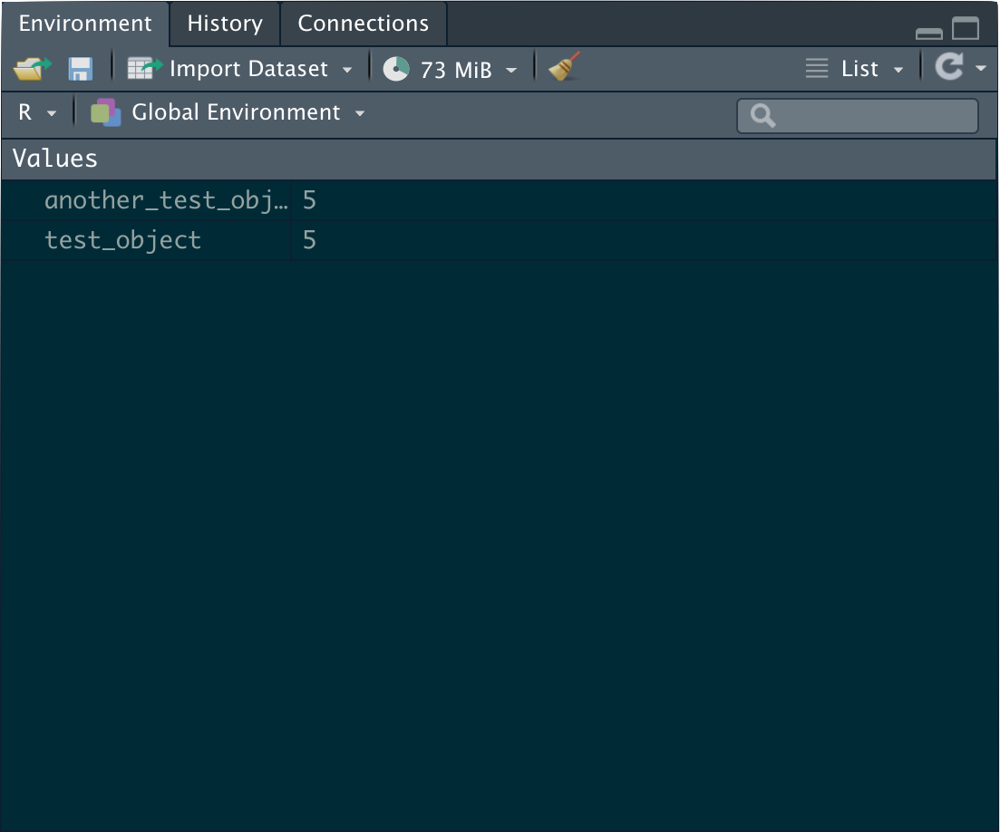
```
]

---
# First steps with R .font60[Working with objects]

--

To see the content of any object, simply type its name into your **Console** and hit return or enter.
```{r}
test_object # Print object #<<
```

--

This is what is known as "printing" the object.
```{r}
another_test_object
```

--

What makes object-oriented programming powerful, is that we can work with the objects we create.
```{r}
test_object * 2
```


---
# Printing $\neq$ assigning!

If you don't use the assignment operator, R will simply print the result of an operation without changing the object (i.e., without any further consequences).

```{r}
test_object + 3 # Print the result of adding 3 to the content of test_object + 3.
test_object # Print the content of test_object.
```

--

If you actually want to create or modify objects, you **need to** use the assignment operator and **explicitly assign** the result of your operation to the name of an object.

```{r}
test_object <- test_object + 3 # Assign to test_object: the result of adding 3 to the content of test_object.
test_object # Print the content of test_object
```

--

When assigning, R does not by default print the object's content. To print the content of an assignment operation, enclose it in `()`:
```{r}
(test_object <- 5 + 2) # Assign the result of 5 + 2 to "test_object" and its content. #<<
```


---

# First steps with R .font60[Functions]

**Functions** provide the breadth of operations in R. To use them, write their _name_ and pass them _argument(s)_ in parentheses:<br>
`function_name(argument1 = value1, argument2 = value2, ...)`

--

A basic example is the function `sqrt()`. It calculates the square root of an object, which it takes as its only argument `x`.
```{r}
(sqrt_of_nine <- sqrt(x = 9)) #<<
```

--

To shorten code, R can infer the arguments by their position (i.e., the order of supplied values).

Consider the function `seq()`, which produces a sequence of numbers and takes `from` and `to` as its first and second argument. Both approaches below create the same result.

```{r}
(yet_another_object <- seq(from = 1, to = 5))
(yet_another_object <- seq(1, 5)) #<<
```


---
layout:true
# First steps with R .font60[Data types and structures]

---

Besides functions, R's versatility comes from its support of different types and structures of data.

--

### Vectors
The simplest and most fundamental data structure in R are (atomic) **vectors**, containing sequences/chains of information. To create a vector, pass the information to the function `c()` to "concatenate" it.

```{r}
# Concatenate the sequence 1 2 3 4 5 to a vector, assign it to object `my_vector`, and print it.
(my_vector <- c(1, 2, 3, 4, 5))
```

--

### Indexing
We can use the order in the sequence of information to access specific _elements_. This is called **indexing** and works by placing brackets `[]` with the rank position or _index_ behind our vector.<br>
.backgrnote[Hint: You can also pass a vector as an index to access multiple elements.]
```{r}
# Print the second element of my vector.
my_vector[2]
```

---

### Data types

.push-left[R can handle other kinds of data besides numbers, and distinguishes among three basic types: `Character`, `Numeric`, and `Logical`.
```{r}
(my_character_vector <- c("Just", "a", "simple",
                          "short", "sentence."))
(my_numeric_vector <- my_vector)
(my_logical_vector <- c(TRUE, TRUE, FALSE, FALSE, TRUE))
```
]

.push-right[
```{r, echo = FALSE, out.width='100%', fig.align='center'}
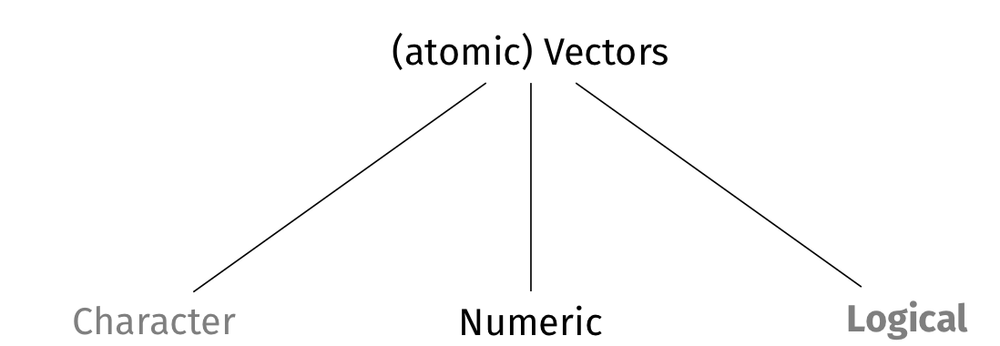
```
]


---

### Data types

.push-left[R can handle other kinds of data besides numbers, and distinguishes among three basic types: `Character`, `Numeric`, and `Logical`.
```{r}
(my_character_vector <- c("Just", "a", "simple",
                          "short", "sentence."))
(my_numeric_vector <- my_vector)
(my_logical_vector <- c(TRUE, TRUE, FALSE, FALSE, TRUE))
```
]

.push-right[
```{r, echo = FALSE, out.width='100%', fig.align='center'}

```

.center[.alert[The "atomic" in "atomic vectors" means that they can contain only one type of data.]]
]

---
layout:false
# Character vectors

.push-left[
**Character** vectors are sequences of text or strings.
``` {r}
# Concatenate these five strings as one vector 
# and assign it to object "my_character_vector".
(my_character_vector <- c("Just", "a", "simple",
                          "short", "sentence."))

# Check the data type using `typeof()`
typeof(my_character_vector)

# Return only the first, second, and fifth element.
my_character_vector[c(1,2,5)]
```

Strings are at the heart of many digital data sources and we can work with them using string functions and regular expressions. 

This is unfortunately beyond our scope, but if you are interested, check out [this tutorial](https://www.storybench.org/getting-started-stringr-textual-analysis-r/) and [this GESIS workshop](https://training.gesis.org/?site=pDetails&child=full&pID=0x31B571BACE1F4C769B22CE82CCDC615C).
]

.push-right[
```{r, echo = FALSE, out.width='100%', fig.align='center'}
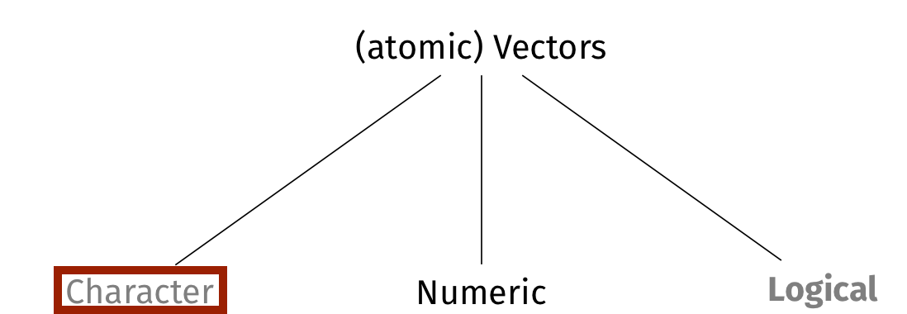
```
]
---
# Logical vectors

.push-left[
**Logical** vectors are sequences containing `TRUE` and `FALSE` (Booleans):
```{r}
# Concatenate these five Booleans as one vector 
# and assign it to object "my_logical_vector"
(my_logical_vector <- c(TRUE, TRUE, FALSE, FALSE, TRUE))

# Check the data type using `typeof()`
typeof(my_logical_vector)

```

Internally, R uses *logical vectors for case selection*. They are thus very important!
```{r}
my_character_vector
# Return those elements of my_character_vector where
# my_logical_vector contains TRUE and not FALSE.
my_character_vector[my_logical_vector]
```

]

.push-right[
```{r, echo = FALSE, out.width='100%', fig.align='center'}
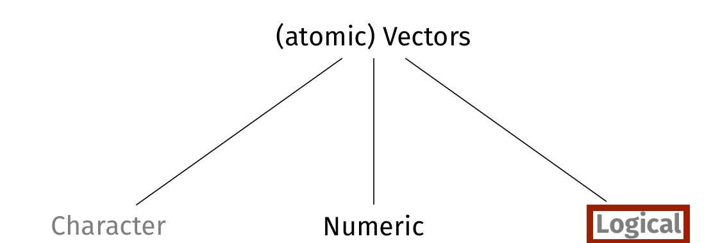
```
]


---
# Numeric vectors

.push-left[
**Numeric** vectors contain sequences of numbers.
```{r}

# Concatenate the sequence 1 2 3 4 5 to a vector
# assign it to object `my_numeric_vector`, 
# and print it.
(my_numeric_vector <- c(1, 2, 3, 4, 5))

# Check the data type using `typeof()`
typeof(my_numeric_vector)
```
]

.push-right[
```{r, echo = FALSE, out.width='100%', fig.align='center'}
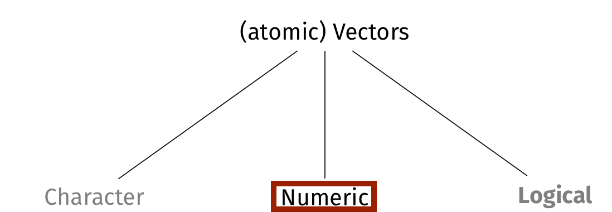
```
]


---
# Numeric vectors

.push-left[
**Numeric** vectors contain sequences of numbers.
```{r}

# Concatenate the sequence 1 2 3 4 5 to a vector
# assign it to object `my_numeric_vector`, 
# and print it.
(my_numeric_vector <- c(1, 2, 3, 4, 5))

# Check the data type using `typeof()`
typeof(my_numeric_vector) #<<
```

.alert[Wait, why is `typeof(my_numeric_vector)` not numeric?]

]

.push-right[
```{r, echo = FALSE, out.width='100%', fig.align='center'}

```
]


---
# Numeric vectors .font60[Integers and Doubles] 

.push-left[
Numeric vectors encompass both **Integer** and **Double** vectors.
```{r}

# Concatenate the sequence 1 2 3 4 5 to a vector
# assign it to object `my_numeric_vector`, 
# and print it.
(my_double_vector <- c(1, 2, 3, 4, 5))
(my_integer_vector <- c(1L, 2L, 3L, 4L, 5L))

# Check the data type using `typeof()`
typeof(my_double_vector)
typeof(my_integer_vector)
```

]

.push-right[
```{r, echo = FALSE, out.width='100%', fig.align='center'}
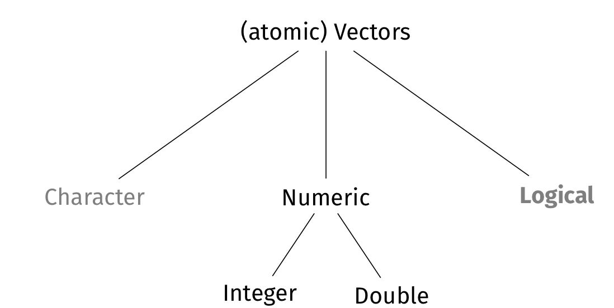
```
]


---
background-image: url(./img/Categorical.jpg)
background-size: contain
class: center

---
layout:true
# Factor vectors

---
.left-column[
```{r, echo = FALSE, out.width='100%', fig.align='center'}
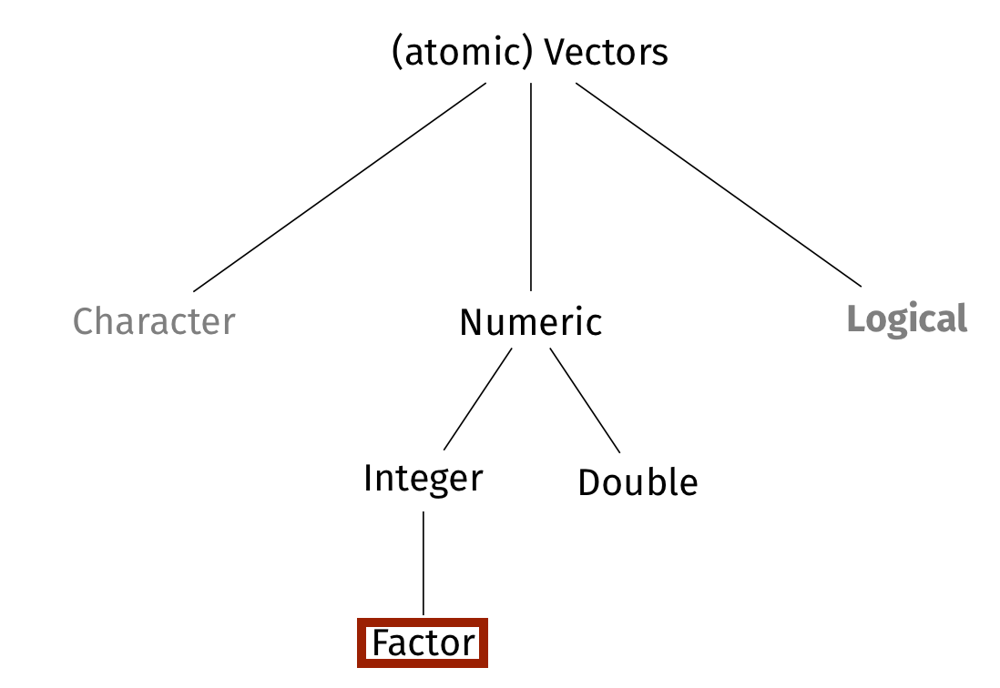
```
]

.right-column[
**Factor** is R's type for categorical data, which classifies observations without a common scale. 

Factors are built up from a sequence of strings, the **values** (i.e., argument x), which R assigns a unique integer under the hood.

```{r}
# Concatenate argument "x" to a factor.
conti <- factor( #<<
  x = c("Europe", "Africa", "Africa", "Asia", "S.America") #<<
) #<<

# Check the data type using `typeof()`
typeof(conti)
```
]

---
.left-column[
```{r, echo = FALSE, out.width='100%', fig.align='center'}

```
]

.right-column[
To link strings to integers, R creates a set of levels. If the sequence of strings does not contain all possible values, it is advisable to pass a vector of all potential values to the **levels** argument.

```{r}
# Print a frequency table of our factor vector.
table(conti)

conti <- factor(
  x = c("Europe", "Africa", "Africa", "Asia", "S.America"),
  levels = c("Africa", "Asia", "Australia", #<<
             "Europe", "N.America", "S.America") #<<
)

# Print a frequency table of our factor vector with
# comprehensive levels.
table(conti)
```
]

---
layout:false
# Date vectors

.push-left[
**Dates** are vectors of the Year-Month-Day (and sometimes -Time) format.
```{r}
# Get the computers current date
Sys.Date() 

# Check the data type using `typeof()`
typeof(Sys.Date())
```

```{r}
# Evaluate the logical statement that
# today is smaller (i.e., before) 
# than the end of the year
Sys.Date() < "2021-12-31"
```

Date vectors are complex, because time is not metric $\rightarrow$ advanced R course.
]

.push-right[
```{r, echo = FALSE, out.width='100%', fig.align='center'}
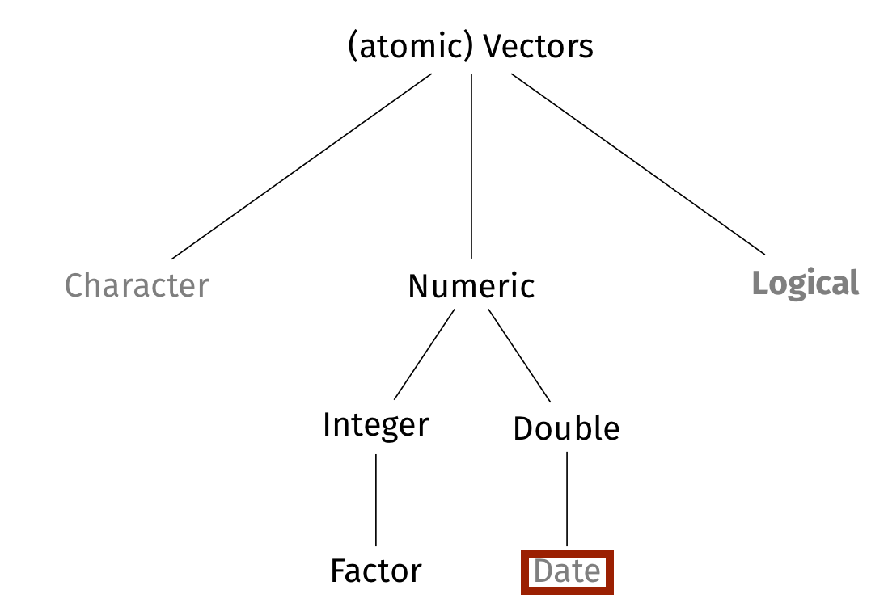
```
]


---
# Data types in vectors

.push-left[
.center[.alert[Atomic vectors cannot contain different data types!]]

```{r, echo = FALSE, out.width='100%', fig.align='center'}
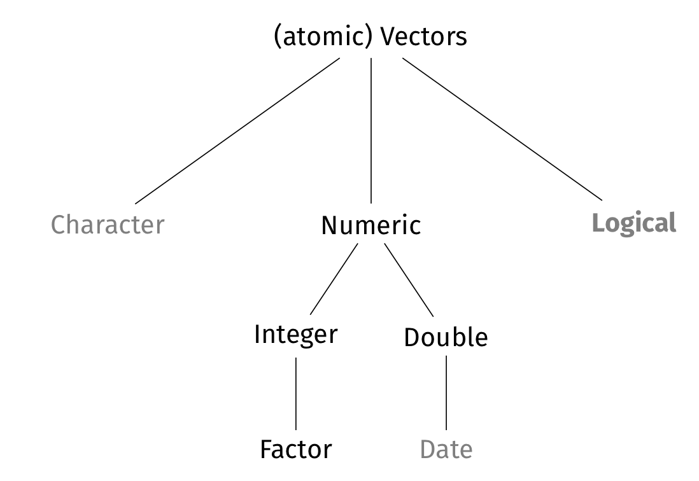
```
]

--

.push-right[
```{r}
# Assign the sequence from 1 to 4 
# to a numeric vector
(another_numeric_vector <- seq(1, 4)) 

# Replace the third element with the string "test"
another_numeric_vector[3] <- "test" 
another_numeric_vector # print x4

# What type of object is another_numeric_vector?
typeof(another_numeric_vector)

# Transform another_numeric_vector back to numeric
as.numeric(another_numeric_vector) 
```
]

---
# NA: Not Available

In general, missing values in R are `NA`. 

```{r}
(another_numeric_vector <- as.numeric(another_numeric_vector)) 
```

--

.push-left[
Many functions will try calculations including `NA` by default. To avoid not receiving a result, we can tell them to ignore `NA`.

```{r}
# Estimate mean of another_numeric_vector
mean(another_numeric_vector)

# Estimate mean of another_numeric_vector ignoring 
# the NA (i.e., casewise deletion)
mean(another_numeric_vector, na.rm = TRUE) 
```
]

--

.push-right[
To test whether an element is `NA` we can use the function `is.na()`. It generates a logical vector that is `TRUE` for missing values.
```{r}
# Which elements are missing?
is.na(another_numeric_vector) 

# Which elements are not missing?
!is.na(another_numeric_vector) 

# Print only non-missing values of another_numeric_vector
another_numeric_vector[!is.na(another_numeric_vector)] 
```
]

---
# First steps with R .font60[Data types and structures, cntd.]

--

Remember that, R's versatility comes from its support of different types and structures of data.

--

### Classes

The three basic data types form the foundation for many different classes of objects. The function `class()` tells you the **class** of an object.

```{r}
# We turned another_numeric_vector back to numeric,
# so let's see if this worked
class(another_numeric_vector) #

# We set up my_character_vector as a sequence of
# strings, so let's check its class
class(my_character_vector)
```

--

Classes also define some more complex data structures, beyond vectors, which we will get to know in the next section.

---
# First steps with R .font60[Data types and structures, cntd.]

Remember that, R's versatility comes from its support of different types and structures of data.

### Classes

In general, functions expect specific classes of objects. If you pass them an object of a class it cannot handle, you will likely encounter en error:

```{r error = TRUE}
# Create a character vector
(alphabet_limits <- c("a","z"))

# Check to see its class
class(alphabet_limits)

# Try to create a sequence of the alpabet
alphabet <- seq(from = alphabet_limits[1],
                to = alphabet_limits[2])
```

---
# First steps with R .font60[Data types and structures, cntd.]

Remember that, R's versatility comes from its support of different types and structures of data.

### Classes

While we use functions to work with objects, they are also objects themselves and have their own class:

```{r}
# Check the class of the function `seq`
class(seq)
```

--

.center[.alert[Avoid naming your objects like existing functions.]]

---
# Getting help

R has a steep learning curve and which can, at times, be simply frustrating. You can access the documentation for a specific function by writing: `?<NAME_OF_FUNCTION>`.

```{r eval = FALSE}
?seq()
```

You can find further useful links under [Resources](https://merfriedo-intro-r-2days.netlify.app/resources/) on the course website.

---
class: inverse
# General lessons


1. R is an **object**-oriented programming language. Objects are flexible containers for anything from data, to functions, other objects, results, figures, and more ... Objects can be called by their name, which needs to start with a letter and cannot contain spaces. If you just type the name of an object, R prints the object.
2. R's basic functionality is built up of **operators** and **functions**. We use **operators** for basic arithmetic, logical operations, and for creating objects. **Functions** provide more complex processing functionality for objects, which we pass as **values** to a function's **arguments**.
3. R knows different data types and structures.   
3.1. The three basic data types in R are **numeric**, **character**, and **logical**, where the numeric type is comprised of **integer** and **double** data. Categorical data in R is represented by **factors** which are built on top of integers, while the **date** type represents temporal data.    
3.2. The most fundamental data structure in R is an (atomic) **vector**: a sequence or chain of one type of information. Elements of a vector can be accessed via their **index** `[i]`. We can feed vectors into an index of another vector to access multiple elements.   
3.3. Objects in R can assume different **classes** which can identify more complex data structures as well as functions.   
5. `NA` stands for "Not Available" and is the code for missing values in R.


---
class: inverse
# Operators

1. `?`: View a function's help file.
2. `#`: defines a **comment** in your code. Comment as much as possible!
3. `<-`: is the **assignment operator** of R.   
3.1. Use it to create objects and assign information to them.     
3.2. Use `Alt` + `-` (Windows) or `Option` + `-` (Mac OS) to create it.
4. `->`: is the **reversed assignment operator** of R. Use it like 3.
5. `+`, `-`, `*`, `\`, `^` : **Arithmetic operators**
6. `==` "Equal", `!=` "Not equal",  `<` "Less than", `>`, `<=` "Less than or equal", `>=`: **Logical** (Boolean) **operators**
7. `&` "and", `|` "or", `!` "not" : **Set operators**


---
class: inverse
# Important functions
1. `c()`: Concatenate a sequence of information into a vector.
2. `factor()`: Create a (categorical) factor vector.
3. `as.numeric()`: Turn a vector into a numeric vector.
4. `table()`: Simple frequency or cross table.
5. `is.na()`: Generate logical vector that identifies missing values.
6. `class()`: Get the class of an object.

---
# References

```{r ref, results = 'asis', echo = FALSE}
PrintBibliography(myBib)
```
