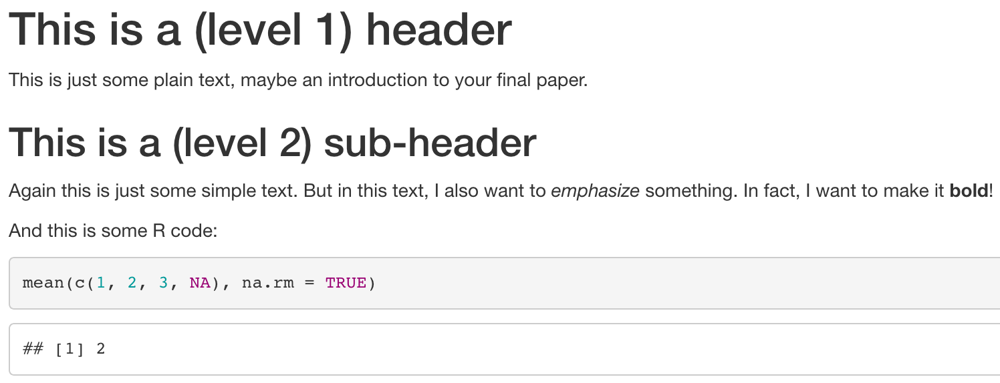

# Work flow

```{r setup, include = FALSE}
library(RefManageR)
library(knitr)
library(equatiomatic)
library(dagitty) # Use the dagitty package
library(ggdag) # Neat visualization of DAGs

options(htmltools.dir.version = FALSE, servr.interval = 0.5, width = 115, digits = 2)
knitr::opts_chunk$set(
  collapse = TRUE, message = FALSE, fig.retina = 3, error = TRUE,
  warning = FALSE, cache = FALSE, fig.align='center',
  comment = "#", strip.white = TRUE)

BibOptions(check.entries = FALSE, 
           bib.style = "authoryear", 
           style = "markdown",
           hyperlink = FALSE,
           no.print.fields = c("doi", "url", "ISSN", "urldate", "language", "note", "isbn", "volume"))
myBib <- ReadBib("./../../intRo.bib", check = FALSE)
```

.push-left[
The normal work flow:

1. R script which contains the *R code* that produces,
2. Our R output: *Figures and Tables*,
3. An MS Word document, which is the *report* describing our results.

```{r, echo = FALSE, out.width='100%'}

```
]

--

.push-right[
.alert[It's disadvantages:]
1. Every time the output changes, we have to revise the Word document.
2. If we comment our R code a lot (as is good practice), we have excessive `#`, and much will be repeated in the 'Data and Methods' section of the Word document.

$\rightarrow$ R Markdown combines R and Markdown to overcome these limitations.
]

---
background-image: url('https://upload.wikimedia.org/wikipedia/commons/thumb/4/48/Markdown-mark.svg/640px-Markdown-mark.svg.png')
background-size: contain
background-position: center
---
# MS Word versus Markdown

.push-left[

Word is a so-called 'What You See is What You Get' text editor. That is, you edit your text and it looks just like the final *formatted document*.

```{r, echo = FALSE, out.width='100%', fig.align='center'}

```

]
--

.push-right[

Markdown separates text editing in *source files*, from the resulting *formatted output*. The source files contain your text and very simple formatting commands:

```markdown
# This is a (level 1) header
This is just some plain text, maybe an introduction
to your final paper.

## This is a (level 2) sub-header
Again this is just some simple text. But in this text,
I also want to *emphasize* something. In fact, I want
to make it **bold**!

```

```{r, echo = FALSE, out.width='100%', fig.align='center'}

```

]

---
background-image: url('https://bookdown.org/yihui/rmarkdown/images/hex-rmarkdown.png')
background-size: contain
background-position: center

---
# R Markdown

.push-left[

R Markdown allows you to insert *R code chunks* into your Markdown source file:

````markdown
# This is a (level 1) header
This is just some plain text, maybe an introduction
to your final paper.

## This is a (level 2) sub-header
Again this is just some simple text. But in this text,
I also want to *emphasize* something. In fact, I want
to make it **bold**!

And this is some R code:

```r
mean(c(1, 2, 3, NA), na.rm = TRUE)
```
````
]

--

.push-right[
When you turn the source file into a formatted output, the R code will be *evaluated* and with its output, nicely rendered and inserted into your formatted document:

```{r, echo = FALSE, out.width='100%', fig.align='center'}

```

]

---
layout: true
# Getting started with R Markdown
---

.left-column[
First, open your R Studio project and install 'rmarkdown'.
```r
install.packages("rmarkdown")
```
]

--

.right-column[
.center[Then start a new R Markdown document.]
```{r, echo = FALSE, out.width='100%', fig.align='center'}

```
]

---

```{r, echo = FALSE, out.width='50%', fig.align='center'}

```

---

```{r, echo = FALSE, out.width='80%', fig.align='center'}

```

---
layout: false
# Klick 'Knit' to compile

.left-column[

```{r, echo = FALSE, out.width='100%', fig.align='center'}
knitr::include_graphics('https://ih0.redbubble.net/image.543341178.1637/flat,750x,075,f-pad,750x1000,f8f8f8.u1.jpg')
```
]

.right-column[
```{r, echo = FALSE, out.width='100%', fig.align='center'}

```
]
---
# What happens in the background

```{r, echo = FALSE, out.width='60%', fig.align='center'}
knitr::include_graphics('https://d33wubrfki0l68.cloudfront.net/61d189fd9cdf955058415d3e1b28dd60e1bd7c9b/9791d/images/rmarkdownflow.png')
```

---
# Four remaining topics

1. Markdown formatting commands,
2. R Code chunk options,
3. The YAML header (e.g., how to produce a word file),
4. Citation.

---
# Markdown formatting commands

```{r, echo = FALSE, out.width='100%', fig.align='center'}

```

---
class: inverse
# Exercise 1

Revise your R Markdown template to a draft of your final paper:
1. Delete the template text.
2. Add a brief intro about your research agenda.
3. Add a link to your homepage or your organization's homepage.
4. Give that paragraph the heading "Introduction".
5. Use Markdown code to emphasize which one or two phenomena you are mainly interested in.
6. Make a list of some of the drivers of that phenomenon.
7. Knit it.

---
# R code chunks

.push-left[
You can initiate an R code chunk with $\rightarrow$

Everything between ` ```{r} ` ...  ` ``` ` is evaluated as R code. Moreover, results produced by that R code are pasted into your document.

R output can be customized with [chunk options](http://yihui.name/knitr/options/), which you can add to the initiation:

` ```{r, echo = FALSE, message = FALSE, warning = FALSE} `
.font80[
  - `include = FALSE` prevents code and results from appearing in the final document, although R will evaluate the code.
  - `echo = FALSE` prevents code, but not the results from appearing in the finished file.
  - `message = FALSE` prevents messages that are generated by code from appearing in the final document.
  - `warning = FALSE` prevents warnings that are generated by code from appearing in the final document.

]]

.push-right[
````markdown 
```r

```
P.S.: You should write {r}, not r
````

````markdown 
```{r}
5 + 8
```
P.S.: You should write {r}, not r
````
]

---
# Further important R code chunks

.push-left[
#### Options for (regression) tables as output:

- `results = 'asis'` prevents Knitr from further processing the R output. This is necessary, for instance, when you generate an html regression table with 'texreg'. Note that this will not work with a Word document as output.
]

.push-right[
#### Options for figures as output:

- `out.width = "90%"` size of the figure in % of the width of your document.
- `fig.align = "center"` centers the figure in the middle of the document. Alternatives are `"left"` or `"right"`.
- `fig.cap = "This is my beautiful figure"` adds a caption to the figure.
- `dpi = 200` defines pixel resolution of the figure.
- `fig.width = 8` defines the width of the figure in inches.
- `fig.height = 4` defines the height of the figure in inches.
]

---
class: inverse
# Exercise 2

Add three R code chunks to your final paper:
1. Add a code chunk that loads the libraries that you are going to use. Make sure that R evaluates the chunk, but that it gives no warnings, no messages, etc..
2. Add a chunk that downloads the ESS data pipes it into a `transmute()` and performs some initial recodings.
3. Add a code chunk that adds a figure (histogram or scatter plot) to your final document.

---
layout: true
# The YAML header .font60[Meta data for your document]
---

.push-left[

```yaml
title: My Title
subtitle: My subtitle
author: Merlin Schaeffer
date: "`r Sys.Date()`"
output: html_document
```

```{r, echo = FALSE, out.width='70%', fig.align='center'}
knitr::include_graphics('./img/rmarkdownoutputformats.png')
```

]

.push-right[
Among others, the following additional output formats are available:

- `pdf_document` creates a PDF via LaTeX, which you will need to install. RStudio will prompt you if you don’t already have it.

- `word_document` for Microsoft Word documents (.docx).

- `odt_document` for Open Document Text (.odt).

- `rtf_document` for Rich Text Format (.rtf).
]

---


.push-left[

```yaml
title: My Title
subtitle: My subtitle
author: Merlin Schaeffer
date: "`r Sys.Date()`"
output: ioslides_presentation
```

```{r, echo = FALSE, out.width='70%', fig.align='center'}
knitr::include_graphics('./img/rmarkdownoutputformats.png')
```
]

.push-right[
You might even try out Presentations:

- `ioslides_presentation` makes HTML presentation with ioslides.
- `slidy_presentation` makes HTML presentation with W3C Slidy.
- `beamer_presentation` makes a PDF presentation with LaTeX Beamer (if you have installed Latex).
- `powerpoint_presentation` makes an MS PowerPoint presentation.

`---` defines the beginning of a new slide.

.backgrnote[I personally use [Xaringan](https://bookdown.org/yihui/rmarkdown/xaringan.html) to make these slides.]
]

---
layout: false
# Citation

.left-column[
If you do not work with any software to manage your literature yet, start using (open source) [Zotero](https://www.zotero.org/)!

```{r, echo = FALSE, out.width='100%', fig.align='center'}
knitr::include_graphics('https://user-images.githubusercontent.com/45201036/52821337-90ef4f00-30bf-11e9-9087-01734395656a.png')
```
]

.right-column[
```{r, echo = FALSE, out.width='100%', fig.align='center'}

```
]

---
layout: true
# Citation .font60[Export your references as 'Bibtex' file]
---

```{r, echo = FALSE, out.width='40%', fig.align='center'}

```

---

```{r, echo = FALSE, out.width='70%', fig.align='center'}

```

---

```{r, echo = FALSE, out.width='50%', fig.align='center'}

```

---

```{r, echo = FALSE, out.width='75%', fig.align='center'}
knitr::include_graphics('./img/Bibtex5.png')
```

---
layout: false
# In-text citation and list of references

.push-left[
Add Bibtex file as bibliography to your YAML header:
```yaml
title: My Title
subtitle: My subtitle
author: Merlin Schaeffer
date: "`r Sys.Date()`"
output: html_document
bibliography: IntRo.bib
```
]

--

.push-right[
Simple in-text citation in R Markdown:
```markdown
This is a claim for which I need a reference 
[@wilkinson_religiosity_2004]. I continue with my paper.

...

To finally add the list of reference, I simply add:

# References
```

```{r, echo = FALSE, out.width='100%', fig.align='center'}

```
]

---
background-image: url(https://mareds.github.io/r_course/img_site/Tidyverse_packages.png)
background-size: contain
background-position: center
class: clear center

--

<br>
.alert[.font200[Thank you for a fun course!]]