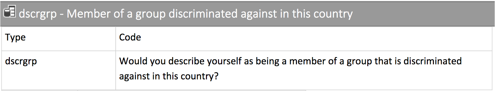

# Processing atomic vectors .font60[Numeric vectors]

```{r setup, include = FALSE}
library(RefManageR)
library(knitr)

options(htmltools.dir.version = FALSE, servr.interval = 0.5, width = 115, digits = 3)
knitr::opts_chunk$set(
  collapse = TRUE, message = FALSE, fig.retina = 3, error = TRUE,
  warning = FALSE, cache = FALSE, fig.align = 'center',
  comment = "#", strip.white = TRUE, tidy = FALSE)

BibOptions(check.entries = FALSE,
           bib.style = "authoryear",
           style = "markdown",
           hyperlink = FALSE,
           no.print.fields = c("doi", "url", "ISSN", "urldate", "language", "note", "isbn", "volume"))
myBib <- ReadBib("./../../intRo.bib", check = FALSE)

xaringanExtra::use_xaringan_extra(c("tile_view", "tachyons"))
xaringanExtra::use_panelset()
```

.push-left[
```{r, echo = FALSE, out.width='100%', fig.align='center'}

```

- Atomic vectors    
    - are a fundamental building block in R 
    - can only contain _one_ type of data
    - require different modes of processing

]

--

.push-right[
**Numeric** vectors allow ...

... _arithmetic operations_.
```{r}
# Create numeric vector x1
(x1 <- c(3,6,9))

# Add 5 to each element and assign
(x1 <- x1 + 5)
```

... a myriad of advanced _functions_.<br> .backgrnote[See Chapter [5 Data transformation](http://r4ds.had.co.nz/transform.html) of `r Citet(myBib, "grolemundDataScience2017")` for further examples.]

```{r}
# Assign logarithm with base 2 of x1 to x1.
(x1 <- log2(x1)) 
```
]

---
# Processing atomic vectors .font60[Factor vectors]

.push-left[
**Factor** vectors *cannot* be *numerically* transformed, since they are categorical.

If you attempt to do so, the result is `NA`.

```{r error = TRUE}
# Create factor vector conti
conti <- factor(
  x = c("Europe", "Africa", "Africa", "Asia", "S.America"),
  levels = c("Africa", "Asia", "Australia",
             "Europe", "N.America", "S.America")
) 

# Multiply conti by 2
conti * 2
```

.center[.alert[Processing factors in R differs fundamentally from working with numeric vectors!]]
]

--

.push-right[
*Base* R can be tedious and confusing when working with factors. Instead, we learn to use functionality from the `forcats` package, part of the tidyverse, to process them.
```{r, echo = FALSE, out.width='50%', fig.align='center'}
knitr::include_graphics('https://forcats.tidyverse.org/logo.png')
```

]

---
# Processing atomic vectors .font60[Factor vectors]

.push-left[
**Factor** vectors *cannot* be *numerically* transformed, since they are categorical.

If you attempt to do so, the result is `NA`.

```{r error = TRUE}
# Create factor vector conti
conti <- factor(
  x = c("Europe", "Africa", "Africa", "Asia", "S.America"),
  levels = c("Africa", "Asia", "Australia",
             "Europe", "N.America", "S.America")
) 

# Multiply conti by 2
conti * 2
```

.center[.alert[Processing factors in R differs fundamentally from working with numeric vectors!]]
]

.push-right[
*Base* R can be tedious and confusing when working with factors. Instead, we learn to use functionality from the `forcats` package, part of the tidyverse, to process them.
```{r, echo = FALSE, out.width='50%', fig.align='center'}
knitr::include_graphics('https://forcats.tidyverse.org/logo.png')
```


.center[.alert[Wait, tidyverse? Packages? What is all of this?]]
]


---
# Packages in R

--

.push-left[
A **package** is a collection of functions and their documentation (sometimes also data). Every installation of R comes with the *base* package pre-installed. 

R's versatility comes from additional, user-written packages. Many of these are hosted on the *Comprehensive R Archive Network (CRAN)*. 

To install any of the 17,000+ packages on CRAN, write `install.packages("name_of_the_package")`.

.backgrnote[Do not add the `install.packages()` call to your R Scripts. Installation downloads the package to your computer, which is required only once.]

]

--

.push-right[
The `tidyverse` is a collection of such user-written packages which includes `forcats` and many other packages we will be using.

```{r, echo = FALSE}
knitr::include_graphics('https://www.tidyverse.org/images/tidyverse-default.png')
```


Please install the tidyverse package now by typing: `install.packages("tidyverse")` into the *console*.
]

???

- Installing a package downloads it to your computer, BUT
- Does not give access in R session


---
# The library

.left-column[
```{r, echo = FALSE, out.width='100%', fig.align='center'}
knitr::include_graphics('https://bucket.trending.com/trending/reddit/2016-12-11/the-incredible-library-at-the-university-of-copenhagen-in-denmark_preview.jpg')
```
]

.right-column[
Since all functions need names and there are so many user-written packages, multiple functions sometimes have the same, *conflicting name*. 

To avoid conflicts, you need to explicitly specify the packages you work with in each R session. To do is, write `library(package_name)`.<br>
.backgrnote[Best practice is to specify all needed packages at the top of your R script.]

Please add the tidyverse to your R session's library by writing the following as the very first line in your R script.

```{r}
# Add tidyverse package to library
library(tidyverse) 
```

.backgrnote[Some `tidyverse` functions conflict with Base R's `stats` package. To call a function from a specific package write `package_name::function_name()`.]
]

???

- Syntax difference between install.packages and library
- Tidyverse is a collection of packages, with uniform logic and syntax

---
# The library

.left-column[

```{r, echo = FALSE, out.width='100%', fig.align='center'}
knitr::include_graphics('https://bucket.trending.com/trending/reddit/2016-12-11/the-incredible-library-at-the-university-of-copenhagen-in-denmark_preview.jpg')
```
]

.right-column[
Since all functions need names and there are so many user-written packages, multiple functions sometimes have the same, *conflicting name*. 

To avoid conflicts, you need to explicitly specify the packages you work with in each R session. To do is, write `library(package_name)`.<br>
.backgrnote[Best practice is to specify all needed packages at the top of your R script.]

Please add the tidyverse to your R session's library by writing the following as the very first line in your R script.

```{r}
# Add tidyverse package to library
library(tidyverse) 
```

.backgrnote[Some `tidyverse` functions conflict with Base R's `stats` package. To call a function from a specific package write `package_name::function_name()`.]

.center[.alert[With this clarified, let's return to processing factor vectors.]]
]

---
# Processing atomic vectors .font60[Factor vectors]

.left-column[
```{r, echo = FALSE, out.width='60%', fig.align='center'}
knitr::include_graphics('https://forcats.tidyverse.org/logo.png')
```
]

.right-column[
Factors can best be **recoded** using `fct_recode()` from the `forcats` package.

```{r message = FALSE, warning = FALSE}
# Recode conti to German
# Not syntax: first the new, then the old value...
conti <- fct_recode(conti, #<<
                    "Europa" = "Europe", #<<
                    "Afrika" = "Africa", #<<
                    "Asien" = "Asia", #<<
                    "Suedamerika" = "S. America", #<<
                    "Nordamerika" = "N. America", #<<
                    "Australien" = "Australia") #<<

# Frequency table of conti
table(conti) 
```

`forcats` contains [many more useful functions](https://forcats.tidyverse.org/reference/index.html) to process factors, including changing the order of levels `fct_relevel()` and removing unused levels `fct_drop()`!<br> .backgrnote[[Chapter 15 Factors](https://r4ds.had.co.nz/factors.html) in `r Citet(myBib, "grolemundDataScience2017")` provides a thorough introduction.]
]

???

- forcats is a package for working with factors (and an anagram)
  - many package creators are fans of puns
- Pay attention to syntax, new_value = old value

---
# Building up from vectors

```{r}
# Add packages for this session to library
library(tidyverse) # Add the tidyverse package to my current library.
library(haven) # Read and handle SPSS, Stata & SAS data (installed with tidyverse)
library(essurvey) # Add ESS API package to library. (needs to be installed first) #<<

# Now create a couple of vectors.
(age <- c(34, 22, 42, 12, 76))
(conti <- factor(x = c("Europe", "Africa", "Africa", "Asia", "S. America"),
                 levels = c("Africa", "Asia", "Australia", "Europe", "N. America", "S. America")))
(employed <- c(FALSE, TRUE, TRUE, TRUE, TRUE))
(name <- c("Agnes", "Martin", "Hakan", "Tu", "Thais"))
(nr_kids <- c(1, 0, 3, 0, 4))
```

???

- vectors as basic building blocks in R
- are limited (one data type) and can be tedious to work with
- need more advanced data structure

---
background-image: url('http://www.europeansocialsurvey.org/about/news/img/round7.png')
background-size: cover
class: center middle

.white[.font200[**Tabular Data**]]

---
# Tabular Data .font60[Data frames]

**Data frames** organize vectors of *equal length* along their indices.

```{r}
# Bind our 4 vectors along their index into a data frame.
# Assign that data frame to object "Dat".
(Dat <- data.frame(name, age, conti, employed, nr_kids))
```

--

.center[Data frames are base R's data structure for "rectangular" or tabular data:]
```{r, echo = FALSE, out.width='60%'}
knitr::include_graphics('https://d33wubrfki0l68.cloudfront.net/6f1ddb544fc5c69a2478e444ab8112fb0eea23f8/91adc/images/tidy-1.png')
```


???

- Data frames are base R data structure for tabular data
- Terminology:    
  - columns = variables
  - rows = observations
  - cells = values

---
background-image: url('http://www.europeansocialsurvey.org/about/news/img/round7.png')
background-size: cover
class: center middle

```{r, echo = FALSE, out.width='30%'}
knitr::include_graphics('https://raw.githubusercontent.com/rstudio/hex-stickers/master/PNG/tibble.png')
```

???

- more convenient, tidyvere tabular structure: tibble

---
# Tabular Data .font60[Tibbles]

**Tibbles** are data frames. But they have some improved features, so we will work with them.

--

.push-left[
Compare how our data frame prints.
```{r}
# Print basic data frame
Dat
```
]

--

.push-right[
To how the same data prints as a tibble
```{r}
# Turn data frame into tibble and print
(Dat <- as_tibble(Dat))
```
]

???

- tibbles:
  - summarize information about cols and rows
  - show the type of each vector
  - only preview the first few rows (can't see here)

---
# Accessing variables .font70[The `$` operator]

The base R way to access a single variable in tabular data uses the `$` operator: `data_frame$variable`.

```{r}
# Return variable "age" contained in tibble Dat.
Dat$age
```

--

We can then work with that individual variable, such as getting some summary information.

```{r}
# Give a summary of numeric vector age contained in Dat.
summary(Dat$age)
```

--

```{r}
# Give a summary of factor vector conti contained in Dat.
summary(Dat$conti)
```

.center[.content-box-green[
Wait, why does `summary()` give me first some summary statistics and then a frequency table?
]]

---
layout:true
# Accessing variables .font70[The `select()` function]

---

The `tidyverse` adds functionality to access multiple variables at once using the `select` function.

```{r}
# Select from tibble Dat the variables name and nr_kids,
# and assign them to the new object Dat_small.
(Dat_small <- select(Dat, name, nr_kids))
```

---

In addition to accessing variables by name, **helper functions** from the `tidyverse` allow us to access them based on conditions, see `?select` for details.
```{r}
# Select from object Dat all variables that start with n,
# and assign the result to a new object Dat_small.
(Dat_small <- select(Dat, starts_with("n")))
```

---
layout:false
layout:true
# Accessing observations .font70[The `filter()` function]

---

To access _observations_ in a tabular data structure, the `tidyverse` provides the `filter()` function which accesses them via conditions.

```{r}
# Return all cases contained in Dat with value "Africa" in conti.
(Dat_small<- dplyr::filter(Dat, conti == "Africa"))
```

--

We can also use base R to do this, similar to indexing of vectors with `[]`.

```{r}
# Or use the index, to achieve the same.
(Dat_small <- Dat[Dat$conti == "Africa", ])
```

---

We can also use base R to do this, similar to indexing of vectors with `[]`.

```{r}
# Or use the index, to achieve the same.
(Dat_small <- Dat[Dat$conti == "Africa", ])
```

.center[.content-box-green[
Why is there a `,` after `"Africa"`?
]]

---
layout:false
# Indexing tabular data .font70[[Rows, columns]]

In contrast to vectors, data frames and tibbles have rows and columns. R's index thus distinguishes `[rows, columns]`. The `,` after `"Africa"` tells R that we talk about rows. To understand how the index method works, remember logical vectors:

.push-left[
```{r}
# Print factor conti contained in tibble Dat.
Dat$conti

# Return a logical vector of whether the different
# elements in Dat$conti equal "Africa".
Dat$conti == "Africa"

# Feed the logical vector to the index of Dat
# to select TRUE cases from "Africa".
(Dat_small <- Dat[Dat$conti == "Africa", ])
```
]

--

.push-right[
```{r}
# Create a new logical variable called "selector",
# which identifies cases with "Africa" in Dat$conti.
Dat$selector <- Dat$conti == "Africa"

# Print Dat.
Dat
```
]

---

# Processing a variable .font60[In tabular data]

To transform and recode a variable in place, simply use `$` to clarify which one you are referring to and remember to assign the result.
```{r}
# Center age around the average age.
(Dat$age <- Dat$age - mean(Dat$age))
```

```{r}
# Recode "Africa" to "Afrika!".
(Dat$conti <- fct_recode(Dat$conti, "Afrika!" = "Africa"))
```

--

To create a new variable instead, assign the result to a new name.
```{r}
# Divide age by its standard deviation;
# now it is z-standardized (mean = 0, sd = 1).
(Dat$z_age <- Dat$age / sd(Dat$age))
```

---
# Processing several variables  .font60[In tabular data]

Processing one variable at a time can become tedious. To simplify processing variables from the same tibble, the `tidyverse` provides the `mutate()` function.

```{r}
(Dat <- mutate(Dat,                              # Use the Dat tibble. #<<
              nr_kids = nr_kids - mean(nr_kids), # Transform to deviation from average.
              z_nr_kids = nr_kids / sd(nr_kids), # z-standardize nr_kids.
              conti = fct_recode(conti,          # Recode conti.
                                 "Europa!" = "Europe", # "Europe" to "Europa!".
                                 "Asien!" = "Asia")    # "Asia" to "Asien!".
              ) # Don't forget to close mutate's bracket ")" #<<
 )
```
.center[.backgrnote[Note how RStudio structures your code. This helps you to understand, within which function or parenthesis things are happening.]]

???

- point to nested functions "mutate(mean(), fct_recode)"
- RStudio helps you with automatically providing closing brackets
- If you encounter an error, check if all brackets are close and contain the right things

---
layout:true
# Conditional processing .font60[(i.e., for filtered cases)]

---

In many cases, you will want to change values only for cases meeting specific conditions. For such complex processing, the `tidyverse` provides the function `case_when()`.

```{r}
Dat <- mutate(
  Dat, # Mutate variables contained in Dat.
  conti = case_when( # Start conditional recode of conti, #<<
    employed == FALSE & conti == "Afrika!" ~ "Atlantis", # 1. complex condition ~ new value "Atlantis", #<<
    age < 0 & nr_kids < -1  ~ "Antarctica",              # 2. complex condition ~ new value "Antarctica", #<<
    TRUE ~ as.character(conti)                           # 3. and all others ~ leave as is; #<<
  ) # close case_when's bracket. #<<
) # close mutate's bracket
```

???

- point out syntax:
  - condition (including potentially old value) ~ new values
  - case_when specifies condition, still need mutate to change values

---

```{r eval = FALSE}
(Dat <- mutate(
  Dat, # Mutate variables contained in Dat.
  conti = case_when( # Start conditional recode of conti, #<<
    employed == FALSE & conti == "Afrika!" ~ "Atlantis", # 1. complex condition ~ new value "Atlantis", #<<
    age < 0 & nr_kids < -1  ~ "Antarctica",              # 2. complex condition ~ new value "Antarctica", #<<
    TRUE ~ as.character(conti)                           # 3. and all others ~ leave as is; #<<
  ) # close case_when's bracket. #<<
)) # close mutate's (and the print) bracket .
```

The three lines of this `case_when()` application do the following thing:

--

1. For all non-employed African cases ~ recode conti to "Atlantis".

--

2. For all those who're younger than 0 and have less than -1 kids ~ recode conti to "Antarctica".

--

3. All remaining cases ~ use their original conti values, but transform them to a character vector.
 - .alert[Remember, vectors can only contain one type of data!] We cannot enter factor data into a character vector. Because we give `case_when()` "Atlantis" and "Antarctica" as new values, it assumes that we want to make conti a character vector. Thus we cannot supply the former factor values in line three.

???

- remember that factor values are integer under the hood
- thus not transforming to character would mean adding integer/numeric values

---
layout:false
# Conditional processing .font60[`case_when()` and `NA`]

```{r error = TRUE}
(Dat <- mutate(
  Dat,
  conti = case_when( # Start conditional recode of conti,
    employed == FALSE & conti == "Afrika!" ~ "Atlantis", # 1. complex condition ~ new value "Atlantis",
    age < 0 & nr_kids < -1  ~ "Antarctica",              # 2. complex condition ~ new value "Antarctica",
    TRUE ~ NA                           # 3. and all others ~ NA #<<
  ) # close case_when's bracket.
)) # close mutate's (and the print) bracket.
```

When working with missing data in `case_when`, we also need to be cognizant of the type of the data. When look into the documentation for `NA` by writing `?NA`, you will learn:
> "*NA is a logical* constant of length 1 which contains a missing value indicator. *NA can be coerced to any other vector type* except raw." 
  
---
# Conditional processing .font60[`case_when()` and `NA`]

`NA` has a type, too! Therefore, we need to coerce `NA` into the appropriate type with `as.character()`/`as.numeric()`.
```{r error = TRUE}
(Dat <- mutate(
  Dat,
  conti = case_when( # Start conditional recode of conti,
    employed == FALSE & conti == "Afrika!" ~ "Atlantis", # 1. complex condition ~ new value "Atlantis",
    age < 0 & nr_kids < -1  ~ "Antarctica",              # 2. complex condition ~ new value "Antarctica",
    TRUE ~ as.character(NA)                              # 3. and all others ~ NA #<<
  ) # close case_when's bracket.
)) # close mutate's (and the print) bracket.
```
.center[.backgrnote[Alternatively, you can also use the type-specific missing values: `NA\\\_character\\\_`, `NA\\\_real\\\_`, etc..]]

---
background-image: url('http://www.europeansocialsurvey.org/docs/img/general_banner.jpg')
background-size: contain
background-position: center

# Setup for next steps

.push-left[
<br>
Please register as a user for the API of<br> the European Social Survey [here](https://www.europeansocialsurvey.org/user/new)
<br><br>
```{r, echo = FALSE, out.width='70%', fig.align='left'}
knitr::include_graphics('https://encrypted-tbn0.gstatic.com/images?q=tbn:ANd9GcQc8K5da5GSR5c4x4lJBIaBheKgcqfNjFfihonLBJWqbzUYVitp&s')
```
]

---
# Importing Data .font60[Local data]

The classic way to work with actual data, is to download them to some folder and to then import them to your software environment. The tidyverse contains three packages for importing local data from your machine:

--

.push-left[
```{r, echo = FALSE, out.width='30%', fig.align = 'center'}
knitr::include_graphics('https://haven.tidyverse.org/logo.png')
```

- The `haven` package allows you to import Stata, SPSS, and SAS files. .backgrnote[See the `haven` website for details [here](https://haven.tidyverse.org/).]
```{r eval = FALSE}
# Create an object ESS and assign the
# imported ESS.dta to it, if you have
# downloaded it into your intro_r folder
ESS <- read_dta("ESS8e02_1.dta")
```
]

--

.push-right[
.push-left[
<br>
```{r, echo = FALSE, out.width='65%', fig.align = 'center'}
knitr::include_graphics('https://readr.tidyverse.org/logo.png')
```
]
.push-right[
<br>
```{r, echo = FALSE, out.width='65%', fig.align = 'center'}
knitr::include_graphics('https://readxl.tidyverse.org/logo.png')
```
]
.white[vcdv]
- The `readr` package allows you to import csv, tsv and fwf files.<br> .backgrnote[See the `readr` website [here](https://readr.tidyverse.org/) and this [cheat sheet](https://rawgit.com/rstudio/cheatsheets/master/data-import.pdf) for details.]
- The `readxl` package allows you to read in Excel's xlsx files. .backgrnote[See the  `readxl` website for more [here](https://readxl.tidyverse.org/).]
]

???

- In this workshop, we will use a non-traditional approach and access the data directly from their online repository

---
# Importing Data .font60[Using the ESS API]

--

The `essurvey` package, allows us to download ESS data directly into our R session using the `import_rounds()` function. .backgrnote[If you did not install and load the package yet, run `install.packages("essurvey")` in your Console, then add `library(essurvey)` to your script)

```{r eval = FALSE}
# Import the ESS round 9 data via the API
ESS <- import_rounds(rounds = 9, ess_email = "YOUR-EMAIL", format = "spss")
```

--

Note: .alert[using an API requires internet access!] So, consider placing data import and transformation in a dedicate R script.

```{r include = FALSE}
library(essurvey) # Add ESS API package to library.

# Import the ESS round 9 data via the API
ESS <- import_rounds(rounds = 9, ess_email = "merlin.schaeffer@uni-koeln.de", format = "spss")
```

```{r}
ESS
```

---
# First steps with the ESS

.push-left[
```{r, echo = FALSE, out.width='100%'}

```

```{r}
# A frequency table to get a first impression
# of the variables values and frequencies.
table(ESS$dscrgrp)
```
]

--

.push-right[
.center[This is not too insightful...<br>Remember how R uses _factors_ for _categorical data_? <br> This is in contrast to labels in Stata or SPSS.]

```{r, echo = FALSE, out.width='40%', fig.align='center'}
knitr::include_graphics('https://i.vimeocdn.com/portrait/3399477_300x300')
```
]

???

- There is no native R data we can download from ESS API
- Instead we downloaded SPSS format with labels

---
# Importing Data .font60[Labelled data]


R imports Stata and SPSS labels, but cannot handle them. Thus, when you import Stata or SPSS data,<br>
... you need to .alert[transform labelled variables into **numeric or factor**] before analyzing them.

--

.push-left[
If you want to use a variable as categorical, use `as_factor()` to make the labels the new factor levels:
```{r comment = '#'}
# Make the labelled variable "dscrgrp" a factor.
ESS$dscrgrp <- as_factor(ESS$dscrgrp) #<<

# A frequency table to get a first impression
# of the variables values and frequencies.
table(ESS$dscrgrp)
```
]

--

.push-right[
If you want to use a variable as numeric, use `zap_labels()` to prevent problems with the imported labels:

```{r comment = '#'}
# Strip/zap the labels from the numeric variable agea.
ESS$agea <- zap_labels(ESS$agea) #<<

# A summary of descriptive statistics
# to get a first impression of the variable.
summary(ESS$agea)
```

]

---
class: inverse
# General lessons

1. When processing data in R, we need to be cognizant of the data type. We can *transform* numeric vectors with arithmetic operators and a myriad of different functions. We can *recode* factor vectors with the `fct_recode()` function.
2. Advanced R functionality is bundled up in *packages*, which are collections of functions along with their documentation. To avoid conflicts, you need to add the packages you will use in a given R session to the *library*.
3. *Data frames* organize equally-sized vectors along their indices; *Tibbles* are modernized data frames. The indices of data frames/tibbles are organized as `[row, column]`.
4. To work with tabular data we need to be able to subset data to specific variables or observations. Both is possible via the index `[row, column]`, but the `tidyverse` functions `filter()` (for case selection) and `select()` (for variable selection) provide a more convenient approach.
5. R code may be *nested*, that is, you can write functions into functions. This is particularly important for *helper functions* make specific tasks easier but work only within the function for which they were designed.
6. In the `tidyverse`, we use `mutate()` to process variables and `case_when` for more complex transformation or conditional processing.
7. R has no labels. Instead, it uses *factors* for categorical data. To work with labelled data from Stata or SPSS, we need to transform first using `zap_labels()` for numeric variables and `as_factor()` for categorical ones.

---
class: inverse
# New operators

1. `$`: Allows your to access vectors contained in a data frame/tibble.

---
class: inverse
# Important functions
1. `data.frame()`: Organize several vectors of equal length by their index.
2. `as_tibble()`: Take a data frame and turn it into a tibble.
3. `summary()`: Give a summary of an object, result depends on object's class.
4. `select()`: Access one or more variables from a data frame/tibble.
5. `filter()`: Subset observations based on conditions (i.e. values in variables). 
6. `mutate()`: Process one or more variables from a data frame/tibble. Keeps all other variables.
7. `case_when()`: Conditionally process variables based on one or more conditions.
8. `as_factor()`: Turn a labelled Stata/SPSS variable into a factor.
9. `zap_labels()`: Turn a labelled Stata/SPSS variable into a numeric vector.