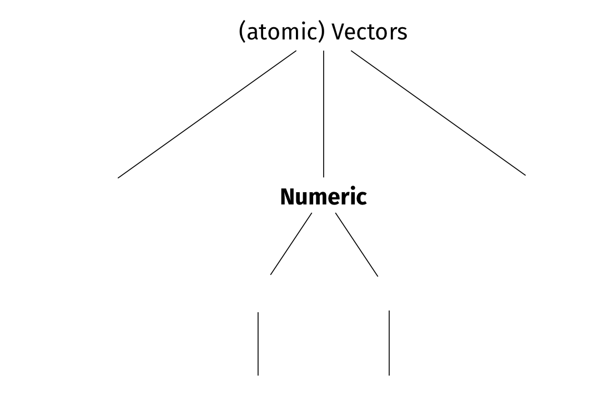
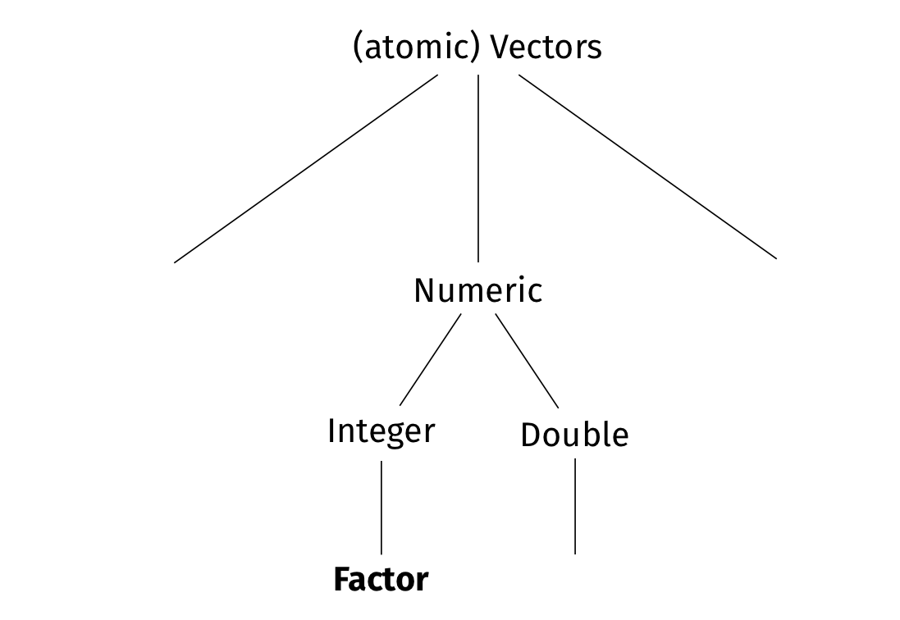
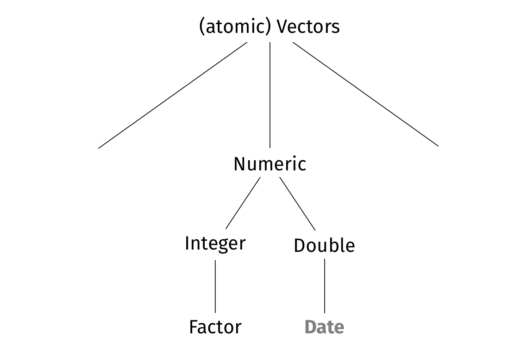

background-image: url(https://cdn.datamentor.io/wp-content/uploads/2017/11/r-vector.jpg)
background-size: cover
class: center

---
class: clear

<iframe src="https://app.sli.do/event/aflvddc2" height="100%" width="100%" frameBorder="0" style="min-height: 560px;"></iframe>

---
# (atomic) Vector

```{r setup, include = FALSE}
library(RefManageR)
library(knitr)

options(htmltools.dir.version = FALSE, servr.interval = 0.5, width = 115, digits = 3)
knitr::opts_chunk$set(
  collapse = TRUE, message = FALSE, fig.retina = 3, error = TRUE,
  warning = FALSE, cache = FALSE, fig.align = 'center',
  comment = "#", strip.white = TRUE, tidy = FALSE)

BibOptions(check.entries = FALSE, 
           bib.style = "authoryear", 
           style = "markdown",
           hyperlink = FALSE,
           no.print.fields = c("doi", "url", "ISSN", "urldate", "language", "note", "isbn", "volume"))
myBib <- ReadBib("./../../intRo.bib", check = FALSE)

xaringanExtra::use_xaringan_extra(c("tile_view", "tachyons"))
xaringanExtra::use_panelset()
```

The most fundamental data type in R is a (atomic) **vector**: a sequence/chain/series of information. You can "concatenate" information into a vector by using `c()`:

```{r}
# Concatenate the sequence 5 4 3 2 1 to a vector, assign it to object x1, and print it.
(x1 <- c(5, 4, 3, 2, 4))
```

--

You can access a specific *element* of a vector via it's vector[**index**]:
```{r}
# Print the second element of x1.
x1[2]
```

--

If you want to access several elements, you need to supply another vector to the vector's index:
```{r }
# Print the second and fourth element of x1.
x1[c(2, 4)]
```

---
background-image: url(https://markosun.files.wordpress.com/2015/06/world-leaders-heights-gra-008.jpg)
background-size: contain
class: center

---
# Numeric vectors

.push-left[
**Numeric** vectors are sequences of numbers.
```{r}
x1 # Print x1
class(x1) # What class of object is x1?
```
]

.push-right[
```{r, echo = FALSE, out.width='100%', fig.align='center'}

```
]

---
# **Transform** numeric vectors

To transform numeric vectors, you can use ...

... *arithmetic operators* `+ - * / ^`.
```{r}
(x1 <- x1 + 5) # Assign the object X1 plus 5 added to each of its elements to x1.
```

--

... a myriad of different *functions*.<br> .backgrnote[See Chapter [5 Data transformation](http://r4ds.had.co.nz/transform.html) of `r Citet(myBib, "grolemundDataScience2017")` for further examples.]

```{r}
(x1 <- log2(x1)) # Assign the logarithm with base 2 of x1 to x1.
```

--

.center[.alert[Watch out, R simply overrides existing objects without a warning!]]

--

Because R is **nested**, you can combine arithmetic operators and several functions in one line.

```{r}
(x1 <- (x1 - mean(x1)) / sd(x1)) # z-standardize x1.
```

---
background-image: url(./img/Categorical.jpg)
background-size: contain
class: center

---
# Factor vectors

.left-column[
```{r, echo = FALSE, out.width='100%', fig.align='center'}

```
]

.right-column[
**Factors** are for categorical variables that make a distinction but whose values cannot be compared on a common scale. They are composed of a sequence of categorical *values* (i.e., argument x), and a (ideally comprehensive) list of potential *levels* (i.e., theoretically-possible values).

```{r}
# Concatenate argument "x" to a factor and give it a
# comprehensive list "levels" of all potential categories.
conti <- factor( #<<
  x = c("Europe", "Africa", "Africa", "Asia", "S.America"), #<<
  levels = c("Africa", "Asia", "Australia", #<<
             "Europe", "N.America", "S.America") #<<
) #<<

# Print a frequency table of our new factor vector.
table(conti)
```
]

---
# Factors instead of labels

.left-column[
```{r, echo = FALSE, out.width='80%', fig.align='center'}
knitr::include_graphics('https://i.vimeocdn.com/portrait/3399477_300x300')
```
]

.right-column[
.center[.alert[R forces you to decide whether a variable is<br> continuous (numeric) or categorical (factor)]]

- Numeric variables have a scale, such as cm, years, or DKK. Hence there is no need for labels. 
- Categorical variables, by contrast, have no actual representation in numbers.
]

---
# **Recoding** factors

.right-column[
Because factors are categorical, they cannot be<br> *numerically* transformed.<br> .backgrnote[What would be Africa devided by half in comparison to Europe devided by half?]<br>

If you nevertheless try to numerically transform a factor,<br> the result is `NA` (i.e., "not available").

```{r error = TRUE}
conti * 2
```

.center[.alert[In R factors need to be handled as fundamentally different from numeric!]]

]

--

.left-column[
*Base* R is rather confusing when it comes to factors. We learn to use recode functions from the forcats package, which is part of the tidyverse.
```{r, echo = FALSE, out.width='50%', fig.align='center'}
knitr::include_graphics('https://forcats.tidyverse.org/logo.png')
```
]

---
# Wait, what's a **package**?

.left-column[
```{r, echo = FALSE, out.width='60%', fig.align='center'}
knitr::include_graphics('http://cdn.osxdaily.com/wp-content/uploads/2016/03/package-file-check.jpg')
```
]

--

.right-column[
A **package** is a collection of functions and their documentation (sometimes also data). Some packages are pre-installed as sub-packages of R's *Base* package. In addition, there are, currently, +17,000 (user-written) packages on the *Comprehensive R Archive Network (CRAN)*. The tidyverse and its forcats package are such user-written packages.

You can install any of the +17,000 (user-written) packages using `install.packages("name_of_the_package")`.

Please all install the tidyverse package now by typing: `install.packages("tidyverse")` into the *console*.

.backgrnote[Do not add the `install.packages()` call to your R Scripts! You will need to install a package only once, and not every time you run your script. If you want to update, use `update.packages()`.]

]

---
# The **library**

.push-left[
Because there are so many user-written packages, they oftentimes contain functions with *conflicting names*. To avoid conflicts, you need to specify for each R session, which packages you want to work with. You do that, by adding the packages to your current R session's **library**.

It is good practice to add all packages to the library on the very top of an R script. Please all add the tidyverse to your library by writing the following as the very first line in your R script.


```{r}
# Add tidyverse package to library
library(tidyverse) 
```
Some tidyverse functions conflict with Base R's Stats package. .backgrnote[You can always address a function from a specific package by initiating it with `package::function()`.]
]

.push-right[

```{r, echo = FALSE, out.width='100%', fig.align='center'}
knitr::include_graphics('https://bucket.trending.com/trending/reddit/2016-12-11/the-incredible-library-at-the-university-of-copenhagen-in-denmark_preview.jpg')
```
]

---
# Back to **recoding** factors

.left-column[
```{r, echo = FALSE, out.width='60%', fig.align='center'}
knitr::include_graphics('https://forcats.tidyverse.org/logo.png')
```
]

.right-column[
Factors can best be **recoded** with `forcats::fct_recode()`.

```{r message = FALSE, warning = FALSE}
# Recode conti to Danish. Watch out: first the new, then the old value...
conti <- fct_recode(conti, #<<
                    "Europa" = "Europe", #<<
                    "Afrika" = "Africa", #<<
                    "Asien" = "Asia", #<<
                    "Suedamerika" = "S. America", #<<
                    "Nordamerika" = "N. America", #<<
                    "Australien" = "Australia") #<<

# Frequency table of conti.
table(conti) 
```
]

---
# Back to **recoding** factors

.left-column[
```{r, echo = FALSE, out.width='60%', fig.align='center'}
knitr::include_graphics('https://forcats.tidyverse.org/logo.png')
```
]

.right-column[
forcats contains [many more useful functions](https://forcats.tidyverse.org/reference/index.html) to handle factors!<br> .backgrnote[Also check out [Chapter 15 Factors](https://r4ds.had.co.nz/factors.html) of `r Citet(myBib, "grolemundDataScience2017")`.]

```{r}
conti <- fct_drop(conti) # Drop unused levels. #<<

# Frequency table of conti.
table(conti) 
```

```{r}
# Reorder factor levels by hand
conti <- fct_relevel(conti, "Europa", "Afrika", "Suedamerika", "Asien") #<<

# Frequency table of conti.
table(conti) 
```
]

---
# Date vectors

.push-right[
```{r, echo = FALSE, out.width='100%', fig.align='center'}

```
]

.push-left[
**Dates** are vectors of the Year-Month-Day (and sometimes -Time) format.
```{r}
Sys.Date() # Tell me the date
```

```{r}
# Evaluate the logical statement that
# today is smaller (i.e., before) 
# than the deadline for the exam.
Sys.Date() < "2020-05-25"
```

Date vectors are complex, because time is not metric $\rightarrow$ advanced R course.
]

---
# Character vectors

.push-right[
```{r, echo = FALSE, out.width='100%', fig.align='center'}
knitr::include_graphics('./img/VectorTypesChar.png')
```
]

.push-left[
**Character**/string vectors are sequences of text.
``` {r}
# Concatenate these five strings as one vector 
# and assign it to object "x2".
x2 <- c("This is", "!", "a", "good idea", "really")

# Return only the first to third character 
# of each string-element of x2.
(x2 <- str_sub(x2, start = 1, end = 3))
```
You can **manipulate** them using string functions and *regular expressions* $\rightarrow$ .alert[advanced R course (taught by Friedolin Merhout ;)]
]

---
# Logical vectors

.push-right[
```{r, echo = FALSE, out.width='100%', fig.align='center'}
knitr::include_graphics('./img/VectorTypesLogic.png')
```
]

.push-left[
**Logical** vectors are sequences of `TRUE` and `FALSE` statements:
```{r}
x3 <- c(TRUE, FALSE, TRUE, TRUE, FALSE)
```

Internally, R uses *logical vectors for case selection*. They are thus very important!
```{r}
x2
# Print those elements that x3 identifies as TRUE, 
# but not the FALSE ones.
x2[x3]
```
]

---
# No mixed vectors 

.push-right[
.center[.alert[A (atomic) vector cannot mix types!]]

```{r, echo = FALSE, out.width='100%', fig.align='center'}
knitr::include_graphics('./img/VectorTypesLogic.png')
```
]

.push-left[
```{r}
# Concacenate the sequence 1-4 to a numeric vector
(x4 <- seq(1, 4)) 

# Replace the third element with the word "test"
x4[3] <- "test" 
x4 # print x4

# What type of object is x4?
class(x4)

# Make x4 a numeric vector again
as.numeric(x4) 
```
]

---
# **NA**: **N**ot **A**vailable

In general, missing values in R are `NA`, impossible values (devision by 0) are `NaN` (Not a Number). 

```{r}
x5 <- c(1, 2, 3, NA, 5, NA, 7)
```

--

.push-left[
Many functions will not ignore `NA` by default and thus return `NA`.

```{r}
# Estimate mean of x5
mean(x5)

# Estimate mean of x5 ignoring 
# the NA (i.e., casewise deletion)
mean(x5, na.rm = TRUE) 
```
]

.push-right[
`is.na()` generates logical vectors that identify missing values.
```{r}
# Which elements are missing?
is.na(x5) 

# Which elements are not missing?
!is.na(x5) 

# Print only non-missing values of x5
x5[!is.na(x5)] 
```
]

---
class: clear

<iframe src="https://app.sli.do/event/aflvddc2" height="100%" width="100%" frameBorder="0" style="min-height: 560px;"></iframe>

---
class: inverse
# Today's general lessons

1. The most fundamental data type in R is a (atomic) *vector*: a sequence/chain/series of information. Elements of a vector can be addressed via it's *index* `[i]`. We can feed vectors into an index of another vector to address certain elements.
2. There are different classes of vectors: *numeric*, *factor*, *date*, *character*, and *logical* vectors. We can *transform* numeric vectors with arithmetic operators and a myriad of different functions. We can *recode* factor vectors with the `fct_recode()` function.
3. R has no labels. The idea is that numeric variables have a scale (e.g., cm, years, DKK), while categorical variables have no true representation in numbers.
4. R code may be *nested*, that is, you can write functions into functions. More on that later!
5. `NA`: is "Not Available" and thus the code for missing values in R. `NaN` are impossible numeric values.
6. There are no value lables in R. You will need to decide whether a variable is continuous or categorical.
7. R functions are contained in *packages*, which are bundles of functions along with their documentation. To avoid conflicts, you need to add the packages you will use in a certain R session to the *library*.

---
class: inverse
# Today's (important) functions

1. `install.packages()`: Installs packages from CRAN.
2. `library()`: adds a package to the library for the current session.
3. `c()`: concatenate a sequence to a vector.
4. `factor()`: Make a vector categorical.
5. `fct_recode`: Recode values of a factor.
6. `as.numeric()`: Make a vector numeric.
6. `table()`: simple frequency or cross table.
7. `is.na()`: generate logical vector that identifies missing values.
