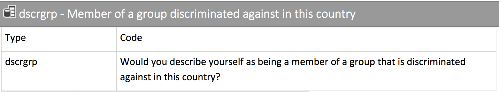

class: clear

<iframe src="https://app.sli.do/event/aflvddc2" height="100%" width="100%" frameBorder="0" style="min-height: 560px;"></iframe>

---
# Some vectors

```{r setup, include = FALSE}
library(RefManageR)
library(knitr)

options(htmltools.dir.version = FALSE, servr.interval = 0.5, width = 115, digits = 3)
knitr::opts_chunk$set(
  collapse = TRUE, message = FALSE, fig.retina = 3, error = TRUE,
  warning = FALSE, cache = FALSE, fig.align = 'center',
  comment = "#", strip.white = TRUE, tidy = FALSE)

BibOptions(check.entries = FALSE,
           bib.style = "authoryear",
           style = "markdown",
           hyperlink = FALSE,
           no.print.fields = c("doi", "url", "ISSN", "urldate", "language", "note", "isbn", "volume"))
myBib <- ReadBib("./../../intRo.bib", check = FALSE)

xaringanExtra::use_xaringan_extra(c("tile_view", "tachyons"))
xaringanExtra::use_panelset()
```

```{r}
# Add packages to library
library(tidyverse) # Add the tidyverse package to my current library.
library(haven) # Read and handle SPSS, Stata & SAS data (no need to install)
library(essurvey) # Add ESS API package to library. #<<

# Now create a couple of vectors.
(age <- c(34, 22, 42, 12, 76))
(conti <- factor(x = c("Europe", "Africa", "Africa", "Asia", "S. America"),
                 levels = c("Africa", "Asia", "Australia", "Europe", "N. America", "S. America")))
(employed <- c(FALSE, TRUE, TRUE, TRUE, TRUE))
(name <- c("Agnes", "Martin", "Hakan", "Tu", "Thais"))
(nr_kids <- c(1, 0, 3, 0, 4))
```

---
background-image: url('http://www.europeansocialsurvey.org/about/news/img/round7.png')
background-size: cover
class: center middle

.white[.font200[**Data Frames**]]

---
# Data frames

**Data frames** organize vectors of *equal length* along their indices.

```{r}
# Bind our 4 vectors along their index into a data frame.
# Assign that data frame to object "Dat".
(Dat <- data.frame(name, age, conti, employed, nr_kids))
```

--

.center[Data frames are the typical "rectangular" way to organize data:]
```{r, echo = FALSE, out.width='60%'}
knitr::include_graphics('https://d33wubrfki0l68.cloudfront.net/6f1ddb544fc5c69a2478e444ab8112fb0eea23f8/91adc/images/tidy-1.png')
```

---
background-image: url('http://www.europeansocialsurvey.org/about/news/img/round7.png')
background-size: cover
class: center middle

```{r, echo = FALSE, out.width='30%'}
knitr::include_graphics('https://raw.githubusercontent.com/rstudio/hex-stickers/master/PNG/tibble.png')
```

---
# Tibbles

**Tibbles** are data frames. But they have some improved features, so we will work with them.

.push-right[
```{r}
# As a comparison, print the former(!) 
# data frame Dat.
Dat
```
]

.push-left[
```{r}
# Make Dat a tibble and assign it to object "Dat", 
# (effectively overwriting Dat as a tibble).
(Dat <- as_tibble(Dat)) 
```
]

---
# Address single variables .font70[The `$` operator]

```{r}
# Return variable "conti" contained in tibble Dat. 
# (R for Data Science mentions two further commands.)
Dat$conti
```

--

```{r}
# Give a summary of numeric vector age contained in Dat.
summary(Dat$age) 
```

--

```{r}
# Give a summary of factor vector conti contained in Dat.
summary(Dat$conti) 
```

.center[.content-box-green[
Wait, why does `summary()` give me first some summary statistics and then a frequency table?
]]

---
# `select()` several variables
 
```{r}
# Select from tibble Dat the variables name and nr_kids, 
# and assign them to the new object Dat_small.
(Dat_small <- select(Dat, name, nr_kids))
```

---
# `select()` several variables

`select()` has a couple of nice **helper functions**, see `?select` for details.
```{r}
# Select from object Dat all variables that start with n, 
# and assign the result to a new object Dat_small.
(Dat_small <- select(Dat, starts_with("n")))
```

---
# `filter()` cases .font60[Based on values in certain variables]

```{r}
# Either, use dplyr's (part of tidyverse) filter() function, 
# to return all cases contained in Dat with value "Africa" in conti.
(Dat_small<- dplyr::filter(Dat, conti == "Africa"))
```

--

```{r}
# Or use the index, to achieve the same.
(Dat_small <- Dat[Dat$conti == "Africa", ])
```

.center[.content-box-green[
Why is there a `,` after `"Africa"`?
]]

---
# Index[Rows, and columns]

In contrast to vectors, data frames and tibbles have rows and columns. As in matrix algebra, R's index thus distinguishes `[rows, columns]`. The `,` after `"Africa"` tells R that we talk about rows. To understand how the index method works, remember logical vectors:

.push-left[
```{r}
# Print factor conti contained in tibble Dat.
Dat$conti 

# Return a logical vector of whether the different 
# elements in Dat$conti equal "Africa".
Dat$conti == "Africa"

# Feed the logical vector to the index of Dat
# to select TRUE cases from "Africa".
(Dat_small <- Dat[Dat$conti == "Africa", ]) 
```
]

--

.push-right[
```{r}
# Create a new logical variable called "selector", 
# which identifies cases with "Africa" in Dat$conti.
Dat$selector <- Dat$conti == "Africa"

# Print Dat.
Dat 
```
]

---
class: clear

# Transform, recode & generate .font60[Variables of tibbles]

To transform and recode simply use `$` to clarify which tibble you are referring to. 
```{r}
# Center age around the average age.
(Dat$age <- Dat$age - mean(Dat$age))
```

```{r}
# Recode "Africa" to "Afrika!".
(Dat$conti <- fct_recode(Dat$conti, "Afrika!" = "Africa"))
```

--

If you rather want to generate a new variable, just give it a name.
```{r}
# Devide age by its standard deviation; 
# now it is z-standardized (mean = 0, sd = 1).
(Dat$z_age <- Dat$age / sd(Dat$age)) 
```

---
class: clear

# Transform, recode & generate .font60[Several variables of a tibble]

If you want to transform and recode several variables from the same tibble, get used to use `mutate()`. .backgrnote[You will better understand why in Session 6 on piping!]<br>

```{r}
(Dat <- mutate(Dat,                              # Use the Dat tibble. #<< 
              nr_kids = nr_kids - mean(nr_kids), # Transform to deviation from average.
              z_nr_kids = nr_kids / sd(nr_kids), # z-standardize nr_kids.
              conti = fct_recode(conti,          # Recode conti.
                                 "Europa!" = "Europe", # "Europe" to "Europa!".
                                 "Asien!" = "Asia")    # "Asia" to "Asien!".
              ) # Don't forget to close mutate's bracket ")" #<<
 ) 
```
.backgrnote[Also, look how RStudio structures the brackets. It helps you to understand, within which function things are happening.]
---
class: clear

# Conditional transform & recode .font60[(i.e., for filtered cases)]

To transform/recode only among certain cases, use `case_when()`.

```{r}
(Dat <- mutate(
  Dat, # Mutate variables contained in Dat.
  conti = case_when( # Start conditional recode of conti, #<<
    employed == FALSE & conti == "Afrika!" ~ "Atlantis", # 1. complex condition ~ new value "Atlantis", #<<
    age < 0 & nr_kids < -1  ~ "Antarctica",              # 2. complex condition ~ new value "Antarctica", #<<
    TRUE ~ as.character(conti)                           # 3. and all others ~ leave as is; #<<
  ) # close case_when's bracket. #<<             
)) # close mutate's (and the print) bracket
```

---
class: clear

# Conditional transform & recode .font60[(i.e., for filtered cases)]

```{r eval = FALSE}
(Dat <- mutate(
  Dat, # Mutate variables contained in Dat.
  conti = case_when( # Start conditional recode of conti, #<<
    employed == FALSE & conti == "Afrika!" ~ "Atlantis", # 1. complex condition ~ new value "Atlantis", #<<
    age < 0 & nr_kids < -1  ~ "Antarctica",              # 2. complex condition ~ new value "Antarctica", #<<
    TRUE ~ as.character(conti)                           # 3. and all others ~ leave as is; #<<
  ) # close case_when's bracket. #<<             
)) # close mutate's (and the print) bracket .
```

The three lines of this `case_when()` application do the following thing:
1. For all non-employed African cases ~ recode conti to "Atlantis".
2. For all those who're younger than 0 and have less than -1 kids ~ recode conti to "Antarctica".
3. All remaining cases ~ use their original conti values, but transform them to a character vector.
 - .alert[Remember, R is class sensitive!] It will not combine numeric information into a character vector. Because we give `case_when()` `"Atlantis"` and `"Antarctica"` as new values, it assumes that we want to make conti a character vector. Thus we cannot supply the former factor values (which are integer) in line three.

---
# `case_when()` and `NA`

```{r error = TRUE}
(Dat <- mutate(
  Dat, 
  conti = case_when( # Start conditional recode of conti,
    employed == FALSE & conti == "Afrika!" ~ "Atlantis", # 1. complex condition ~ new value "Atlantis",
    age < 0 & nr_kids < -1  ~ "Antarctica",              # 2. complex condition ~ new value "Antarctica",
    TRUE ~ NA                           # 3. and all others ~ NA #<<
  ) # close case_when's bracket.            
)) 
```

In R vectors are type sensitive; the elements of one vector may only be of one type. If you type `?NA`, you will learn: 
> "*NA is a logical* constant of length 1 which contains a missing value indicator. *NA can be coerced to any other vector type* except raw."

---
# `case_when()` and `NA`

`NA` are type sensitive, too! Therefore, coerce NA to character/numeric with `as.character()`/`as.numeric()`.
```{r error = TRUE}
(Dat <- mutate(
  Dat, 
  conti = case_when( # Start conditional recode of conti,
    employed == FALSE & conti == "Afrika!" ~ "Atlantis", # 1. complex condition ~ new value "Atlantis",
    age < 0 & nr_kids < -1  ~ "Antarctica",              # 2. complex condition ~ new value "Antarctica",
    TRUE ~ as.character(NA)                              # 3. and all others ~ NA #<<
  ) # close case_when's bracket.            
)) # close mutate's (and the print) bracket.
```
.backgrnote[Alternatively, you can also use type-specific `NA`: `` `NA_character_` ``, `` `NA_real_` ``, etc..]

---
background-image: url('http://www.europeansocialsurvey.org/docs/img/general_banner.jpg')
background-size: contain
background-position: center

.push-left[
<br>
.center[Please register as a user:]
<iframe src="https://www.europeansocialsurvey.org/user/new" height='500' frameborder='0' width="100%"></iframe>
]

.push-right[
<br>
<br>
<br>
<br>
<br>
<br>
<br>
<br>
<br>
```{r, echo = FALSE, out.width='50%', fig.align = 'right'}
knitr::include_graphics('https://encrypted-tbn0.gstatic.com/images?q=tbn:ANd9GcQc8K5da5GSR5c4x4lJBIaBheKgcqfNjFfihonLBJWqbzUYVitp&s')
```
]
---
# Import downloaded data

The classic way to work with actual data, is to download them to some folder and to then import them to your software environment. The tidyverse contains the following three packages: 

.push-left[
```{r, echo = FALSE, out.width='30%', fig.align = 'center'}
knitr::include_graphics('https://haven.tidyverse.org/logo.png')
```

- The "haven" package allows you to import Stata, SPSS, and SAS files. .backgrnote[See the respective [Haven Website](https://haven.tidyverse.org/).]
```{r eval = FALSE}
# Create an object ESS and assign the 
# imported ESS.dta to it, if you have
# downloaded it into your intro_r folder
ESS <- read_dta("ESS8e02_1.dta")
```
]

.push-right[
.push-left[
<br>
```{r, echo = FALSE, out.width='65%', fig.align = 'center'}
knitr::include_graphics('https://readr.tidyverse.org/logo.png')
```
]
.push-right[
<br>
```{r, echo = FALSE, out.width='65%', fig.align = 'center'}
knitr::include_graphics('https://readxl.tidyverse.org/logo.png')
```
]
.white[vcdv]
- The "readr" package allows you to import csv, tsv and fwf files.<br> .backgrnote[See the respective [Readr Website](https://readr.tidyverse.org/) and [Cheat Sheet](https://rawgit.com/rstudio/cheatsheets/master/data-import.pdf).] 
- The readxl package allows you to read in Excel's xlsx files. .backgrnote[See the respective [Readxl Website](https://readxl.tidyverse.org/).]
]

---
# Importing the ESS via the ESS API

Beware, however, that .alert[using an API assumes you have internet access!] It thus makes sense to have an extra R-Script for Data import and transformation, and then other ones for data analyses and visualization.

```{r eval = FALSE}
# Import the ESS round 9 data via the API
ESS <- import_rounds(rounds = 9, ess_email = "YOUR-EMAIL", format = "spss")
```

```{r include = FALSE}
library(essurvey) # Add ESS API package to library.

# Import the ESS round 9 data via the API
ESS <- import_rounds(rounds = 9, ess_email = "merlin.schaeffer@uni-koeln.de", format = "spss")
```

```{r}
ESS
```

---
# First steps with the ESS

.push-left[
```{r, echo = FALSE, out.width='100%'}

```

```{r}
# A frequency table to get a first impression of the variables values and frequencies.
table(ESS$dscrgrp)
```
]

--

.push-right[
.center[Not very telling...<br>But remember, R does not do labels,<br> in contrast to Stata or SPSS!]

```{r, echo = FALSE, out.width='40%', fig.align='center'}
knitr::include_graphics('https://i.vimeocdn.com/portrait/3399477_300x300')
```
]

---
layout: true
# Importing labelled data!

.pull-left[
R imports Stata and SPSS labels, but cannot handle them. Thus, when you import Stata or SPSS data,<br>
... you need to .alert[change each labelled variable to **numeric or factor** from the outset] of your analysis!!]

---

--

.pull-right[
If you want to use a variable as categorical, use `as_factor()` to make the labels the new factor levels:
```{r comment = '#'}
# Make the labelled dscrgrp a factor.
ESS$dscrgrp <- as_factor(ESS$dscrgrp) #<<

# A frequency table to get a first impression of the variables values and frequencies.
table(ESS$dscrgrp)
```
]

---

.pull-right[
If you want to use a variable as numeric, use `zap_labels()` to prohibit problems with the imported labels:

```{r comment = '#'}
# Strip/zap the labels from the numeric variable agea.
ESS$agea <- zap_labels(ESS$agea) #<<

# A summary of descriptive statistics to get a first impression of the variable.
summary(ESS$agea)
```

]

---
layout: false
class: clear

<iframe src="https://app.sli.do/event/aflvddc2" height="100%" width="100%" frameBorder="0" style="min-height: 560px;"></iframe>

---
layout: false
class: inverse
# Today's general lessons

1. *Data frames* organize equally-sized vectors along their indices; *Tibbles* are modernized data frames. The indices of data frames/tibbles are organized as `[row, column]`.
2. *Helper functions* are sub-functions that help you to make coding easier in many ways. They only work within the confines of the function for which they were designed as helpers.
3. Addressing variables means to address the columns of a data frame. Filtering cases means to address certain rows. Both is possible via the index `[row, column]`, but the `filter()` and `select()` functions have advantages.
4. R has no labels. The idea is that numeric variables have a scale (e.g., cm, years, DKK), while categorical variables have no true representation in numbers. When you import labelled data from Stata or SPSS, the labels are stored in R but will create confusion in the mid run. Make sure to `zap_labels()` from numeric variables and to treat categorical variables `as_factor()`.

---
class: inverse
# Today's important operators

1. `$`: Allows your to address vectors contained in a data frame/tibble.

---
class: inverse
# Today's (important) functions
1. `data.frame()`: organize several vectors of equal length by their index.
2. `as_tibble()`: take a data frame and make it a Tibble.
3. `summary()`: Give a summary of an object.
4. `select()`: select several variables from a data frame/Tibble.
5. `filter()`: filter cases based on values in certain variables. 
6. `mutate()`: Adds new variables and preserves existing. Good for recoding several variables.
7. `case_when()`: Conditional recode for cases filtered in complex ways.
8. `as_factor()`: Make a labelled Stata/SPSS variable a factor.
9. `zap_labels()`: Make a labelled Stata/SPSS variable numeric.