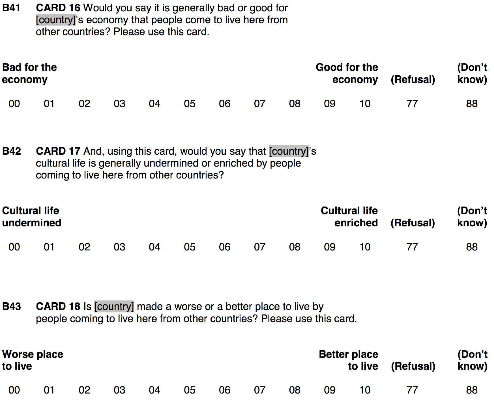
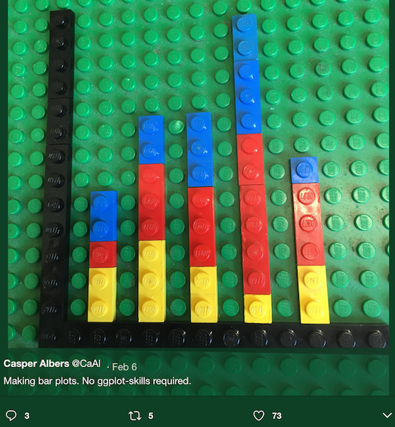

background-image: url('https://drupal-images.tv2.dk/sites/images.tv2.dk/files/t2img/2019/12/18/960x540/311984641-7613085-3c76aadd7dd99694e5f5bb3c787190d6.jpeg')
background-size: cover

```{r, echo = FALSE, out.width='60%', fig.align='center', fig.retina = 3}

```

---
class: clear
name: setup

```{r setup, include = FALSE}
library(RefManageR)
library(knitr)
library(haven) # Read and handle SPSS, Stata & SAS data
library(tidyverse) # Add the tidyverse package to my current library.
library(essurvey) # Add ESS API package to library.
library(ggplot2) # Allows us to create nice figures. #<<

options(htmltools.dir.version = FALSE, servr.interval = 0.5, width = 115, digits = 3)
knitr::opts_chunk$set(
  collapse = TRUE, message = FALSE, fig.retina = 3, error = TRUE,
  warning = FALSE, cache = FALSE, fig.align = 'center',
  comment = "#", strip.white = TRUE, tidy = FALSE)

BibOptions(check.entries = FALSE,
           bib.style = "authoryear",
           style = "markdown",
           hyperlink = FALSE,
           no.print.fields = c("doi", "url", "ISSN", "urldate", "language", "note", "isbn", "volume"))
myBib <- ReadBib("./../../intRo.bib", check = FALSE)

xaringanExtra::use_xaringan_extra(c("tile_view", "tachyons"))
xaringanExtra::use_panelset()
```

```{r eval = FALSE}
# Add packages to library
library(tidyverse) # Add the tidyverse package to my current library.
library(haven) # Read and handle SPSS, Stata & SAS data (no need to install)
library(ggplot2) # Allows us to create nice figures. #<<

# Import the ESS round 10
ESS <- read_spss("ESS10.sav")
```

```{r include = FALSE}
# Import the ESS round 9 data via the API
ESS_raw <- read_spss("./../../assets/ESS10.sav")
```

--

```{r}
ESS <- transmute(ESS_raw, # Recode several variables & keep only the recoded ones (i.e., transmute vs mutate). #<<
                 idno = zap_labels(idno),
                 # Make the following variables factors:
                 cntry = as_factor(cntry),
                 gndr = as_factor(gndr),
                 facntr = as_factor(facntr),
                 mocntr = as_factor(mocntr),
                 # Make the following variables numeric:
                 imbgeco = max(imbgeco, na.rm = TRUE) - zap_labels(imbgeco), # Also turn scale around.
                 imueclt = max(imueclt, na.rm = TRUE) - zap_labels(imueclt), # Also turn scale around.
                 imwbcnt = max(imwbcnt, na.rm = TRUE) - zap_labels(imwbcnt), # Also turn scale around.
                 agea = zap_labels(agea),
                 pspwght = pweight*dweight,
                 eduyrs = case_when(
                   eduyrs > 21 ~ 21, # Recode to max 21 years of edu.
                   eduyrs < 9 ~ 9, # Recode to min 9 years of edu.
                   TRUE ~ zap_labels(eduyrs) # Make it numeric.
                 ),
) #<<
```

???

- first, we set up our R script for this section
  - load packages - new packages ggplot2 for vis
  - download ESS data from API
  - basic data transformation
    - work with labelled data
    - reversing scales for immigration attitudes
    - complex recoding of education


---
class: clear middle

```{r}
# Case selection.
ESS <- dplyr::filter(ESS,
                     # Only respondents whose parents were born in country of interview.
                     facntr == "Yes" & mocntr == "Yes" &
                       # Only respondents from Eastern European countries:
                       (cntry %in% c("Slovakia", "Hungary", "Czechia", "Slovenia")
))

# Casewise deletion of missing values
(ESS <- drop_na(ESS))
```


???

- continued set up
  - case selection:
    - only respondents with native parents
    - only respondents from Germany and landboarder neighbors
  - removing cases with any missing data

---
# Why visualize? .font60[A *simulated* example]

- We are better in detecting visual patterns in figures compared to numeric patterns in tables.
- You will reach wider audiences with figures than with tables.
- You will understand your own data faster while exploring it.

```{r echo = FALSE}
library(lme4)
library(stargazer)
set.seed(97664) # Allows me to reproduce the same "pseudo-random" outcome.
# Make a tibble called sim-data, containting:
sim_data <- tibble(# A normally distributed var with 1000 obs.
                   education = rnorm(mean = 0, sd = 1, n = 500),
                   e = rnorm(sd = 0.3, n = 500),
                   # A factor that distinguishes 10 types with each 100 obs.
                   Country = factor(c(rep(1:5, each = 100))),
                   # Another normally distributed random var which does not vary within the factor types.
                   u_c = rep(rnorm(0, sd = 0.7, n = 5), each = 100),
                   u_x = rep(rnorm(0, sd = 0.6, n = 5), each = 100)
                  )
# Generate outcome as linear function of the other vars.
sim_data <- sim_data %>% mutate(
    education = education + abs(min(education)),
    xeno = 0 + -0.3*education + u_c + u_x*education + e)
```

--

.push-left[
```{r}
# Multilevel mixed effects model.
lmer(data = sim_data,
  formula = xeno ~ education +
  (1 + education | Country)) %>% 
  stargazer(type = "text", style = "asr")
```
]

--

.push-right[
```{r echo = FALSE, out.width='100%', fig.height = 3, fig.width = 5}
ggplot(data = sim_data, mapping = aes(y = xeno, x = education, color = Country)) +
  geom_point(alpha = 0.5) +
  geom_smooth(method = "lm", se = FALSE, size =0.4) +
  geom_smooth(method = "lm", se = FALSE, color = "black", size = 1.5) +
  scale_y_continuous("Xenophobia") +
  scale_x_continuous("Education") +
  theme_minimal()
```
]

???

- simulated data in the background
  - regression table sensible for informed audience
    - negative coefficient for education
  - complex models (multilevel) require thorough consideration
    - but how does coefficient vary?
  - visualization more intuitive

---
# Why `ggplot2`? .font60[Because of its *grammar of graphics*]

.left-column[
Independently specify the building blocks of a figure and combine them to create just about any kind of figure you want; its like Lego ;-).
]

.right-column[
```{r, echo = FALSE, out.width='55%'}

```
]

---
layout:true
# First steps in `ggplot2` .font60[The coordinate system]

---

Every visualization with `ggplot2` starts with a call to `ggplot()`

```{r out.height='80%', fig.width = 12, fig.height = 6}
ggplot() # Create an empty coordinate system.
```

---

In the `ggplot()` function, we specify the data we want to plot

```{r out.height='80%', fig.width = 12, fig.height = 6}
ggplot(data = ESS) # Create an empty coordinate system for the ESS data. 
```

---
layout:false
layout:true
# First steps in `ggplot2` .font60[Layers]

---

On top of the coordinate system, we add layers of visualization. The most basic layer describes the kind of visualization we want. All of them start with  `geom_`.

```{r out.height='80%', fig.width = 10, fig.height = 5}
ggplot(data = ESS) + # Add ...
  geom_point(mapping = aes(y = imwbcnt, x = eduyrs)) # a "layer" of points (i.e., a scatter plot). #<<
```

???

- point to syntax:
  - `+` to add layers

---

.push-left[
```{r out.width='85%', fig.width = 5, fig.height = 3.5}
ggplot(data = ESS) +
  geom_point(mapping = aes(y = imwbcnt, x = eduyrs))
```
]

.push-right[
```{r, echo = FALSE, out.width='80%'}

```
]

???

- ggplot works just like Lego,
  - adding one layer at a time

---
layout:false
# First steps in `ggplot2` .font60[Grammar of graphics]

```{r, eval = FALSE}
# A general template
ggplot(data = <DATA>) +         # Create a coordinate system for <DATA>, and add "+" #<<
  <GEOM_FUNCTION>(              # a layer of (geometric) information, which #<<
     mapping = aes(<MAPPINGS>), # maps our data to aesthetics, and #<<
     stat = <STAT>,             # may depend on statistical transformations.
  ) +
  <COORDINATE_FUNCTION> +       # Change the default coordinate system.
  <FACET_FUNCTION>              # Draw sub-plots by categorical variables. #<<
```
.center[.backgrnote[*Source*: Wickham & Grolemund ["R for Data Science"](http://r4ds.had.co.nz/data-visualisation.html)]]

`ggplot2` provides an entire family of **geom functions**, which add different types of geometric objects (e.g., points, bars, lines) on top of the coordinate system.

--

- Geom functions depend on the `mapping` argument, which maps/connects variables to elements in your plot. To do this mapping, we use the `aes()` function, which stands for "**aesthetics**". Aesthetics are the _variable_ visual properties of your plot. 

--

- The most central aesthetics of any graph is a data points location in the coordinate system. In `aes()`, we use the arguments `x` and `y` to specify which variable to map to the x-axis and y-axis respectively.

--

- Any variable visual property (color, shape, size, etc.) can be an aesthetic.

---
layout:true
# Aesthetics .font60[The _variable_ visual plot properties]

---

If you want to map or connect an aesthetic to variable, you need to specify it _within_ `aes()`.

```{r out.width='80%', fig.width = 9, fig.height = 4}
ggplot(data = ESS) +
  geom_point(mapping = aes(y = imwbcnt, x = eduyrs, color = cntry)) # Color by country. #<<
```

???

- ggplot2 will automatically assign a unique level of an aesthetic (e.g., color/shape/size/etc.) to each value of the variable.

- the type of level (distinct or continuous colors) depend on the variable (factor or numeric)

- It will also generate a legend.

---

Depending on what you want to visualize, you can have just `x` and `y` or a whole set of aesthetics.

```{r out.width='70%', fig.width = 9, fig.height = 4}
ggplot(data = ESS) +
  geom_point(mapping = aes(y = imwbcnt, x = eduyrs, color = cntry,
                           size = pspwght)) # Size by post-stratification weight. #<<
```

???

You can manually control the aesthetics, that is, which color and which sizes. But that is fine tuning. We want to explore our data right now.

---

`ggplot2` tries to be smart with its defaults and will adjust aesthetics to the type of vector you are mapping.

```{r out.width='70%', fig.width = 9, fig.height = 4}
ggplot(data = ESS) +
  geom_point(mapping = aes(y = imwbcnt, x = eduyrs,
                           color = pspwght, size = cntry)) # Exchanged color and date aes. #<<
```

???

- Now color is gradual, rather than different colors.

- For size, a categorical variable makes little sense.

- Categorical are factor and character vectors.

- continuous are numerical vectors.

---

Static visual properties **are not** aesthetics and need to be specified _outside_ the `aes()` function.

```{r out.width='65%', fig.width = 9, fig.height = 4}
ggplot(data = ESS) +
  geom_point(mapping = aes(y = imwbcnt, x = eduyrs,
                           size = pspwght, color = cntry),
             shape = 21) # Use hollow circles. #<<
```

???

- Here we specify a constant shape for all data points.

- You need to give static visual properties a value that is sensible.

---
layout:false
layout:true
# Geoms .font60[What type of visualization to choose?]

---

.center[.content-box-green[
How are these two plots similar?
]]

.push-left[
```{r out.width='75%', fig.width = 4.5, fig.height = 4}
ggplot(data = ESS) +
  geom_point(mapping = aes(y = imwbcnt, x = eduyrs))
```
]

.push-right[
```{r out.width='75%', fig.width = 4.5, fig.height = 4}
ggplot(data = ESS) +
  geom_smooth(mapping = aes(y = imwbcnt, x = eduyrs))
```
]

???

- They show the same data, but expressed as different geometric objects.
  - Scatter plot and smoothed line plot

- ggplot2 contains +30 geoms. Extension packages contain even more.

- Consider what is important about your data to communicate
  - Scatter plot shows all data points
  - Smoothed line plot shows central tendency

---

.push-left[
```{r out.width='80%', fig.width = 6, fig.height = 4}
ggplot(data = ESS) +
  geom_boxplot(mapping = aes(y = imwbcnt,
                             x = factor(eduyrs)))
```
]

.push-right[
<br>
<br>
<br>
<br>
```{r, echo = FALSE, out.width='100%'}
knitr::include_graphics('./img/Boxplot.png')
```
.center[.backgrnote[*Source*: [Wikipedia](https://en.wikipedia.org/wiki/Box_plot)]]
]

???

- For distributions at different levels, box plot might be better
  - adds measures of dispersion to central tendency

---
layout:false
# Geoms .font60[How to account for weights?]

.push-left[
```{r out.width='80%', fig.width = 4.5, fig.height = 4}
ggplot(data = ESS) +
  geom_point(aes(y = imwbcnt, x = eduyrs,
                 size = pspwght)) # Visualize #<<
```
]

.push-right[
```{r out.width='80%', fig.height = 4.5, fig.height = 4}
ggplot(data = ESS) +
  geom_smooth(aes(y = imwbcnt, x = eduyrs,
                  weight = pspwght)) # Apply #<<
```
]

???

- depending on geom, 
  - might be able to apply (smooth)
  - or visualize (point)

---
# Geoms .font60[General and specific aesthetics]

Basic aesthetics like `x` or `color` apply to all geoms, whereas others only for work specific ones.<br>.backgrnote[Check `?geom_name` to find the applicable aesthetics.]

.push-left[
```{r out.width='70%', fig.width = 4.5, fig.height = 4}
ggplot(data = ESS) +
  geom_point(aes(y = imwbcnt, x=eduyrs, color=cntry,
                 size = pspwght,
                 shape = cntry)) #<<
```
]

.push-right[
```{r out.width='70%', fig.width = 4.5, fig.height = 4}
ggplot(data = ESS) +
  geom_smooth(aes(y=imwbcnt, x=eduyrs, color=cntry,
                  weight = pspwght,
                  linetype = cntry)) #<<
```
]

???

- We can use the color aestetic in both plots.

- We cannot use shape for lines and line types for points.

- Note that ggplot2 automatically groups data for geoms whenever you map an aesthetic to a categorical variable!

---
layout:true
# Geoms .font60[Combining geoms]
---

To have several geoms in one plot, simply add `+` them on top of each other.
```{r out.width='65%', fig.width = 8, fig.height = 4}
ggplot(data = ESS) + # Coordinate system, add ...
  geom_point(mapping = aes(y = imwbcnt, x = eduyrs, size = pspwght)) + # layer of points, add ...#<<
  geom_smooth(mapping = aes(y = imwbcnt, x = eduyrs, weight = pspwght)) # layer of smoothed average & 95%-CI.
```

---

The order of geoms matters, `ggplot2` adds layer on top of layer.
```{r out.width = '65%', fig.width = 8, fig.height = 4}
ggplot(data = ESS) + # Coordinate system, add ...
  geom_smooth(mapping = aes(y = imwbcnt, x = eduyrs, weight = pspwght)) + #<<
  geom_point(mapping = aes(y = imwbcnt, x = eduyrs, size = pspwght)) #<<
```

???

- See how smooth line is under scattered point
  
---
layout:false
layout:true
# Advanced aesthetics .font60[Global or local]

---

To simplify our code, we can specify **global aesthetics** in the `ggplot()` call. These are passed to each layer and hold *for all geoms*.
```{r out.width='63%', fig.width = 8, fig.height = 4}
ggplot(data = ESS, mapping = aes(y = imwbcnt, x = eduyrs)) + # Coord. system with global aesthetics, add ... #<<
  geom_point() + # a layer of points, add ...
  geom_smooth() # a layer with a line of locally-smoothed averages and CI.
```

---

By the way, this is a nice example for why graphics are great for data exploration:
```{r out.width='60%', fig.width = 8, fig.height = 4}
ggplot(data = ESS, mapping = aes(y = imwbcnt, x = factor(eduyrs))) + # Coord. system with global aesthetics, add ...
  geom_boxplot()  + # a layer of boxplots, add ...
  # For some reason, geom_smooth needs the "aes(group = 1)" argument.
  geom_smooth(mapping = aes(group = 1), se = FALSE) + # No CI (i.e., confidence interval), add ...
  geom_smooth(mapping = aes(group = 1), method = "lm", se = FALSE, color = "red") # an OLS line.
```

???

- Imagine having to read a table that shows all of this,
  - at minimum the trend lines would be hard to get from tables

- Note: needed to remove: weight = pspwght to make this work

---

.center[.alert[Note that local aesthetics override the global aesthetics.]]
```{r out.width='65%', fig.width = 8, fig.height = 4}
ggplot(data = ESS, mapping = aes(y = imwbcnt, x = eduyrs)) +
  geom_point(mapping = aes(color = cntry, size = pspwght), alpha = 0.2) + # aes() for geom_point exclusively. #<<
  geom_smooth(mapping = aes(y = agea, weight = pspwght)) #<<
```

???

- Global y: attitudes about immigrants (0-10)
- Local smooth y: age (18-90)

---
layout:false
# Putting it all together
```{r out.width='65%', fig.width = 8, fig.height = 4}
ggplot(data = ESS, # Coordinate system, add ...
       mapping = aes(y = imwbcnt, x = factor(eduyrs))) +  # define global aesthetics, add ...
  geom_boxplot() + # a layer of boxplots, add
  geom_smooth(mapping = aes(color = cntry, group = cntry)) # Add smooth for each country.
```

???

- Now we've got all the ingredients for an informative plot
- But you might say, trends for different countries are hard to read

---
layout:true
# Facets .font60[Sub-plots by categorical data]
---

Layering and using many aesthetics can create overwhelming plots. In this case smaller replicates (facets) of the same plot might be useful.
```{r out.width='75%', fig.width = 8, fig.height = 3}
ggplot(data = ESS, mapping = aes(y = imwbcnt, x = factor(eduyrs))) +
  geom_boxplot() +
  geom_smooth(mapping = aes(group = 1)) +
  facet_wrap( ~ cntry, nrow = 1) # Make sub-plots by cntry. #<<
```

???

- Consider whether faceting helps to see the comparisons you are interested in!
- Note that with facets, it becomes crucial to find appropriate dimensions

---


Replicate plots can also be arranged in a grid for two categorical variables.
```{r out.width='85%', fig.width = 8, fig.height = 3}
ggplot(data = ESS, mapping = aes(y = imwbcnt, x = factor(eduyrs))) +
  geom_boxplot() +
  geom_smooth(mapping = aes(group = 1)) +
  facet_grid(gndr ~ cntry) # Make sub-plots by gender (row) ~ country (column). #<<
```

---
layout:false
# Exporting plots .font60[`ggsave()`]

To enable you to use your plot outside R, `ggplot` provides functionality to export them using the function `ggsave()`. 

You can export your plot to various file types, including pdf, jpeg, png, and many more. `ggsave()` will determine the type from the extension of the name you give to the file (e.g., "MyPlot.pdf").

```{r}
# Make our plot and assign it to object my_plot.
my_plot <- ggplot(data = ESS, mapping = aes(y = imwbcnt, x = factor(eduyrs))) +
  geom_boxplot() +
  geom_smooth(mapping = aes(group = 1)) +
  facet_grid(gndr ~ cntry)

# Save the plot into the working directory as pdf with the dimensions 9 inches by 4.5 inches.
ggsave(filename = "myplot1.pdf", plot = my_plot, width = 8, height = 3) #<<
```

--

```{r}
# Save the plot but with different dimensions
ggsave(filename = "myplot2.pdf", plot = my_plot, width = 16, height = 9)
```

--

```{r}
# Save the plot as jpeg, with yet different dimensions and very low resolution to reduce the file size.
ggsave(filename = "myplot1.jpeg", plot = my_plot, width = 4.5, height = 9, dpi = 50)
```

???

- Key syntax:
  - filename
  - plot (defaults to most recent)
  - dimensions are optional

- PDFs do not need the dpi argument, because they are vector-based graphics.


---
class: inverse
# General lesson

```{r, eval = FALSE, error = TRUE}
# A general template
ggplot(data = <DATA>) +         # Create a coordinate system for <DATA>, and add "+" #<<
  <GEOM_FUNCTION>(              # a layer of (geometric) information, which #<<
     mapping = aes(<MAPPINGS>), # maps our data to aesthetics, and #<<
     stat = <STAT>,             # may depend on statistical transformations.
  ) +
  <COORDINATE_FUNCTION> +       # Change the default coordinate system.
  <FACET_FUNCTION>              # Draw sub-plots by categorical variables. #<<
```
.font70[*Source*: Wickham & Grolemund ["R for Data Science"](http://r4ds.had.co.nz/data-visualisation.html)]

---
class: inverse
# Further important functions

1. `transmute()`: Similar to mutate, but only keeps variables created within it.
