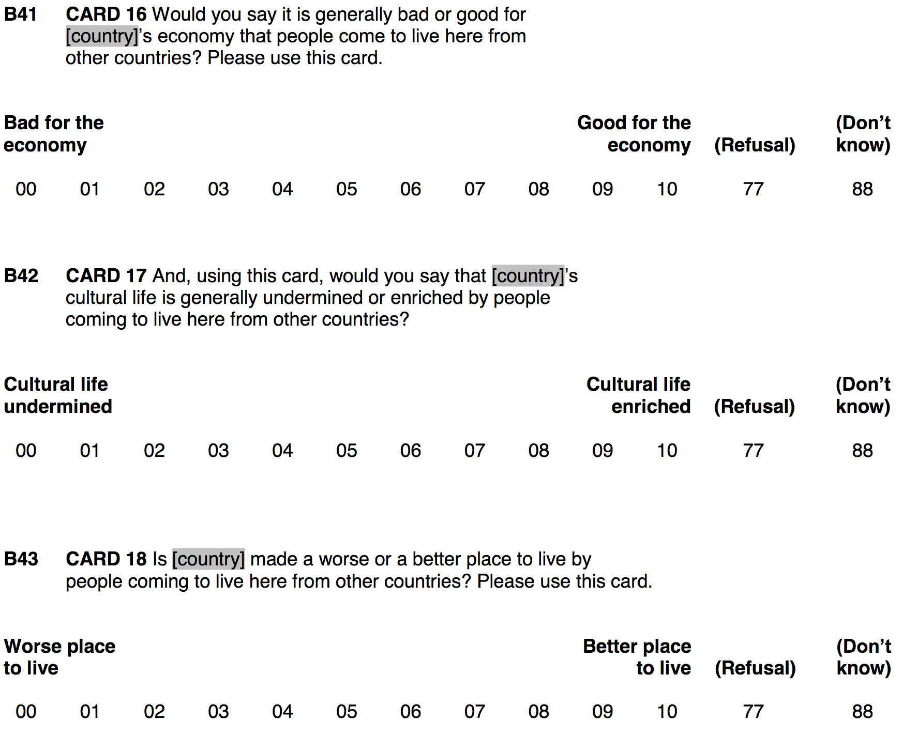
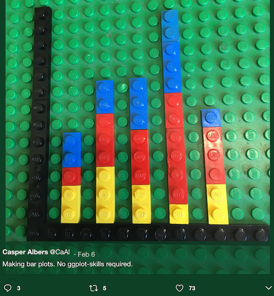
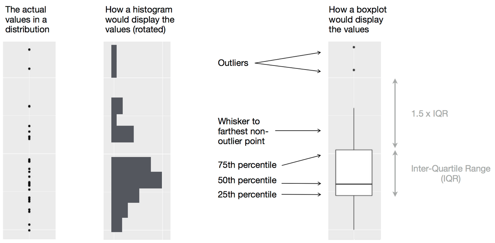

background-image: url('https://drupal-images.tv2.dk/sites/images.tv2.dk/files/t2img/2019/12/18/960x540/311984641-7613085-3c76aadd7dd99694e5f5bb3c787190d6.jpeg')
background-size: cover

```{r, echo = FALSE, out.width='60%', fig.align='center', fig.retina = 3}

```

---
class: clear

<iframe src="https://app.sli.do/event/aflvddc2" height="100%" width="100%" frameBorder="0" style="min-height: 560px;"></iframe>

---
class: clear
name: setup

```{r setup, include = FALSE}
library(RefManageR)
library(knitr)
library(haven) # Read and handle SPSS, Stata & SAS data
library(tidyverse) # Add the tidyverse package to my current library.
library(essurvey) # Add ESS API package to library.
library(ggplot2) # Allows us to create nice figures. #<<

options(htmltools.dir.version = FALSE, servr.interval = 0.5, width = 115, digits = 3)
knitr::opts_chunk$set(
  collapse = TRUE, message = FALSE, fig.retina = 3, error = TRUE,
  warning = FALSE, cache = FALSE, fig.align = 'center',
  comment = "#", strip.white = TRUE, tidy = FALSE)

BibOptions(check.entries = FALSE, 
           bib.style = "authoryear", 
           style = "markdown",
           hyperlink = FALSE,
           no.print.fields = c("doi", "url", "ISSN", "urldate", "language", "note", "isbn", "volume"))
myBib <- ReadBib("./../../intRo.bib", check = FALSE)

xaringanExtra::use_xaringan_extra(c("tile_view", "tachyons"))
xaringanExtra::use_panelset()
```

```{r eval = FALSE}
# Add packages to library
library(tidyverse) # Add the tidyverse package to my current library.
library(haven) # Read and handle SPSS, Stata & SAS data (no need to install)
library(essurvey) # Add ESS API package to library.
library(ggplot2) # Allows us to create nice figures. #<<

# Import the ESS round 9 data via the API
ESS <- import_rounds(rounds = 9, ess_email = "YOUR-EMAIL", format = "spss")
```

```{r include = FALSE}
# Import the ESS round 9 data via the API
ESS <- import_rounds(rounds = 9, ess_email = "merlin.schaeffer@uni-koeln.de", format = "spss")
```

--

```{r}
ESS <- transmute(ESS, # Recode several variables & keep only the recoded ones (i.e., transmute vs mutate). #<<
                 idno = zap_labels(idno),
                 # Make the following variables factors:
                 cntry = as_factor(cntry), 
                 gndr = as_factor(gndr),
                 facntr = as_factor(facntr),
                 mocntr = as_factor(mocntr),
                 # Make the following variables numeric:
                 imbgeco = max(imbgeco, na.rm = TRUE) - zap_labels(imbgeco), # Also turn scale around.
                 imueclt = max(imueclt, na.rm = TRUE) - zap_labels(imueclt), # Also turn scale around.
                 imwbcnt = max(imwbcnt, na.rm = TRUE) - zap_labels(imwbcnt), # Also turn scale around.
                 agea = zap_labels(agea),
                 pspwght = zap_labels(pspwght),
                 eduyrs = case_when(
                   eduyrs > 21 ~ 21, # Recode to max 21 years of edu.
                   eduyrs < 9 ~ 9, # Recode to min 9 years of edu.
                   TRUE ~ zap_labels(eduyrs) # Make it numeric.
                 ),
) #<<
```

---
class: clear middle

```{r}
# Case selection.
ESS <- dplyr::filter(ESS,
                     # Only respondents whose parents were born in country of interview.
                     facntr == "Yes" & mocntr == "Yes" &
                       # Only respondents from direct neighbors of Denmark:
                       (cntry == "Denmark" | cntry == "Germany" | cntry == "Sweden" | cntry == "Norway")
)

# Casewise deletion of missing values
(ESS <- drop_na(ESS))
```

---
# Why visualize? .font60[A *simulated* example]

- We are better in detecting visual patterns in figures compared to numeric patterns in tables.
- You will reach wider audiences with figures than with tables.
- You will understand your own data faster while exploring it.

```{r echo = FALSE}
library(lme4)
library(stargazer)
set.seed(97664) # Allows me to reproduce the same "pseudo-random" outcome.
# Make a tibble called sim-data, containting:
sim_data <- tibble(# A normally distributed var with 1000 obs.
                   education = rnorm(mean = 0, sd = 1, n = 500),
                   e = rnorm(sd = 0.3, n = 500),
                   # A factor that distinguishes 10 types with each 100 obs.
                   Country = factor(c(rep(1:5, each = 100))),
                   # Another normally distributed random var which does not vary within the factor types.
                   u_c = rep(rnorm(0, sd = 0.7, n = 5), each = 100),
                   u_x = rep(rnorm(0, sd = 0.6, n = 5), each = 100)
                  )
# Generate outcome as linear function of the other vars.
sim_data <- sim_data %>% mutate(
    education = education + abs(min(education)),
    xeno = 0 + -0.3*education + u_c + u_x*education + e)
```


.push-left[
```{r}
# Multilevel mixed effects model.
lmer(data = sim_data,
  formula = xeno ~ education +
  (1 + education | Country)) %>% 
  stargazer(type = "text", style = "asr")
```
]

--

.push-right[
```{r echo = FALSE, out.width='100%', fig.height = 3, fig.width = 5}
ggplot(data = sim_data, mapping = aes(y = xeno, x = education, color = Country)) +
  geom_point(alpha = 0.5) +
  geom_smooth(method = "lm", se = FALSE, size =0.4) +
  geom_smooth(method = "lm", se = FALSE, color = "black", size = 1.5) +
  scale_y_continuous("Xenophobia") +
  scale_x_continuous("Education") +
  theme_minimal()
```
]

---
# Why ggplot2? .font60[Because of its *grammar of graphics*]

.left-column[
Independently specify the building blocks of a figure and combine them to create just about any kind of figure you want; its like Lego ;-).
]

.right-column[
```{r, echo = FALSE, out.width='55%'}

```
]

---
# The **coordinate system**

```{r out.width='80%', fig.width = 9, fig.height = 4.5}
ggplot() # Create an empty coordinate system.
```

---
# The coordinate system

```{r out.width='80%', fig.width = 9, fig.height = 4.5}
ggplot(data = ESS) # Create an empty coordinate system for the ESS data.
```

---
# **Layers**

```{r out.width='80%', fig.width = 9, fig.height = 4.5}
ggplot(data = ESS) + # Add ...
  geom_point(mapping = aes(y = imwbcnt, x = eduyrs)) # a "layer" of points (i.e., a scatter plot). #<<
```

---
# Layers

.push-left[
```{r out.width='85%', fig.width = 5, fig.height = 4.5}
ggplot(data = ESS) +
  geom_point(mapping = aes(y = imwbcnt, x = eduyrs))
```
]

.push-right[
```{r, echo = FALSE, out.width='80%'}

```
]

---
# The layered grammar of graphics

```{r, eval = FALSE}
# A general template
ggplot(data = <DATA>) +         # Create a coordinate system for <DATA>, and add "+" #<<
  <GEOM_FUNCTION>(              # a layer of (geometric) information, which #<<
     mapping = aes(<MAPPINGS>), # maps our data to aestetics, and #<<
     stat = <STAT>,             # may depend on statistical transformations.
     position = <POSITION>      # Positioning may be adjusted.
  ) +
  <COORDINATE_FUNCTION> +       # Change the default coordinate system.
  <FACET_FUNCTION>              # Draw sub-plots by categorical variables. #<<
```
.center[.backgrnote[*Source*: Wickham & Grolemund ["R for Data Science"](http://r4ds.had.co.nz/data-visualisation.html)]]

ggplot2 contains many **geom functions**, which put layers of different types of geometric objects (e.g., points, bars, lines) over a coordinate system.

--

- All geom functions depend on the `mapping` argument. It is paired with `aes()`, which stands for **"aestetic"**. Aestetics are the visual properties of your plot. 
- The most important aestetics of any graph are the y-axis and the x-axis. Therefore, `aes()` depends on `x` and `y`, because these specify which variable to map to the y-axis and which one to map to the x-axis.
- But of course, aestetics also means, among others, color, shape, size, and so on.

---
# **Aestetics** .font60[The visual properties of your plot]

If you want to have an aestetic depend on the values of a variable, you need to specify it *within* `aes()`.

```{r out.width='80%', fig.width = 9, fig.height = 4}
ggplot(data = ESS) +
  geom_point(mapping = aes(y = imwbcnt, x = eduyrs, color = cntry)) # Color by country. #<<
```

???

- ggplot2 will automatically assign a unique aesthetic (e.g., color/shape/size/etc.) to each value of the variable. 

- It will also generate a legend.
---
# Aestetics

```{r out.width='80%', fig.width = 9, fig.height = 4}
ggplot(data = ESS) +
  geom_point(mapping = aes(y = imwbcnt, x = eduyrs, color = cntry, 
                           size = pspwght)) # Size by post-stratification weight. #<<
```

???

You can manually control the aestetics, that is, which color and which sizes. But that is fine tuning. We want to explore our data right now.

---
# Aestetics

Because R is object-oriented, aestetics behave differently depending on whether you give it a categorical or a continuous variable.

```{r out.width='70%', fig.width = 9, fig.height = 4}
ggplot(data = ESS) +
  geom_point(mapping = aes(y = imwbcnt, x = eduyrs, 
                           color = pspwght, size = cntry)) # Exchanged color and date aes. #<<
```

???

- Now color is gradual, rather than different colors.

- For size, a categorical variable makes little sense.

- Categorical are factor and character vectors.

- continuous are numerical vectors.
---
# Aestetics

If you want to define an aestetic irrespective of the values of any variable, you need to place *outside* the mapping argument.

```{r out.width='65%', fig.width = 9, fig.height = 4}
ggplot(data = ESS) +
  geom_point(mapping = aes(y = imwbcnt, x = eduyrs, 
                           size = pspwght, color = cntry), 
             shape = 21) # Use hollow circles. #<<
```

???

- `alpha` adds transparency, which varies between 0 (see through) and 1 nontransparent.

- You need to give that aestetic a value that makes sense to it.

---
class: clear
# **Geometric objects** .font60[As what do you visualize your data?]

.center[.content-box-green[
How are these two plots similar?
]]

.push-left[
```{r out.width='75%', fig.width = 4.5, fig.height = 4}
ggplot(data = ESS) + 
  geom_point(mapping = aes(y = imwbcnt, x = eduyrs)) 
```
]

.push-right[
```{r out.width='75%', fig.width = 4.5, fig.height = 4}
ggplot(data = ESS) +
  geom_smooth(mapping = aes(y = imwbcnt, x = eduyrs))
```
]

???

- They show the same data, but expressed as different geometric objects.
- ggplot2 contains +30 geoms. Extension packages contain even more.

---
class: clear
# **Geometric objects** .font60[As what do you visualize your data?]

.push-left[
```{r out.width='80%', fig.width = 6, fig.height = 4}
ggplot(data = ESS) + 
  geom_boxplot(mapping = aes(y = imwbcnt, 
                             x = factor(eduyrs))) 
```
]

.push-right[
<br>
<br>
<br>
<br>
```{r, echo = FALSE, out.width='100%'}

```
.center[.backgrnote[*Source*: [Wikipedia](https://en.wikipedia.org/wiki/Box_plot)]]
]

---
class: clear
# Geoms & weights .font60[Apply or visualize, it depends on the geom ...]

.push-left[
```{r out.width='80%', fig.width = 4.5, fig.height = 4}
ggplot(data = ESS) + 
  geom_point(aes(y = imwbcnt, x = eduyrs, 
                 size = pspwght)) # Visualize #<<
```
]

.push-right[
```{r out.width='80%', fig.height = 4.5, fig.height = 4}
ggplot(data = ESS) +
  geom_smooth(aes(y = imwbcnt, x = eduyrs, 
                  weight = pspwght)) # Apply #<<
```
]

---
class: clear
# Geoms & aestetics .font60[Some aestetics are geom specific]

.push-left[
```{r out.width='77%', fig.width = 4.5, fig.height = 4}
ggplot(data = ESS) + 
  geom_point(aes(y = imwbcnt, x=eduyrs, color=cntry,
                 size = pspwght, 
                 shape = cntry)) #<<
```
]

.push-right[
```{r out.width='77%', fig.width = 4.5, fig.height = 4}
ggplot(data = ESS) +
  geom_smooth(aes(y=imwbcnt, x=eduyrs, color=cntry, 
                  weight = pspwght, 
                  linetype = cntry)) #<<
```
]

???

- We can use the color aestetic in both plots.

- We cannot use shape for lines and line types for points.

- Note that ggplot2 automatically groups data for geoms whenever you map an aesthetic to a categorical variable!

---
# Multiple geoms .font60[Are layered on top of each other]

To have several geoms in one plot, simply add `+` them on top of each other.
```{r out.width='65%', fig.width = 8, fig.height = 4}
ggplot(data = ESS) + # Coordinate system, add ...
  geom_point(mapping = aes(y = imwbcnt, x = eduyrs, size = pspwght)) + # layer of points, add ...#<<
  geom_smooth(mapping = aes(y = imwbcnt, x = eduyrs, weight = pspwght)) # layer of smoothed average & 95%-CI.
```

---
# Multiple geoms

The order of geoms matters, ggplot2 adds layer on top of layer.
```{r out.width = '65%', fig.width = 8, fig.height = 4}
ggplot(data = ESS) + # Coordinate system, add ...
  geom_smooth(mapping = aes(y = imwbcnt, x = eduyrs, weight = pspwght)) + #<<
  geom_point(mapping = aes(y = imwbcnt, x = eduyrs, size = pspwght)) #<<
```

---
# **Global aestetics**

To avoid repetitive code, we can specify global aestetics, which (by default) hold *for all geoms*.
```{r out.width='65%', fig.width = 8, fig.height = 4}
ggplot(data = ESS, mapping = aes(y = imwbcnt, x = eduyrs)) + # Coord. system with global aestetics, add ... #<<
  geom_point() + # a layer of points, add ...
  geom_smooth() # a layer with a line of locally-smoothed averages and CI.
```

---
class: clear

By the way, this is a nice example why graphics are great for data exploration:
```{r out.width='70%', fig.width = 8, fig.height = 4}
ggplot(data = ESS, mapping = aes(y = imwbcnt, x = factor(eduyrs), weight = pspwght)) + # Coord. system with global aestetics, add ...
  geom_boxplot() + # a layer of boxplots, add ...
  # For some reason, geom_smooth needs the "aes(group = 1)" argument.
  geom_smooth(mapping = aes(group = 1), se = FALSE) + # No CI (i.e., confidence interval), add ...
  geom_smooth(mapping = aes(group = 1), method = "lm", se = FALSE, color = "red") # an OLS line.
```

---
# **Local aestetics** .font70[For the single geoms]

.alert[Beware, local aesthetics override the global (default) aestetics!]
```{r out.width='65%', fig.width = 8, fig.height = 4}
ggplot(data = ESS, mapping = aes(y = imwbcnt, x = eduyrs)) +
  geom_point(mapping = aes(color = cntry, size = pspwght), alpha = 0.2) + # aes() for geom_point exclusively. #<<
  geom_smooth(mapping = aes(y = agea, weight = pspwght)) #<<
```

---
# Putting it all together:
```{r out.width='65%', fig.width = 8, fig.height = 4}
ggplot(data = ESS, # Coordinate system, add ...
       mapping = aes(y = imwbcnt, x = factor(eduyrs), weight = pspwght)) +  # define global aestetics, add ...
  geom_boxplot() + # a layer of boxplots, add
  geom_smooth(mapping = aes(color = cntry, group = cntry)) # Add smooth for each country.
```

---
# **Facets** .font60[Sub-plots by categorical type]

When another layer of (important) information does not improve the plot.
```{r out.width='75%', fig.width = 8, fig.height = 3}
ggplot(data = ESS, mapping = aes(y = imwbcnt, x = factor(eduyrs), weight = pspwght)) +
  geom_boxplot() +
  geom_smooth(mapping = aes(group = 1)) +
  facet_wrap( ~ cntry, nrow = 1) # Make sub-plots by cntry. #<<
```

???

Consider whether faceting helps to see the comparisons you are interested in!

---
# Facet grid .font60[A cross-table of plots]

```{r out.width='85%', fig.width = 8, fig.height = 3}
ggplot(data = ESS, mapping = aes(y = imwbcnt, x = factor(eduyrs), weight = pspwght)) +
  geom_boxplot() +
  geom_smooth(mapping = aes(group = 1)) +
  facet_grid(gndr ~ cntry) # Make sub-plots by gender (row) ~ country (column). #<<
```

---
# Save your plot

`ggsave()` allows you to save your plot as pdf, jpeg, png, tiff, svg, bmp, ps, eps. It will guess the type from the ending of the name you give the plot (e.g., "MyPlot.pdf"). 

```{r}
# Make our plot and assign it to object my_plot.
my_plot <- ggplot(data = ESS, mapping = aes(y = imwbcnt, x = factor(eduyrs), weight = pspwght)) +
  geom_boxplot() +
  geom_smooth(mapping = aes(group = 1)) +
  facet_grid(gndr ~ cntry)

# Save the plot into the working directory as pdf. It shall be 9 inches wide and 4.5 inches high.
ggsave(filename = "myplot1.pdf", plot = my_plot, width = 8, height = 3) #<<
```

--

```{r}
# Save the plot but with different margins.
ggsave(filename = "myplot2.pdf", plot = my_plot, width = 16, height = 9)
```

--

```{r}
# Save the plot as jpeg, again different margins and very low resolution.
ggsave(filename = "myplot1.jpeg", plot = my_plot, width = 4.5, height = 9, dpi = 50)
```

???

PDFs do not need the dpi argument, because they are vector-based graphics.

---
class: clear

<iframe src="https://app.sli.do/event/aflvddc2" height="100%" width="100%" frameBorder="0" style="min-height: 560px;"></iframe>

---
class: inverse
# Today's general lesson

```{r, eval = FALSE, error = TRUE}
# A general template
ggplot(data = <DATA>) +         # Create a coordinate system for <DATA>, and add "+" #<<
  <GEOM_FUNCTION>(              # a layer of (geometric) information, which #<<
     mapping = aes(<MAPPINGS>), # maps our data to aestetics, and #<<
     stat = <STAT>,             # may depend on statistical transformations.
     position = <POSITION>      # Positioning may be adjusted.
  ) +
  <COORDINATE_FUNCTION> +       # Change the default coordinate system.
  <FACET_FUNCTION>              # Draw sub-plots by categorical variables. #<<
```
.font70[*Source*: Wickham & Grolemund ["R for Data Science"](http://r4ds.had.co.nz/data-visualisation.html)]

---
class: inverse
# Today's (important) functions

1. `transmute()`: similar to mutate, but only keeps the newly generated variables.
