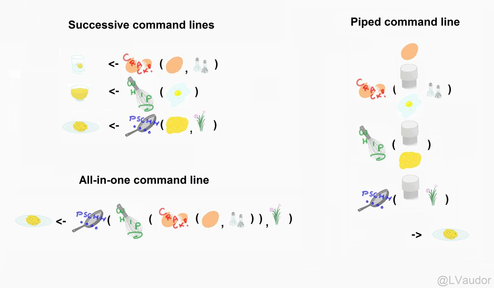
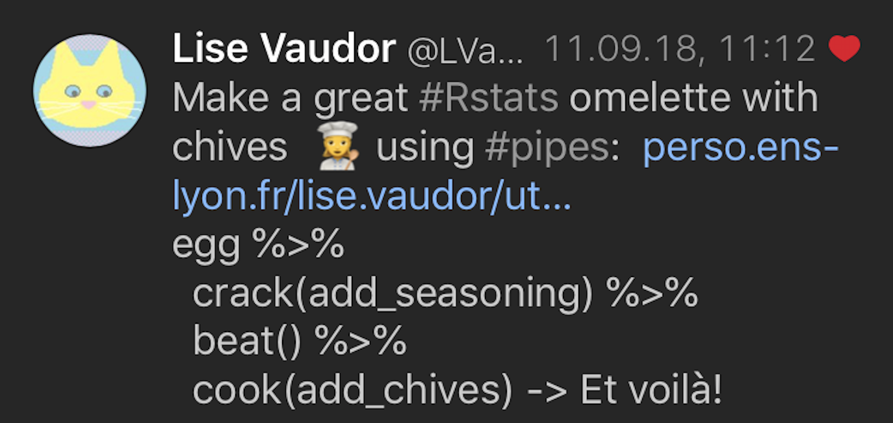
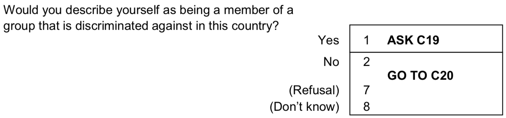
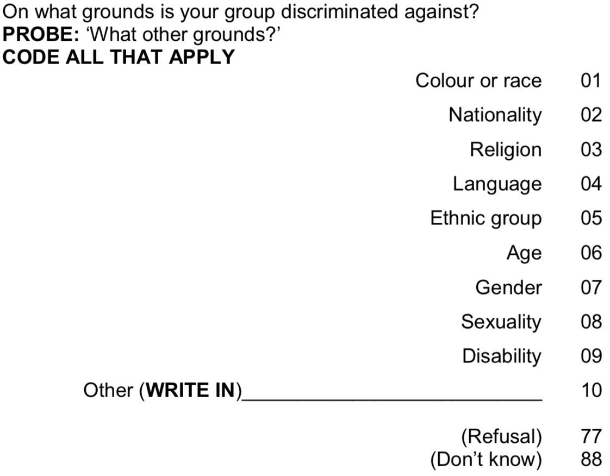
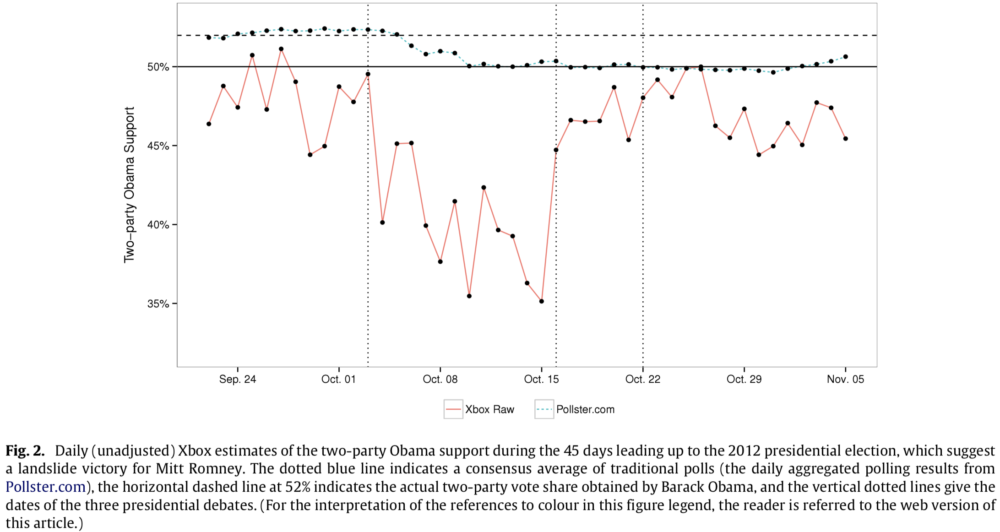
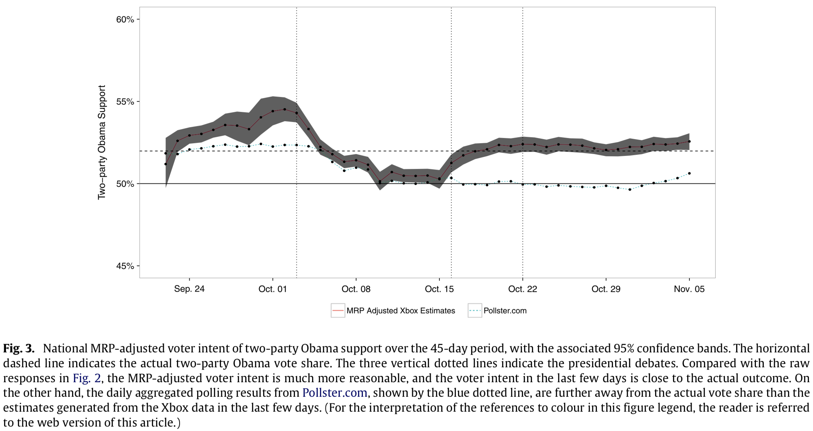

class: clear

```{r setup, include=FALSE}
library(RefManageR)
library(knitr)
library(tidyverse) # Add the tidyverse package to my current library.
library(haven) #<< Handle labelled data.
library(ggplot2) # Allows us to create nice figures.

options(htmltools.dir.version = FALSE, servr.interval = 0.5, width = 115, digits = 3)
knitr::opts_chunk$set(
  collapse = TRUE, message = FALSE, fig.retina = 3, error = TRUE,
  warning = FALSE, cache = FALSE, fig.align = 'center',
  comment = "#", strip.white = TRUE, tidy = FALSE)

BibOptions(check.entries = FALSE, 
           bib.style = "authoryear", 
           style = "markdown",
           hyperlink = FALSE,
           no.print.fields = c("doi", "url", "ISSN", "urldate", "language", "note", "isbn", "volume"))
myBib <- ReadBib("./../../intRo.bib", check = FALSE)

xaringanExtra::use_xaringan_extra(c("tile_view", "tachyons"))
xaringanExtra::use_panelset()

# Import the ESS round 10
ESS <- read_spss("./../../assets/ESS10.sav")
```

# Nested code

We have learned that R code may be nested. But too much nesting becomes unintelligible: Because R evaluates code from the inside-out, we need to read nested code from the inside-out!

```{r}
# Nested code
mean(sqrt(seq(from = 1, to = 13)))
```

--

Alternatively, we could write several lines of code successively and read from top to bottom. But this leads to many irrelevant intermediate objects that crowd our environment.

```{r}
# Non-nested code
x <- seq(from = 1, to = 13)
x_sqrt <- sqrt(x) # Intermediate object. #<<
mean(x_sqrt)
```

---
# The (forward) **pipe** `%>%`

The `%>%` operator pipes output of one function as input to the next function. You can basically say: `function(argument1 = value)` can be written as `value %>% function()`. 

Or even easier, think of it as: .alert["then"], .alert["dann"], or .alert["så"].

```{r}
# Piped code
seq(from = 1, to = 13) %>% sqrt() %>% mean()
```

--

.push-left[
```{r, echo = FALSE, out.width='100%', fig.align='center'}

```
]

.push-right[
```{r, echo = FALSE, out.width='100%', fig.align='center'}

```
]

---
background-image: url('https://img.nzz.ch/C=W900,H507,X0,Y56/O=75/http://s3-eu-west-1.amazonaws.com/nzz-img/2014/06/20/1.18327083.1403287109.jpg?width=560&fit=crop&quality=75&auto=webp&crop=900,507,x0,y56')
background-size: cover
class: center

<br>
.alert[.font200[**Belonging to a**<br><br>**Discriminated Minority**]]

---
class: clear

.push-right[
<br>
```{r, echo = FALSE, out.width='100%', fig.align='center'}


```
]

.push-left[
<br>
<br>
.center[Homes of Alevis in western Turkey]
```{r, echo = FALSE, out.width='80%', fig.align='center'}
knitr::include_graphics('https://i.hurimg.com/i/hdn/75/600x369/5a1578a47af50714084c50e8.jpg')
knitr::include_graphics('https://anfenglish.com/uploads/en/articles/2021/01/20210126-20210125-mrk-25-01-2021-alevi-aileler-jpgc2e241-image-jpg64f624-image.jpg')
```
]

---
# Library for today

```{r}
# Add packages to the library
library(tidyverse) # Add the tidyverse package to my current library.
library(haven) #<< Handle labelled data.
library(ggplot2) # Allows us to create nice figures.
library(Hmisc) # We need this for some weighted statistics. #<<
```

---
# Manipulating the ESS .font60[using `%>%`]

.font80[
```{r eval = FALSE}
# Import the ESS round 10
ESS <- read_spss("ESS10.sav")
```

```{r}
ESS <- ESS %>% # Import the ESS, then (pipe result into) #<<
  transmute( # Create new variables and keep only those
    cntry = as_factor(cntry) %>% fct_drop(), # Country of interview
    gndr = as_factor(gndr),
    facntr = as_factor(facntr), # Father born in cntry
    mocntr = as_factor(mocntr), # Mother born in cntry
    dscrgrp = as_factor(dscrgrp), # Belonging to discriminated group #<<
    dscrrlg = as_factor(dscrrlg), # Discriminated because of religion #<<
    rel_discr = case_when( #<<
      dscrgrp == "Yes" & dscrrlg == "Marked" ~ "Yes", #<<
      dscrgrp == "No" | (dscrgrp == "Yes" & dscrrlg != "Marked") ~ "No", #<<
      TRUE ~ as.character(NA)) %>% as_factor(), # all others missing, then change to factor #<<
    pspwght = dweight*pweight, # Post-stratification weights.     
    agea = zap_labels(agea), # Age
    eduyrs = case_when( # Education
      eduyrs > 21 ~ 21, # Recode to max 21 years of edu.
      eduyrs < 9 ~ 9, # Recode to min 9 years of edu.
      TRUE ~ zap_labels(eduyrs)) # Make it numeric.
  ) %>% # finish transmute, then (pipe result into) #<<
  dplyr::filter( # filter cases from three countries,
    (cntry %in% c("France", "Bulgaria", "Hungary"))
  ) %>% # finish filter, then #<<
  drop_na() # Casewise deletion.
```
]
---
# Result .font60[Of the piped code  from last slide]

```{r}
ESS
```

---
# The `.` .font70[Aka piping to specific arguments]

By default, `%>%` pipes into the *first* argument of a function. .backgrnote[You can find out what the first argument of a function is by typing `?function`.]

```{r}
# Both lines of code round 5.882 to have only one digit.
round(x = 5.882, digits = 1) 
5.882 %>% round(digits = 1)
```

--

The `.` placeholder allows us to pipe into *another* argument.

```{r}
2 %>% round(x = 5.882, digits = .)
```

---
# Why the `.` matters

For many (non-tidyverse functions), the data frame is not the first argument. Make sure to pipe into the argument which you actually intend to feed.

.left-column[
```{r}
t.test(ESS, agea ~ gndr)
```

```{r}
ESS %>% t.test(agea ~ gndr)
```
]

.right-column[
```{r eval = FALSE}
t.test(agea ~ gndr, data = ESS)
```

```{r}
ESS %>% t.test(agea ~ gndr, data = .)
```
]

---
# Advantages of piping .font60[And when not to pipe]

.center[The advantages are:]
 - *Legible code*: We can structure code from left to right, as apposed to from inside and out.
 - *Shorter code*: You minimize the need for local/intermediate variables.
 - *Easily mutable code*: You can easily add steps anywhere in the sequence of operations.

--

.center[.alert[But:]]
 - If you have more than one or two major inputs, don't pipe.
 - If you have more than ca. ten steps, better make intermediate objects.
  + It helps you to debug (i.e., find mistakes) and is simply easier to read.

---
# Reminder .font70[Weights]

.push-left[
- A *weight* tells you the probability that an observation should be in the sample. .backgrnote[
For a true random sample, each case of the population has an equal probability to be sampled. Thus the weight would be 1 for every observation of a sample.]
-  Some populations tend to be over\under-sampled. Post-stratification weights try to counterbalance this.
<br>

.content-box-green[.center[
Why would survey researchers assign lower weights to older people?
]]]

.push-right[
.panelset[
.panel[.panel-name[Plot]
```{r weights_fig, out.width='100%', fig.height = 4, fig.width = 5, results = FALSE, echo = FALSE}
ggplot(data = ESS, 
       mapping = aes(y = pspwght, x = agea)) +
  geom_smooth() + # Smoothed average weight by age.
  labs(y = "Post-stratification weight", x = "Age in years",
       caption = "Danish European Social Survey 2018") +
  theme_minimal()
```
]
.panel[.panel-name[Code]
```{r ref.label="weights_fig", results = FALSE, fig.show = "hide"}
```
]]]

---
# Reminder .font70[Working with weights]

- Statistically, we use weights by multiplication. 

.push-left[
- Imagine a patriarchal society, where men's votes count twice. Here we have a ballot on whether women should be allowed to drive:

```{r results = 'asis', echo = FALSE}
library(knitr)
i <- 1:5
Gender <- c("man", "man", "woman", "woman", "woman")
Vote <- c("No", "Yes", "Yes", "Yes", "No")
`Voted yes` <- c(0, 1, 1, 1, 0)
Weight <- c(2, 2, 1, 1, 1)

dat <- tibble(i, Gender, Vote, `Voted yes`, Weight)
kable(dat, format = "html")
```

.center[
.content-box-green[
What is the patriarchy-weighted percent <br> of "Yes"-votes?
]
]
]

--

.push-right[
- Three equivalent ways to the percent of patriarchy-weighted "Yes"-votes:

.panelset[
.panel[.panel-name[1.]
```{r}
((0*2 + 1*2 + 1 + 1 + 0) / 7) * 100 # 1
```
]
.panel[.panel-name[2.]
```{r}
(sum(`Voted yes` * Weight) / sum(Weight)) * 100 # 2
```
]
.panel[.panel-name[3.]
```{r}
weighted.mean(x = `Voted yes`, w = Weight) * 100 # 3
```
]]]

---
# Weights can be amazing!

.push-left[
```{r, echo = FALSE, out.width='100%', fig.align='center'}

```
]

--

.push-right[
```{r, echo = FALSE, out.width='100%', fig.align='center'}

```
]

---
# **Grouped operations**

Today, we want to compare countries. `group_by()` will transform your data into a **grouped tibble**. Afterwards, certain functions will operate on the level of those specified groups!

```{r comment #}
# Group my data by country.
(ESS_cntry <- ESS %>% 
   group_by(cntry)) #<<
```

---
# Grouped operations .font60[**summarize**]

`summarize()` allows you to calculate *all kinds* of statistics on the level of the groups you have specified.

```{r}
(ESS_cntry <- ESS %>% # use the ESS, then
   mutate( # Generate a numeric 0/1 indicator of religious discrimination.
     rel_discr_num = case_when(rel_discr == "Yes" ~ 1, 
                               rel_discr == "No" ~ 0,
                               TRUE ~ as.numeric(NA))) %>% # then
   group_by(cntry) %>% # group ESS by cntry, then
   dplyr::summarize( # Start summarize function. #<<
     n = n(), # Number of cases,
     wn = sum(pspwght, na.rm = TRUE), # weighted number of cases,
     n_rd = sum(rel_discr_num, na.rm = TRUE), # Cases reporting religious discrimination,
     wn_rd = sum(rel_discr_num * pspwght, na.rm = TRUE), # weighted number of cases who ...,
     perc_rd = (n_rd / n) * 100, # % cases who ...,
     wperc_rd = (wn_rd / wn) * 100 # weighted % who ...,
   )) # End of summarize. #<<
```

---
# Reminder .font70[Standard errors & confidence intervals]

.push-left[
The *standard error* tells you the "standard deviation" of your estimate (i.e., mean, percentage, $\beta$ etc.), if we conducted the same study (i.e., the ESS) over and over again.

Standard error of the mean: $\text{SE}(\bar{x}) = \frac{ \text{SD(x)}}{\sqrt{n}}$

Standard error of a proportion: $\text{SE}(p) = \sqrt{\frac{p(1-p)}{n}}$

The *95% Confidence Interval* tries to capture the range in which the true value lies with an *accuracy* of 95%.

$$\text{CI}_{95} = \bar{x} \pm \text{Critical Value} * \text{SE}(\bar{x})$$
$$\text{CI}_{95} = p \pm \text{Critical Value} * \text{SE}(p)$$
]

.push-right[
<iframe src="https://seeing-theory.brown.edu/frequentist-inference/index.html#section2" height='550' frameborder='0' width="100%"></iframe>
]
---
# Grouped operations .font60[**Summarize**]

```{r}
(ESS_cntry <- ESS %>% # use the ESS, then
   mutate( # Generate a numeric 0/1 indicator of perceived discrimination.
     rel_discr_num = case_when(rel_discr == "Yes" ~ 1, 
                               rel_discr == "No" ~ 0,
                               TRUE ~ as.numeric(NA))) %>%
   group_by(cntry) %>% # group ESS_minority by cntry, then
   dplyr::summarize( # Start summarize function.
     n = n(), # Number of cases,
     wn = sum(pspwght, na.rm = TRUE), # weighted number of cases,
     n_rd = sum(rel_discr_num, na.rm = TRUE), # Cases reporting religious discrimination,
     wn_rd = sum(rel_discr_num * pspwght, na.rm = TRUE), # weighted number of cases who ...,
     perc_rd = (n_rd / n) * 100, # % cases who ...,
     wperc_rd = (wn_rd / wn) * 100, # weighted % who ...,
     df = (wn^2 / sum(pspwght^2, na.rm = TRUE)), # degrees of freedom, #<<
     wse_rd = sqrt(wperc_rd * (100 - wperc_rd) / wn), # Standard error of the percent, #<<
     wmin95_rd = wperc_rd - qt(p = 0.975, df = df) * wse_rd, # Lower bound of 95% CI, #<<
     wmax95_rd = wperc_rd + qt(p = 0.975, df = df) * wse_rd # Upper bound of 95% CI, #<<
   )) # End of summarize.
```

---
class: inverse
# General lessons

1. R code can be nested, but alternatively it can also be *piped.* Piping allows you two write more legible code that can be read from left to right and that does not contain several useless intermediate objects.

2. By *grouping* and *summarizing* you can quickly generate all kinds of summary statistics that allow you to describe your research phenomenon just as you want to; at best of course with ggplot2 figures ;)

---
class: inverse
# Important operators

1. `%>%`: the (forward) pipe, allows you to pipe the output of one function into the next function as input. By default, it will be channeled as value to the first function. `value %>% function(argument1 = value)`.

2. `.`: combined with the pipe, it allows you to pipe input to other arguments than the first.

---
class: inverse
# Important functions
1. `group_by()`: Subsets a tibble into groups. Certain functions will afterwards operate by each of the specified groups.

2. `summarize()`: Allows you to estimate any kind of aggregate statistic. Combined with `group_by()`, it estimates those statistic by specified group.
  - `n()` counts the number of cases within `summarize()`.
  - `sum()` gives you $\sum{}$.
  - `mean()` and `wtd.mean()` give you the average\mean.
  - `sd()` and `wtd.sd() %>% sqrt()` give you the standard deviation.

