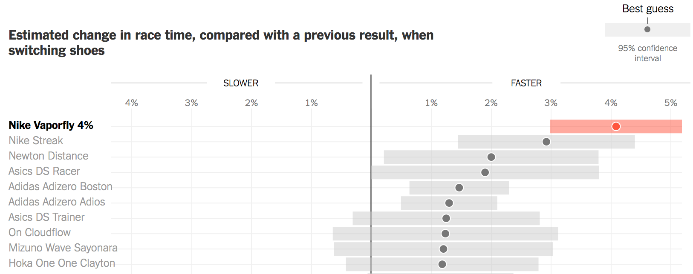

# The final pieces of ggplot2's grammar

```{r setup, include = FALSE}
library(RefManageR)
library(knitr)
library(tidyverse) # Add the tidyverse package to my current library.
library(haven) # Handle labelled data.
library(ggplot2) # Allows us to create nice figures.

options(htmltools.dir.version = FALSE, servr.interval = 0.5, width = 115, digits = 3)
knitr::opts_chunk$set(
  collapse = TRUE, message = FALSE, fig.retina = 3, error = TRUE,
  warning = FALSE, cache = FALSE, fig.align = 'center',
  comment = "#", strip.white = TRUE, tidy = FALSE)

BibOptions(check.entries = FALSE, 
           bib.style = "authoryear", 
           style = "markdown",
           hyperlink = FALSE,
           no.print.fields = c("doi", "url", "ISSN", "urldate", "language", "note", "isbn", "volume"))
myBib <- ReadBib("./../../intRo.bib", check = FALSE)

xaringanExtra::use_xaringan_extra(c("tile_view", "tachyons"))
xaringanExtra::use_panelset()

# Import the ESS round 10
ESS <- read_spss("./../../assets/ESS10.sav")
```

```{r, eval = FALSE, error = TRUE}
# A general template
ggplot(data = <DATA>) +         # Create a coordinate system for <DATA>, and add "+"
  <GEOM_FUNCTION>(              # a layer of (geometric) information, which
     mapping = aes(<MAPPINGS>), # maps our data to aestetics, and 
     stat = <STAT>,             # may depend on statistical transformations.  #<<
     position = <POSITION>      # Positioning may be adjusted.
  ) +
  <COORDINATE_FUNCTION> +       # Change the default coordinate system. #<<
  <FACET_FUNCTION>              # Draw sub-plots by categorical variables. 
```
.center[.backgrnote[*Source*: Wickham & Grolemund ["R for Data Science"](http://r4ds.had.co.nz/data-visualisation.html)]]

---
# Let's get ready

```{r}
# Add packages to library
library(tidyverse) # Add the tidyverse package to my current library.
library(haven) # Handle labelled data.
library(ggplot2) # Allows us to create nice figures.
library(Hmisc) # Weighted statistics.
```

---
# Let's get ready

.font80[
```{r eval = FALSE}
# Import the ESS round 9 data via the API
ESS <- read_spss("ESS10.sav")
```

```{r}
ESS <- ESS %>% # Import the ESS, then (pipe result into)
  transmute( # Create new variables and keep only those
    cntry = as_factor(cntry) %>% fct_drop(), # Country of interview
    gndr = as_factor(gndr),
    facntr = as_factor(facntr), # Father born in cntry
    mocntr = as_factor(mocntr), # Mother born in cntry
    dscrgrp = as_factor(dscrgrp), # Belonging to discriminated group
    dscrrlg = as_factor(dscrrlg), # Discriminated because of religion
    rel_discr = case_when(
      dscrgrp == "Yes" & dscrrlg == "Marked" ~ "Yes",
      dscrgrp == "No" | (dscrgrp == "Yes" & dscrrlg != "Marked") ~ "No",
      TRUE ~ as.character(NA)) %>% as_factor(), # all others missing, then change to factor
    pspwght = dweight*pweight,
    eduyrs = case_when( # Education
      eduyrs > 21 ~ 21, # Recode to max 21 years of edu.
      eduyrs < 9 ~ 9, # Recode to min 9 years of edu.
      TRUE ~ zap_labels(eduyrs)), # Make it numeric
    atchctr = zap_labels(atchctr)) %>% # Emotionally attached to cntry, then #<< 
  dplyr::filter(
    # filter cases from four countries
    (cntry %in% c("Croatia", "France", "Bulgaria")))
```
]

---
# **Statistical transformations**

Scatter plots are rather unique, in that they show the "raw" data.
```{r out.width='60%', fig.height = 3.6, fig.width = 7.2}
ggplot(data = ESS, mapping = aes(y = atchctr, x = eduyrs)) +
  geom_point(alpha = 1/20) +
  labs(y = "Emotionally attached to country",
       x = "Years of education")
```

---
# **Statistical transformations**

Most figures rather visualize *statistically-transformed data*, here the count per category.
.push-left[
```{r out.width='100%', fig.height = 3.6, fig.width = 7.2}
ggplot(data = ESS) +
  # Add layer of bars showing
  # count of discrimination.
  geom_bar(mapping = aes(x = rel_discr, #<<
                         weight = pspwght)) + #<<
  labs(x = "Belong to discr. religious minority")
```
]

.push-right[
```{r}
# Frequency/count table of experienced discrimination.
table(ESS$rel_discr, useNA = "always") 
```
]

---
# ggplot2's statistical transformations 

```{r, echo = FALSE, out.width='90%'}
knitr::include_graphics('https://d33wubrfki0l68.cloudfront.net/70a3b18a1128c785d8676a48c005ee9b6a23cc00/7283c/images/visualization-stat-bar.png')
```

.center[.backgrnote[*Source*: [Wickham & Grolemund: "R for Data Science"](http://r4ds.had.co.nz/data-visualisation.html)]]

---
# Statistical transformations

Geoms have a default `stat` function, which performs the transformation, such as counting.<br> .backgrnote[Vice versa, stats have default geom functions. Chapter 3 of [R for Data Science](http://r4ds.had.co.nz/data-visualisation.html) explains how you build graphs based on stats stats rather than geoms.]

.push-left[
```{r out.width='95%', fig.height = 3.6, fig.width = 7.2}
ggplot(data = ESS) +
  # Add layer of bars showing count of discr.  
  geom_bar(mapping = aes(x = rel_discr, 
                         weight = pspwght)) +
  
  labs(x = "Belong to discr. religious minority")
```
]

.push-right[
```{r out.width='95%', fig.height = 3.6, fig.width = 7.2}
ggplot(data = ESS) +
  # The default of geom_bar is stat = "count"s
  geom_bar(mapping = aes(x = rel_discr,
                         weight = pspwght), 
           stat = "count") + #<<
  labs(x = "Belong to discr. religious minority")
```
]

---
# Statistical transformations .font60[**Like a pro** ...]

Oftentimes, we want to do statistical transformations by hand and plot the resulting data.
```{r}
ESS_cntry <- ESS %>% # use the ESS, then
  mutate( # Generate a numeric 0/1 indicator of perceived discrimination.
    rel_discr_num = case_when(rel_discr == "Yes" ~ 1, 
                              rel_discr == "No" ~ 0,
                              TRUE ~ as.numeric(NA))) %>%
  group_by(cntry) %>% # group ESS_minority by cntry, then
  dplyr::summarize( # Start summarize function.
    wn = sum(pspwght, na.rm = TRUE), # weighted number of cases,
    df = (wn^2 / sum(pspwght^2, na.rm = TRUE)), # degrees of freedom,
    wn_rd = sum(rel_discr_num * pspwght, na.rm = TRUE), # weighted number of cases who ...,
    wperc_rd = (wn_rd / wn) * 100, # weighted % who ...,
    wse_rd = sqrt(wperc_rd * (100 - wperc_rd) / wn), # Standard error of the percent,
    wmin95_rd = wperc_rd - wse_rd * qt(p = 0.975, df = df), # Lower bound of 95% CI,
    wmax95_rd = wperc_rd + wse_rd * qt(p = 0.975, df = df) # Upper bound of 95% CI,
  ) # End of summarize.
```

---
# Statistical transformations .font60[**Like a pro** ...]

If we statistically transform data by ourselves and then wish to plot the resulting data, we have to:
1. Give ggplot2 both `x` and `y` for its coordinate system. 
2. Tell the geom that we do not wish to use the default `stat`, but instead use the statistically-transformed data as raw input without further transformation (i.e., `"identity"`, aka "leave as it").

.push-left[
```{r StatTrans1, fig.show = "hide"}
ggplot(data = ESS_cntry) +
  geom_bar(mapping = aes(x = cntry, 
                         y = wperc_rd), 
           stat = "identity") + # Leave as is. #<<
  labs(y = "% Stating They Belong\n to a Discriminated Religious Minority",
       x = "Country")
```

```{r}
ESS_cntry
```
]

.push-right[
```{r ref.label = "StatTrans1", fig.height = 3.4, fig.width = 7.2, echo = FALSE}
```
]


???
Again a nice example how we are quicker to pick up the differences in the plot.

---
# Statistical transformations .font60[**Like a pro** ...]

If we statistically transform data by ourselves and then wish to plot the resulting data, we have to:
1. Give ggplot2 both `x` and `y` for its coordinate system. 
2. Tell the geom that we do not wish to use the default `stat`, but instead use the statistically-transformed data as raw input without further transformation (i.e., `"identity"`, aka "leave as it").

.push-left[
```{r eval = FALSE}
ggplot(data = ESS_cntry) +
  geom_bar(mapping = aes(x = cntry, 
                         y = wperc_rd), 
           stat = "identity") + # Leave as is. #<<
  labs(y = "% Stating They Belong\n to a Discriminated Religious Minority \n (Along with 95% Confidence Intervals)",
       x = "Country")
```

```{r}
ESS_cntry
```
]

.push-right[
```{r ref.label = "StatTrans1", out.width='90%', fig.height = 3.4, fig.width = 7.2, echo = FALSE}
```
```{r echo = FALSE, out.width='90%'}

```
]

---
class: clear

```{r out.width='85%', fig.height = 3.4, fig.width = 7.2}
ggplot(data = ESS_cntry, mapping = aes(y = wperc_rd, x = cntry)) +
  geom_bar(stat = "identity") +
  geom_errorbar(mapping = aes(ymin = wmin95_rd, ymax = wmax95_rd)) + # Add layer of errorbars. #<<
  labs(y = "% Stating They Belong\n to a Discriminated Religious Minority \n (Along with 95% Confidence Intervals)",
       x = "Country")
```

---
class: clear

```{r out.width='85%', fig.height = 3.4, fig.width = 7.2}
ggplot(data = ESS_cntry, mapping = aes(y = wperc_rd, x = cntry)) +
  geom_bar(stat = "identity") +
  geom_errorbar(mapping = aes(ymin = wmin95_rd, ymax = wmax95_rd), 
                width = 0.25) + # Add layer of decently-sized errorbars. #<<
labs(y = "% Stating They Belong\n to a Discriminated Religious Minority \n (Along with 95% Confidence Intervals)",
     x = "Country")
```

---
# Can we make publishable figures?

New York Times: [Nike Says Its $250 Running Shoes Will Make You
Run Much Faster. What if That’s Actually True?](https://www.nytimes.com/interactive/2018/07/18/upshot/nike-vaporfly-shoe-strava.html)

.left-column[
<br>

]

.right-column[
```{r, echo = FALSE, out.width='100%'}

```
]

---
# Reorder .font60[Consider a meaningful *order* for your graphs]

.push-left[
```{r reorder, fig.show = 'hide'}
ggplot(data = ESS_cntry, 
       mapping = aes(y = wperc_rd,
                     # Reorder x based on 
                     # *increasing* values of y. 
                     x = reorder(cntry, wperc_rd))) + #<<
  geom_bar(stat = "identity") +
  geom_errorbar(mapping = aes(ymin = wmin95_rd, 
                              ymax = wmax95_rd), 
                width = 0.25) +
  labs(y = "% Stating They Belong\n to a Discriminated Religious Minority \n (Along with 95% Confidence Intervals)",
       x = "Country")
```
]

.push-right[
```{r ref.label = "reorder", fig.height = 3.4, fig.width = 7.2, echo = FALSE}
```
]

---
# Reorder .font60[Consider a meaningful *order* for your graphs]

.push-left[
```{r reorder2, fig.show = 'hide'}
ggplot(data = ESS_cntry, 
       mapping = aes(y = wperc_rd,
                     # Reorder x based on 
                     # *decreasing* values of y. 
                     x = reorder(cntry, -wperc_rd))) + #<<
  geom_bar(stat = "identity") +
  geom_errorbar(mapping = aes(ymin = wmin95_rd, 
                              ymax = wmax95_rd), 
                width = 0.25) +
  labs(y = "% Stating They Belong\n to a Discriminated Religious Minority \n (Along with 95% Confidence Intervals)",
       x = "Country")
```
]

.push-right[
```{r ref.label = "reorder2", fig.height = 3.4, fig.width = 7.2, echo = FALSE}
```
]

---
# Polar **coordinate system**

.push-left[
```{r polar, fig.show = 'hide'}
ggplot(data = ESS_cntry, 
       mapping = aes(y = wperc_rd,
                     # Reorder x based on 
                     # *decreasing* values of y. 
                     x = reorder(cntry, wperc_rd))) +
  geom_bar(stat = "identity") +
  geom_errorbar(mapping = aes(ymin = wmin95_rd, 
                              ymax = wmax95_rd), 
                width = 0.25) +
  labs(y = "% Stating They Belong\n to a Discriminated Religious Minority \n (Along with 95% Confidence Intervals)",
       x = "Country") +
  coord_polar() #<<
```
]

.push-right[
```{r ref.label = "polar", fig.height = 3.4, fig.width = 7.2, echo = FALSE}
```
]

---
# Flipped coordinate system

.push-left[
```{r flipped, fig.show = 'hide'}
ggplot(data = ESS_cntry, 
       mapping = aes(y = wperc_rd,
                     # Reorder x based on 
                     # *decreasing* values of y. 
                     x = reorder(cntry, wperc_rd))) +
  geom_bar(stat = "identity") +
  geom_errorbar(mapping = aes(ymin = wmin95_rd, 
                              ymax = wmax95_rd), 
                width = 0.25) +
  labs(y = "% Stating They Belong\n to a Discriminated Religious Minority \n (Along with 95% Confidence Intervals)",
       x = "Country") +
  coord_flip() # Switch the x and y axes. #<<
```
]

.push-right[
```{r ref.label = "flipped", fig.height = 3.4, fig.width = 7.2, echo = FALSE}
```
]

---
# Same info, different geoms

.push-left[
```{r segment, fig.show = 'hide'}
ggplot(data = ESS_cntry, 
       mapping = aes(y = wperc_rd,
                     # Reorder x based on 
                     # *decreasing* values of y. 
                     x = reorder(cntry, wperc_rd))) +
  geom_segment(mapping = aes(y = wmin95_rd, #<<
                             yend = wmax95_rd, #<<
                             xend = cntry), #<<
               size = 6.5, alpha = 0.3) + #<<
  geom_point(size = 5, shape = 21, #<<
             color = "white", fill = "gray45") + #<<
  labs(y = "% Stating They Belong\n to a Discriminated Religious Minority \n (Along with 95% Confidence Intervals)",
       x = "Country") +
  coord_flip() # Switch the x and y axes.
```
]

.push-right[
```{r ref.label = "segment", fig.height = 3.4, fig.width = 7.2, echo = FALSE}
```
]

---
# Highlight specific cases

```{r}
(ESS_cntry <- ESS_cntry %>% 
  mutate(discr_level = case_when(
      cntry == "France" ~ "Pronounced",
      TRUE ~ "Less pronounced") %>% 
        # Make "Pronounced" first level
        fct_relevel("Pronounced")))
```

---
# Highlight specific cases

.push-left[
```{r highlight, fig.show = 'hide'}
ggplot(data = ESS_cntry, 
       mapping = aes(y = wperc_rd,
                     # Reorder x based on 
                     # *decreasing* values of y. 
                     x = reorder(cntry, wperc_rd))) +
  geom_segment(mapping = aes(color = discr_level, #<<
                             y = wmin95_rd,
                             yend = wmax95_rd,
                             xend = cntry),
               size = 6.5, alpha = 0.3) +
  geom_point(mapping = aes(fill = discr_level), #<<
             color = "white", size = 5, shape = 21) +
  labs(y = "% Stating They Belong\n to a Discriminated Religious Minority \n (Along with 95% Confidence Intervals)",
       x = "Country") +
  coord_flip() # Switch the x and y axes.
```
]

.push-right[
```{r ref.label = "highlight", fig.height = 3.4, fig.width = 7.2, echo = FALSE}
```
]

---
# Fine tuning

.push-left[
```{r labs, fig.show = 'hide'}
(myplot <- ggplot(data = ESS_cntry, 
       mapping = aes(y = wperc_rd,
                     # Reorder x based on 
                     # *decreasing* values of y. 
                     x = reorder(cntry, wperc_rd))) +
  geom_segment(mapping = aes(color = discr_level, #<<
                             y = wmin95_rd,
                             yend = wmax95_rd,
                             xend = cntry),
               size = 6.5, alpha = 0.3) +
  geom_point(mapping = aes(fill = discr_level), #<<
             color = "white", size = 5, shape = 21) +
  labs(y = "% Stating They Belong\n to a Discriminated Religious Minority \n (Along with 95% Confidence Intervals)",
       x = "Country", 
       color = "Level of Discrimination", #<<
       fill = "Level of Discrimination", #<<
       title = "Perceived Religious Discrimination", #<<
       subtitle = "A Comparison of three countries", #<<
       caption = "(Based on the European Social Survey 2022)") + #<<
  coord_flip()) # Switch the x and y axes.
```
]

.push-right[
```{r ref.label = "labs", fig.height = 3.4, fig.width = 7.2, echo = FALSE}
```
]

---
# Fine tuning .font60[once you are more advanced ...]

.push-left[
```{r final, fig.show = 'hide'}
myplot + # The object that contains the figure 
  # produced in the previous slide. 
  # Yes, you can recall and add to it.
  theme_minimal() + #<<
  theme(legend.position = c(0.87, 0.27), #<<
        legend.background = 
          element_rect(fill = NA, #<<
                       color = NA)) #<<
```
]

.push-right[
```{r ref.label = "final",fig.height = 3.4, fig.width = 7.2, echo = FALSE}
```
]

---
# Publishable figures ...

.push-right[
```{r ref.label = "final", fig.height = 3.4, fig.width = 7.2, echo = FALSE}
```
]

.push-left[

<iframe src="https://www.soc.ku.dk/instituttet/nyheder_/2021/hver-femte-dansker-vil-sende-indvandrere-med-covid-19-bag-i-hospitalskoeen/" height="100%" width="100%" frameBorder="0" style="min-height: 560px;"></iframe>

]

---
class: inverse
# Today's general lessons

```{r, eval = FALSE, error = TRUE}
# A general template
ggplot(data = <DATA>) +         # Create a coordinate system for <DATA>, and add "+"
  <GEOM_FUNCTION>(              # a layer of (geometric) information, which
     mapping = aes(<MAPPINGS>), # maps our data to aestetics, and
     stat = <STAT>,             # may depend on statistical transformations.
     position = <POSITION>      # Positioning may be adjusted.
  ) +
  <COORDINATE_FUNCTION> +       # Change the default coordinate system.
  <FACET_FUNCTION>              # Draw sub-plots by categorical variables.
```
