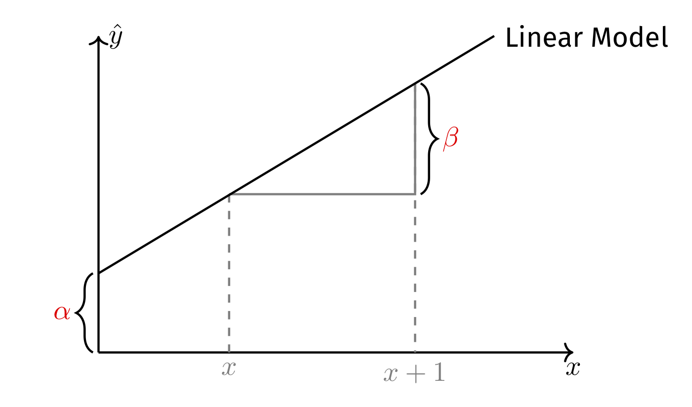

```{r setup, include = FALSE}
library(RefManageR)
library(knitr)
library(equatiomatic)

options(htmltools.dir.version = FALSE, servr.interval = 0.5, width = 115, digits = 3)
knitr::opts_chunk$set(
  collapse = TRUE, message = FALSE, fig.retina = 3, error = TRUE,
  warning = FALSE, cache = FALSE, fig.align = 'center',
  comment = "#", strip.white = TRUE, tidy = FALSE)

BibOptions(check.entries = FALSE, 
           bib.style = "authoryear", 
           style = "markdown",
           hyperlink = FALSE,
           no.print.fields = c("doi", "url", "ISSN", "urldate", "language", "note", "isbn", "volume"))
myBib <- ReadBib("./../../intRo.bib", check = FALSE)

xaringanExtra::use_xaringan_extra(c("tile_view", "tachyons"))
xaringanExtra::use_panelset()
```
# Let's get ready

```{r}
# Add packages to library
library(tidyverse) # Add the tidyverse package to my current library.
library(haven) # Handle labelled data.
library(ggplot2) # Allows us to create nice figures.
library(estimatr) # Allows us to estimate (cluster-)robust standard errors. #<<
library(texreg) # Allows us to make nicely-formatted Html & Latex regression tables. #<<
library(broom) # Allows us to turn model objects into tibbles. #<<
library(modelr) # Further process model objects #<<
```

```{r include = FALSE}
# Import the ESS round 10
ESS <- read_spss("./../../assets/ESS10.sav")
```

---
# Data preparation

```{r}
ESS <- ESS %>% transmute( # Create new variables and keep only those
  idno = zap_labels(idno),
  cntry = as_factor(cntry) %>% fct_drop(), # Country of interview
  facntr = as_factor(facntr), # Father born in cntry
  mocntr = as_factor(mocntr), # Mother born in cntry
  imwbcnt = max(imwbcnt, na.rm = TRUE) - zap_labels(imwbcnt),
  pspwght = dweight*pweight,
  eduyrs = case_when( # Education
    eduyrs > 21 ~ 21, # Recode to max 21 years of edu.
    eduyrs < 9 ~ 9, # Recode to min 9 years of edu.
    TRUE ~ zap_labels(eduyrs))) %>% # Make it numeric, then
  dplyr::filter(
    # Keep only respondents with native-born parents,
    facntr == "Yes" & mocntr == "Yes" &
      (cntry %in% c("Slovakia", "Hungary", "Czechia", "Slovenia")))
```

---
# Design matrix

```{r}
# Design matrix (i.e., tibble of the vars going into out model)
ESS <- ESS %>%
  select(idno, cntry, imwbcnt, eduyrs, pspwght) %>%
  drop_na() # Casewise deletion.
```

---
# Modeling xenophobia

.push-left[
.panelset[
.panel[.panel-name[Plot]
```{r echo = FALSE, out.width='100%', fig.height = 4, fig.width = 6}
# Plot the distribution of imwbcnt
ggplot(data = ESS, aes(x = imwbcnt)) +
  geom_histogram() +
  theme_minimal()
```
.panel[.panel-name[Code]
```{r fig.show = 'hide'}
# Plot the distribution of imwbcnt
ggplot(data = ESS, aes(x = imwbcnt)) +
  geom_histogram() +
  theme_minimal()
```
]
]]]

--

.push-right[
#### Modeling
Coming up with a model of xenophobia means: Can xenophobia (i.e., $y$) be expressed as a function (i.e., $f()$) of another variable (i.e., $x$)?

$$\hat{y} = f(x)$$
The two critical questions are thus:

1. What is $f()$?
2. What is $x$? <br> .backgrnote[
You will need to find the answer to the second question in your research question, theory, and hypothesis.]
]

---
# A linear Model of $y$ .font60[Simple, but extremely versatile!]

.right-column[
$$\hat{y} = \alpha + \beta x$$

```{r, echo = FALSE, out.width='100%'}

```
]

--

.left-column[
Now, the two critical questions have turned to:
1. What are $\alpha$ and $\beta$?
2. What is $x$? <br> .backgrnote[
You will need to find the answer to the second question in your research question, theory, and hypothesis.]

]

---
# A linear Model of $y$

.left-column[
Let's try $x = \text{years of education}$, since schools in most countries teach humanism and tolerance: Is xenophobia a linear (i.e., constant slope) function of one's years of education?
]

.right-column[
.panelset[
.panel[.panel-name[Plot]
```{r echo = FALSE, out.width='85%', fig.height = 4, fig.width = 7}
ggplot(data = ESS, mapping = aes(y = imwbcnt, x = eduyrs)) +
  geom_jitter(aes(size = pspwght), alpha = 1/5) + 
  geom_smooth(aes(weight = pspwght), se = FALSE) +
  geom_smooth(aes(weight = pspwght), method = "lm", se = FALSE, color = "red") +
  labs(y = "Xenophobia", x =  "Years of education", size = "Survey \n weight") +
  theme_minimal() +
  theme(legend.position = "none")
```
]
.panel[.panel-name[Code]
```{r start, fig.show = "hide"}
ggplot(data = ESS, mapping = aes(y = imwbcnt, x = eduyrs)) +
  geom_jitter(aes(size = pspwght), alpha = 1/5) + 
  geom_smooth(aes(weight = pspwght), se = FALSE) +
  geom_smooth(aes(weight = pspwght), method = "lm", 
              se = FALSE, color = "red") +
  labs(y = "Xenophobia", x =  "Years of education", 
       size = "Survey \n weight") +
  theme_minimal() +
  theme(legend.position = "none")
```
]]]

---
# Regressing linear models from data

.panelset[
.panel[.panel-name[Residuals, e]
```{r results = FALSE, echo = FALSE}
mod <- ESS %>%
  lm(formula = imwbcnt ~ eduyrs, data = .)

Dat_ols <- ESS %>% 
  add_residuals(model = mod) %>% 
  add_predictions(model = mod)
```

.left-column[
- **Residuals**, $e_{i} =y_{i} - \hat{y}$
  + the differences between what our model predicts and the actual data.

$e_{\text{Zoltán}} = `r Dat_ols$imwbcnt[Dat_ols$idno == 11975]` - `r round(Dat_ols$pred[Dat_ols$idno == 11975], 1)`=`r Dat_ols$imwbcnt[Dat_ols$idno == 11975] - round(Dat_ols$pred[Dat_ols$idno == 11975], 1)`$
]
.right-column[
```{r residuals, out.width='100%', fig.height = 4, fig.width = 6.5, results = FALSE, echo = FALSE}
library(ggrepel)

resid <- ggplot(data = Dat_ols, mapping = aes(y = imwbcnt, x = eduyrs)) +
  geom_jitter(alpha = 1/3, aes(size = pspwght)) +
  geom_smooth(method = "lm", se = FALSE) +
  labs(y = "Xenophobia", 
       x = "Years of education") +
  theme_minimal()

resid + 
  geom_linerange(data = Dat_ols %>% filter(idno == 11975), size = 1,
                 mapping = aes(ymin = pred, ymax = (resid + pred)), color = "#901A1E") +
  geom_point(data = Dat_ols %>% filter(idno == 11975), 
             color = "#ffbd38", size = 5, alpha = 0.6) +
  geom_point(data = Dat_ols %>% filter(idno == 11975), 
             aes(y = pred), color = "#425570", size = 5, alpha = 0.6) +
  geom_label_repel(data = Dat_ols %>% filter(idno == 11975), 
                   aes(y = pred, label = paste("Predicted xenophobia for Zoltán: ", round(pred, 1), sep = "")),
                   show.legend = FALSE,
                   alpha = 0.8, segment.curvature = -0.1,
                   segment.ncp = 4, segment.angle = 10,
                   size = 3, box.padding = 1.5,
                   point.padding = 0.5, force = 100,
                   segment.size  = 0.3) +
  geom_label_repel(data = Dat_ols %>% filter(idno == 11975), 
                   aes(label = paste("Actual xenophobia for Zoltán: ", imwbcnt, sep = "")),
                   show.legend = FALSE,
                   alpha = 0.8, segment.curvature = -0.1,
                   segment.ncp = 4, segment.angle = 10,
                   size = 3, box.padding = 1.5,
                   point.padding = 0.5, force = 100,
                   segment.size  = 0.3) +
    theme(legend.position = "none")
```
]]

.panel[.panel-name[Minimize 1]

.left-column[
- **The _best_ fitting line**:
$$\begin{align*}
      \min \text{RSS} &= \min \sum_{i=1}^{n} e_{i}^{2} \\
      &= \min \sum_{i=1}^{n} y_{i} - \hat{y_{i}} \\
      &= \min \sum_{i=1}^{n} (y_{i} - (\color{orange}{\alpha} + \color{orange}{\beta} x_{i})^{2}
    \end{align*}$$
]

.right-column[
```{r min_resid, out.width='90%', fig.height = 4, fig.width = 6.5, results = FALSE, echo = FALSE}
library(modelr)
mod <- lm(formula = imwbcnt ~ eduyrs, data = ESS, weights = pspwght)
eduyrs <- rnorm(mean = 15, sd = 3, n = 75)
imwbcnt <-  coef(mod)[1] + coef(mod)[2]*eduyrs + rnorm(mean = 0, sd = 0.5, n = 75)  
dat <- tibble(imwbcnt, eduyrs)
mod2 <- lm(formula = imwbcnt ~ eduyrs, data = dat)

dat <- dat %>% add_residuals(model = mod2) %>% add_predictions(model = mod2)

ggplot(data = dat, mapping = aes(y = imwbcnt, x = eduyrs)) +
  geom_point() +
  geom_linerange(mapping = aes(ymin = pred, ymax = (resid + pred)), color = "#901A1E") +
  geom_smooth(method = "lm", se = FALSE) +
  labs(y = "Xenophobia", x =  "Years of education") +
  theme_minimal() +
  theme(legend.position = "none")
```
]]

.panel[.panel-name[& 2]
.left-column[
- **The _best_ fitting line**:
$$\begin{align*}
      \min \text{RSS} &= \min \sum_{i=1}^{n} e_{i}^{2} \\
      &= \min \sum_{i=1}^{n} y_{i} - \hat{y_{i}} \\
      &= \min \sum_{i=1}^{n} (y_{i} - (\color{orange}{\alpha} + \color{orange}{\beta} x_{i})^{2}
    \end{align*}$$
]

.right-column[
```{r, echo = FALSE, out.width='50%'}
knitr::include_graphics('https://mlfromscratch.com/content/images/size/w2000/2020/06/linear_regression_gif.gif')
```
.backgrnote[.center[
*Source*: [Machine Learning From Scratch](https://mlfromscratch.com/linear-regression-from-scratch/#/)
]]]]

.panel[.panel-name[R2 model fit]
.left-column[
- How much smaller are the residuals from our model (blue line), compared to simply using the mean $\bar{y}$ as best guess (orange line)?
$$\text{TSS}=\sum_{i=1}^{n}(y_i-\bar{y})^2$$
$$\text{RSS}=\sum_{i=1}^{n}(y_i-\hat{y}_i)^2$$
$R^2=\frac{\text{TSS} - \text{RSS}}{\text{TSS}}$
]
.right-column[
```{r R2, out.width='100%', fig.height = 4, fig.width = 6.5, results = FALSE, echo = FALSE}
resid +
  geom_hline(yintercept = mean(ESS$imwbcnt), color = "#ffbd38") +
  geom_linerange(data = Dat_ols %>% filter(idno == 11975),
                 mapping = aes(ymin = pred, ymax = (resid + pred)), color = "#901A1E") +
  geom_linerange(data = Dat_ols %>% filter(idno == 11975),
                 mapping = aes(ymin = mean(ESS$imwbcnt), ymax = (pred)), color = "#901A1E", size = 2) +
  geom_label_repel(data = Dat_ols %>% filter(idno == 11975),
                   label = "Zoltán",
                   show.legend = FALSE,
                   alpha = 0.8, segment.curvature = -0.1,
                   segment.ncp = 4, segment.angle = 10,
                   size = 3, box.padding = 1.5,
                   point.padding = 0.5, force = 100,
                   segment.size  = 0.3) +
  theme(legend.position = "none")
```
]]

.panel[.panel-name[Regression using R]
.push-left[
```{r ols, eval = FALSE}
# Estimate regression models.
ols <- lm_robust(data = ESS, formula = imwbcnt ~ eduyrs,
                 weights = pspwght)

screenreg(ols, # Nicely-formatted table.
        digits = 3, include.ci = FALSE)
```

```{r ref.label = "start", out.width='100%', fig.height = 4, fig.width = 6.5, results = FALSE, echo = FALSE}
```
]

.push-right[
```{r ref.label = "ols", echo = FALSE}
```
]]

.panel[.panel-name[Interpretation]
.push-left[
```{r ref.label = "start", out.width='100%', fig.height = 4, fig.width = 6.5, results = FALSE, echo = FALSE}
```
]

```{r trick, include = FALSE}
ols_trick <- lm(data = ESS, formula = imwbcnt ~ eduyrs, weights = pspwght)
```


.push-right[
`r extract_eq(ols_trick, use_coefs = TRUE)` $\rightarrow$ the best-fitting line that $\min \sum_{i=1}^{n} e_{i}^{2}$.

- For respondents with no formal education (.alert[Note: Unsupported extrapolation!]), the predicted average level of xenophobia is `r round(coef(ols)[1], 2)`. 
  + $(\hat{y}|\text{Eduyrs = 0}) = `r round(coef(ols)[1], 2)`$. 
  
- With every year of education, the average level of xenophobia is `r round(coef(ols)[2], 2)` lower.

- This model accounts for `r round(summary(ols)$r.squared, 2)`* 100 % more of the variation of xenophobia, than simply using the mean as best guess $\bar{y} = `r round(mean(ESS$imwbcnt), 2)`$.
]]]

---
# Two types of interpretation

.left-column[
.center[**1. Causal**]

With every additional year of education, xenophobia is expected to decline on average by `r round(coef(ols)[2], 2)`%.

.alert[Beware, this interpretation only holds if X was (as good as) randomly assigned!]
]

--

.right-column[
.center[
**2. Descriptive: conditional means $\bar{y}|x$**
]

With every year of education, the average level of xenophobia is `r round(coef(ols)[2], 2)` units lower.

Here regression is a (linear) model that describes the average of the outcome for different values of the predictor.
]

---
# Weighted linear OLS

.left-column[
The `weights` argument allows you to use post-stratification weights.

But beware, `lm()` inference (e.g., standard errors, *t*-values, *p*-values) will be wrong, because weights introduce heteroscedasticity.

.alert[We thus need to estimate heteroscedasticity-robust standard errors.] One comfortable possibility to do that is `estimatr::lm_robust()`.
]

.right-column[
```{r}
# Estimate a weighted linear OLS model.
ols <- lm_robust(formula = imwbcnt ~ eduyrs, data = ESS, #<<
                 weights = pspwght) #<<
summary(ols) # Give a summary of the main results.
```
]

---
# Categorical predictors

.panelset[
.panel[.panel-name[Scatter plot]

.left-column[
.content-box-green[
1. At which $\hat{Y}$ does the regression line pass through the cloud of respondents from Czechia?
2. At which $\hat{Y}$ does the regression line pass through the cloud of respondents from Slovenia?
3. What does this suggest about the slope $\hat{\beta}$?
]]
.right-column[
```{r categorical, out.width='100%', fig.height = 3, fig.width = 5, results = FALSE, echo = FALSE}
Dat_bi <- ESS %>%
  mutate(
    cntry_bi = case_when(
      cntry == "Czechia" ~ 0,
      cntry == "Slovenia" ~ 1,
      TRUE ~ as.numeric(NA)))

ggplot(data = Dat_bi, aes(y = imwbcnt, x = cntry_bi)) +
  geom_jitter(alpha = 1/10, size = 3, width = 0.05, height = 0.3) +
  geom_smooth(method = "lm", se = FALSE) +
  scale_x_continuous(breaks = c(0, 1), labels = c("Czechia", "Slovenia")) +
  labs(y = "Xenophobia", 
       x = "Country") +
  theme_minimal() +
  guides(color = "none")
```
]]

.panel[.panel-name[Dummy coding]

.push-left[
$$x=
  \begin{cases}
    1, & \text{if condition is met} \\
    0 & \text{otherwise}
  \end{cases}$$

Country                       |  Slovenia | Hungary | ...
---------------------------------|----|----|----
1                 | 1  | 0  | 0 
2                 | 1  | 0  | 0
...                 | 1  | 0  | 0
1230                          | 0  | 1  | 0  
1231                          | 0  | 1  | 0
...                          | 0  | 1  | 0
Reference <br> .backgrnote[(Czechia)] | 0  | 0  | 0
]

.push-right[
```{r categorical2, out.width='100%', fig.height = 3, fig.width = 4.5, results = FALSE, echo = FALSE}
Dat_bi <- ESS %>%
   mutate(
     cntry_bi = case_when(
       cntry == "Slovenia" ~ 1,
       cntry == "Czechia" ~ 0,
       TRUE ~ as.numeric(NA)))

ggplot(data = Dat_bi, aes(y = imwbcnt, x = cntry_bi)) +
  geom_jitter(alpha = 1/10, size = 3, width = 0.05, height = 0.3) +
  geom_smooth(method = "lm", se = FALSE) +
  scale_x_continuous(breaks = c(0, 1)) +
  labs(y = "Xenophobia", 
       x = "Slovenia") +
  theme_minimal() +
  guides(color = "none")
```
]]

.panel[.panel-name[How it's done in R]
.push-left[
```{r ols_2, eval = FALSE}
# R recognizes categorical variables automatically,
# if they are factor or character vectors.
ols_2 <- lm_robust(imwbcnt ~ cntry, data = ESS, 
                   weights = pspwght)

screenreg(ols_2, # Nicely-formatted table.
        include.ci = FALSE, digits = 3, 
        single.row = TRUE)
```

```{r ref.label = "categorical", out.width='80%', fig.height = 4, fig.width = 6.5, results = FALSE, echo = FALSE}
```
]
.push-right[
```{r ref.label = "ols_2", echo = FALSE}
```
]]

.panel[.panel-name[Interpretation]
.push-left[.font90[
```{r ref.label = "ols_2", echo = FALSE}
```
]]
.push-right[
```{r include = FALSE}
# R recognizes categorical variables automatically.
ols_2a <- lm(imwbcnt ~ cntry, data = ESS, weights = pspwght)
```

`r extract_eq(ols_2a, wrap = TRUE, terms_per_line = 2, use_coefs = TRUE)`

- When Hungary = 0, Slovenia = 0, and Slovakia = 0, we predict xenophobia of `r round(coef(ols_2)[1], 2)`.<br> $\rightarrow$ Average level of xenophobia in Czechia is: `r round(coef(ols_2)[1], 2)`.

- In Hungary, xenophobia is on average `r round(coef(ols_2)[2], 2)` units lower than among the Czech population; and this difference is statistically significant/systematic.
  + In Hungary, xenophobia is thus: $`r round(coef(ols_2)[1], 2)` + `r round(coef(ols_2)[2], 2)` = `r round(coef(ols_2)[1], 2) + round(coef(ols_2)[2], 2)`$.
]]]

---
# Regression tables

.font90[
```{r warning = FALSE, message = FALSE}
# Regression table of model objects ols1 and ols_2; report standard errors, not confidence intervals.
texreg::screenreg(list(ols, ols_2), include.ci = FALSE) 
```
]

---
# Regression tables

.push-left[
```{r}
# Regression table of model objects ols1 and ols_2; 
# report standard errors, not confidence intervals.
texreg::htmlreg(list(ols, ols_2), 
        include.ci = FALSE, 
        file = "MyOLSModels.doc") # Word table

texreg::htmlreg(list(ols, ols_2), 
        include.ci = FALSE, 
        file = "MyOLSModels.html") # Html table

texreg::texreg(list(ols, ols_2), 
       include.ci = FALSE, 
       file =  "MyOLSModels.tex") # Latex table 
```

```{r regtable, eval = FALSE}
# Regression table with labelled predicators
htmlreg(list(ols, ols_2), include.ci = FALSE,
        custom.coef.names = c("Intercept", 
                              "Years of Education", 
                              "Hungary", "Slovenia", 
                              "Slovakia"),
        caption = "My regression table", 
        caption.above = TRUE,
        single.row = TRUE)
```
]

.push-right[
.font60[
```{r ref.label = "regtable", results = 'asis', echo = FALSE}
```
]]

---
# Further processing of model results

`broom:tidy()` turns a model object into a tibble containing coefficients and inference stats.
```{r}
tidy(ols_2) 
```

---
# Regression results are data too!

```{r out.width='50%', fig.align='center', dpi = 350, fig.height = 3, fig.width = 5}
(plotdata <- ols_2 %>% tidy() %>% # Use the ols_2 model object, then tidy it, then
   mutate(term = fct_recode(factor(term), # Recode predictor names, then
                            "Intercept" = "(Intercept)",
                            "Hungary" = "cntryHungary",
                            "Slovenia" = "cntrySlovenia",
                            "Slovakia" = "cntrySlovakia")) %>% 
  select(term, estimate, conf.low, conf.high) %>% # keep only some of all the info.
   filter(term != "Intercept"))
```

---
class: clear
# Coefficient plots .font60[Good alternative to regression tables]

.panelset[
.panel[.panel-name[Plot]
```{r out.width='60%', fig.height = 4, fig.width = 6, echo = FALSE}
ggplot(data = plotdata,
       aes(x = reorder(term, estimate), 
           y = estimate, 
           ymin = conf.low, ymax = conf.high)) +
  geom_hline(yintercept = 0, # Null-hypothesis line.
             color = "#901A1E", lty = "dashed") + 
  geom_pointrange() + # Coefs with 95% CI.
  coord_flip() + 
  theme_minimal() +
  # Axis title: greek beta.
  labs(y = "Difference in xenophobia as compared to Czechia", 
       x = "",
       caption = "Note: Results are from post-stratitification weighted OLS regression with robust inference") +
  theme(legend.position="bottom",
        legend.title=element_blank())
```
]
.panel[.panel-name[Code]
```{r fig.show = "hide"}
ggplot(data = plotdata,
       aes(x = reorder(term, estimate), y = estimate, ymin = conf.low, ymax = conf.high)) +
  geom_hline(yintercept = 0, # Null-hypothesis line.
             color = "#901A1E", lty = "dashed") + 
  geom_pointrange() + # Coefs with 95% CI.
  coord_flip() + 
  theme_minimal() +
  # Axis title: greek beta.
  labs(y = "Difference in xenophobia as compared to Czechia", 
       x = "",
       caption = "Note: Results are from post-stratitification weighted OLS regression with robust inference") +
  theme(legend.position="bottom",
        legend.title=element_blank())
```
]]

---
# Model predictions .font60[For continuous predictors]

.panelset[
.panel[.panel-name[The OLS model]
.push-left[
```{r}
ols <- lm_robust(formula = imwbcnt ~ eduyrs, data = ESS, weights = pspwght)
```
]
.push-right[
```{r Coefplot2, out.width='100%', fig.height = 4, fig.width = 6, echo = FALSE}
plotdata2 <- ols %>%
  tidy() %>% # Turn results into a tibble,
  mutate( # Rename variables for the plot.
    term = case_when(
      term == "eduyrs" ~ "Years of education",
      term == "(Intercept)" ~ "Intercept")) %>%
  filter(term != "Intercept")

ggplot(data = plotdata2, aes(y = estimate, 
                            # Order by effect size
                            x = reorder(term, estimate))) +
  geom_hline(yintercept = 0, color = "red", lty = "dashed") +
  # Point with error-bars,
  geom_pointrange(aes(min = conf.low, max = conf.high)) +
  coord_flip() + # Flip Y- & X-Axis,
  labs(
    title = "Regression of xenophobia",
    x = "",
    # Write Greek beta into axis title.
    y = expression("Estimate of"~beta)) +
  theme_minimal()
```
]]
.panel[.panel-name[Predictions]
.push-left[
**Step 1**: Generate fictional data of $x$ with theoretically-informative values.

```{r}
(fict_dat <- tibble(eduyrs = 1:30))
```
]
.push-right[
**Step 2**: Apply estimated model to fictional data. Given fictional data, what $\hat{y}$ does our model predict?

```{r}
(fict_dat <- predict( #<<
  ols, newdata = fict_dat, #<<
  interval = "confidence", level = 0.95)$fit %>% #<<
   as_tibble() %>% # Turn into a tibble, then
   bind_cols(fict_dat, .)) # Add to the synthetic data.
```
]]
.panel[.panel-name[Visualization]
.push-left[
```{r Predplot, fig.show = 'hide'}
ggplot(data = fict_dat, aes(y = fit, x = eduyrs)) +
  geom_vline(xintercept = c(9, 21), color = "red", lty = "dashed") +
  geom_ribbon(aes(ymin = lwr, ymax = upr), alpha = 0.5) +
  geom_line() +
  labs(
    title = "Predictions based on regression of xenophobia",
    x = "By years of education",
    # Write Greek beta into axis title.
    y = "Predicted average of xenophobia") +
  theme_minimal()
```
]
.push-right[
```{r ref.label = "Predplot", out.width='100%', fig.height = 4, fig.width = 6, echo = FALSE}
```
]]]

---
class: inverse
# General lessons

1. Again: everything in R is an object and you can always further process it. For instance, regression results are also just data, which you can visualize, table, join to other data, etc.

---
class: inverse
# Important functions

1. `estimatr::lm_robust()` estimates linear OLS regression with heteroscedasticity-robust standard errors (or cluster-robust standard errors if you wish).
2. `broom::tidy()`: Return tibble of model results.
3. `textreg::texreg()`, `textreg::htmlreg()`, and `textreg::screenreg()`: Create nicely-formatted (html, Word, ASCII, or Latex) tables of (one or several) regression models.
